# Changelog

All notable changes to this project will be documented in this file.

The format is based on [Keep a Changelog](https://keepachangelog.com/en/1.0.0/),
and this project adheres to [Semantic Versioning](https://semver.org/spec/v2.0.0.html).

## [Unreleased]

## [0.4.0] - 2025-06-21

```mermaid
graph TD
    subgraph "🎯 Single Responsibility Principle"
        A1[SRP-Compliant Module Architecture]
        A2[PatternMatcher - Pattern Logic Only]
        A3[AlphaNodeManager - Node CRUD Only]
        A4[AlphaMemoryManager - Memory Ops Only]
        A5[AlphaNetworkCoordinator - Coordination Only]
        A6[RuleStorage - Rule CRUD Only]
        A7[RuleMetadata - Metadata Only]
        A8[ExecutionTracker - Execution Order Only]
    end
    
    subgraph "🔧 Architectural Improvements"
        B1[Split 845-line State Module]
        B2[Created 8 Focused Modules]
        B3[Clear Module Boundaries]
        B4[Eliminated SRP Violations]
    end
    
    subgraph "🚀 Enhanced Maintainability"
        C1[Each Module Has One Reason to Change]
        C2[Improved Code Organization]
        C3[Better Testability]
        C4[BSSN Principles Applied]
    end
    
    subgraph "✅ Quality Assurance"
        D1[All 235 Tests Passing]
        D2[Functionality Preserved]
        D3[Zero Breaking Changes]
        D4[Clean Modular Design]
    end
    
    A1 --> A2
    A2 --> A8
    B1 --> B2
    C1 --> C4
    
    classDef srp fill:#e8f5e8,stroke:#4caf50,stroke-width:2px
    classDef arch fill:#fff3e0,stroke:#ff9800,stroke-width:2px
    classDef maintain fill:#e3f2fd,stroke:#2196f3,stroke-width:2px
    classDef quality fill:#fce4ec,stroke:#e91e63,stroke-width:2px
    
    class A1,A2,A3,A4,A5,A6,A7,A8 srp
    class B1,B2,B3,B4 arch
    class C1,C2,C3,C4 maintain
    class D1,D2,D3,D4 quality
```

### Major Changes

#### 🎯 Single Responsibility Principle Implementation
- **Architectural Refactoring**: Split state management into SRP-compliant modules
- **Created PatternMatcher**: Handles pattern matching and test evaluation logic only
- **Created AlphaNodeManager**: Manages alpha node CRUD operations and indexing only
- **Created AlphaMemoryManager**: Handles alpha memory operations and storage only
- **Created AlphaNetworkCoordinator**: Coordinates alpha network processing only
- **Created RuleStorage**: Manages rule storage and retrieval operations only
- **Created RuleMetadata**: Handles rule metadata and optimization data only
- **Created ExecutionTracker**: Tracks rule execution order and history only

#### 🔧 Code Organization Improvements
- **Module Separation**: Reduced 845-line State module to focused components
- **Clear Boundaries**: Each module has exactly one well-defined responsibility
- **Eliminated Violations**: Fixed all identified SRP violations in previous architecture
- **Updated RuleEngine**: Refactored GenServer to use new modular architecture

#### 🚀 Developer Experience
- **Improved Maintainability**: Each module has single reason to change
- **Better Testability**: Focused modules enable targeted testing
- **Clean Architecture**: Follows BSSN (Best Simple System for Now) principles
- **Type Safety**: Maintained comprehensive type specifications

### Technical Details
- **Zero Breaking Changes**: All existing APIs preserved
- **Functionality Preserved**: All 235 tests continue to pass
- **Performance Maintained**: No performance regression in modular design
- **Documentation Updated**: Module documentation reflects single responsibilities

## [0.3.0] - 2025-06-21

### Added
- **Presto.RuleEngine.State Module**: New dedicated module for state management with comprehensive type specifications
- **Structured State Management**: Introduced `defstruct` with `@enforce_keys` for critical state fields
- **Type-Safe Operations**: 40+ functions for state manipulation with proper type specifications
- **Independent State Testing**: State operations can now be tested independently from GenServer

### Changed
- **GenServer Simplification**: Refactored GenServer to focus purely on message handling, delegating state operations to State module
- **Improved Code Organisation**: Organised state into 9 logical groupings (Engine Core, ETS Tables, Working Memory, Alpha Network, Rules Management, Statistics, Incremental Processing, Configuration, Fact Lineage)
- **Enhanced Maintainability**: Cleaner separation of concerns between message handling and state management

### Removed
- **Duplicated State Logic**: Consolidated state operations from GenServer into dedicated State module
- **200+ Lines of Code**: Removed redundant state management code from GenServer through consolidation

### Refactoring Details
- **State Initialisation**: Simplified `init/1` to use `State.new/1`
- **State Operations**: All working memory, alpha network, and statistics operations moved to State module
- **Message Handlers**: Updated all `handle_call` functions to use State module APIs
- **Resource Management**: Centralised cleanup through `State.cleanup/1`

### Quality Assurance
- **Test Coverage**: All 235 tests continue to pass, ensuring functionality preservation
- **BSSN Compliance**: Applied "Best Simple System for Now" principles for cleaner architecture
- **Type Safety**: Enhanced type safety through structured state and enforce_keys

### Impact
This release represents a significant architectural improvement focused on maintainability and code organisation. The separation of state management from GenServer logic creates clearer boundaries, improves testability, and makes the codebase more maintainable whilst preserving all existing functionality.

## [0.2.0] - 2025-06-21

### Added
- **RETE-Native Aggregations**: Introduced native support for `sum`, `count`, `avg`, `min`, `max`, and `collect` aggregations directly within the RETE network
- **Presto.Rule Module**: New module providing explicit Elixir helper functions for rule construction and manipulation
- **Batch API Functions**: Added `assert_facts/2` and `add_rules/2` for efficient batch operations

### Changed
- **BSSN-based Architecture**: Implemented Best Simple System for Now approach, consolidating from 11 to 8 modules
- **Simplified API**: Streamlined interface design with cleaner, more intuitive function signatures
- **Performance Optimisations**: Enhanced processing speed through module consolidation and native aggregations

### Removed
- **FastPathExecutor Module**: Consolidated functionality into core processing modules
- **RuleAnalyzer Module**: Integrated analysis capabilities into simplified architecture
- **Legacy Aggregation Patterns**: Replaced with native RETE implementations

### Performance
- **Module Loading**: Faster startup times with 27% fewer modules to load
- **Memory Efficiency**: Reduced memory footprint through architectural consolidation
- **Processing Speed**: Improved rule execution performance with native aggregations
- **Test Coverage**: All 235 tests passing with improved reliability

### Impact
This release represents a significant architectural improvement focusing on the "Best Simple System for Now" philosophy. The consolidation reduces complexity whilst maintaining full functionality, and the addition of native aggregations provides substantial performance benefits for data-intensive rule processing.

## [0.1.0] - 2024-12-16

```mermaid
graph TD
    subgraph "🏗️ Core Architecture"
        A1[RETE Algorithm Implementation]
        A2[Alpha & Beta Networks]
        A3[Working Memory Management]
        A4[Rule Registry System]
    end
    
    subgraph "📋 Rule Examples"
        B1[Payroll Processing Rules]
        B2[Compliance Checking Rules]
        B3[California Spike Break Rules]
    end
    
    subgraph "⚡ Performance & Testing"
        C1[Benchmarking Framework]
        C2[Time-based Scheduling]
        C3[Integration Test Suite]
        C4[Performance Monitoring]
    end
    
    subgraph "🔧 Configuration & Execution"
        D1[JSON-based Rule Specs]
        D2[Concurrent Processing]
        D3[Fault-tolerant Architecture]
        D4[Hot Rule Updates]
    end
    
    subgraph "📚 Documentation"
        E1[API Documentation]
        E2[Architecture Guides]
        E3[Performance Guides]
        E4[Usage Examples]
    end
    
    A1 --> A2
    A2 --> A3
    A3 --> A4
    
    classDef core fill:#e3f2fd,stroke:#1976d2,stroke-width:2px
    classDef examples fill:#f1f8e9,stroke:#388e3c,stroke-width:2px
    classDef perf fill:#fff3e0,stroke:#f57c00,stroke-width:2px
    classDef config fill:#fce4ec,stroke:#c2185b,stroke-width:2px
    classDef docs fill:#f3e5f5,stroke:#7b1fa2,stroke-width:2px
    
    class A1,A2,A3,A4 core
    class B1,B2,B3 examples
    class C1,C2,C3,C4 perf
    class D1,D2,D3,D4 config
    class E1,E2,E3,E4 docs
```

### Added
- Initial release of Presto RETE Rules Engine
- Core RETE algorithm implementation with Alpha and Beta networks
- Working memory management with efficient fact storage
- Rule registry for dynamic rule management
- Comprehensive rule examples for payroll, compliance, and California spike break rules
- Benchmarking framework with performance monitoring
- Time-based requirement scheduling system
- Extensive test coverage with integration tests
- Configuration-driven rule execution
- Support for concurrent rule processing
- Fault-tolerant supervision tree architecture

### Features
- **High Performance**: O(RFP) complexity instead of naive O(RF^P)
- **Incremental Processing**: Only processes changes (deltas) to working memory
- **Concurrent Execution**: Rules can fire in parallel processes
- **Hot Updates**: Rules can be modified without stopping the engine
- **Type Safety**: Comprehensive validation and error checking
- **Configurable**: JSON-based rule specifications
- **Extensible**: Plugin architecture for custom rules and requirements

### Documentation
- Comprehensive README with quick start guide
- API documentation for all public modules
- Architecture documentation explaining RETE implementation
- Performance benchmarking guides
- Example implementations for common use cases

[Unreleased]: https://github.com/hl/presto/compare/v0.3.0...HEAD
[0.3.0]: https://github.com/hl/presto/compare/v0.2.0...v0.3.0
[0.2.0]: https://github.com/hl/presto/compare/v0.1.0...v0.2.0
[0.1.0]: https://github.com/hl/presto/releases/tag/v0.1.0