# Changelog

All notable changes to this project will be documented in this file.

The format is based on [Keep a Changelog](https://keepachangelog.com/en/1.0.0/),
and this project adheres to [Semantic Versioning](https://semver.org/spec/v2.0.0.html).

## [Unreleased]

## [0.1.0] - 2024-12-16

```mermaid
graph TD
    subgraph "🏗️ Core Architecture"
        A1[RETE Algorithm Implementation]
        A2[Alpha & Beta Networks]
        A3[Working Memory Management]
        A4[Rule Registry System]
    end
    
    subgraph "📋 Rule Examples"
        B1[Payroll Processing Rules]
        B2[Compliance Checking Rules]
        B3[California Spike Break Rules]
    end
    
    subgraph "⚡ Performance & Testing"
        C1[Benchmarking Framework]
        C2[Time-based Scheduling]
        C3[Integration Test Suite]
        C4[Performance Monitoring]
    end
    
    subgraph "🔧 Configuration & Execution"
        D1[JSON-based Rule Specs]
        D2[Concurrent Processing]
        D3[Fault-tolerant Architecture]
        D4[Hot Rule Updates]
    end
    
    subgraph "📚 Documentation"
        E1[API Documentation]
        E2[Architecture Guides]
        E3[Performance Guides]
        E4[Usage Examples]
    end
    
    A1 --> A2
    A2 --> A3
    A3 --> A4
    
    classDef core fill:#e3f2fd,stroke:#1976d2,stroke-width:2px
    classDef examples fill:#f1f8e9,stroke:#388e3c,stroke-width:2px
    classDef perf fill:#fff3e0,stroke:#f57c00,stroke-width:2px
    classDef config fill:#fce4ec,stroke:#c2185b,stroke-width:2px
    classDef docs fill:#f3e5f5,stroke:#7b1fa2,stroke-width:2px
    
    class A1,A2,A3,A4 core
    class B1,B2,B3 examples
    class C1,C2,C3,C4 perf
    class D1,D2,D3,D4 config
    class E1,E2,E3,E4 docs
```

### Added
- Initial release of Presto RETE Rules Engine
- Core RETE algorithm implementation with Alpha and Beta networks
- Working memory management with efficient fact storage
- Rule registry for dynamic rule management
- Comprehensive rule examples for payroll, compliance, and California spike break rules
- Benchmarking framework with performance monitoring
- Time-based requirement scheduling system
- Extensive test coverage with integration tests
- Configuration-driven rule execution
- Support for concurrent rule processing
- Fault-tolerant supervision tree architecture

### Features
- **High Performance**: O(RFP) complexity instead of naive O(RF^P)
- **Incremental Processing**: Only processes changes (deltas) to working memory
- **Concurrent Execution**: Rules can fire in parallel processes
- **Hot Updates**: Rules can be modified without stopping the engine
- **Type Safety**: Comprehensive validation and error checking
- **Configurable**: JSON-based rule specifications
- **Extensible**: Plugin architecture for custom rules and requirements

### Documentation
- Comprehensive README with quick start guide
- API documentation for all public modules
- Architecture documentation explaining RETE implementation
- Performance benchmarking guides
- Example implementations for common use cases

[Unreleased]: https://github.com/hl/presto/compare/v0.1.0...HEAD
[0.1.0]: https://github.com/hl/presto/releases/tag/v0.1.0