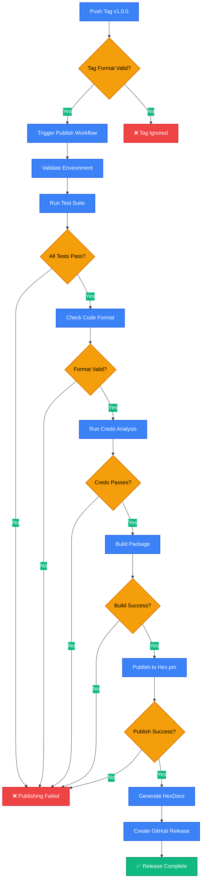
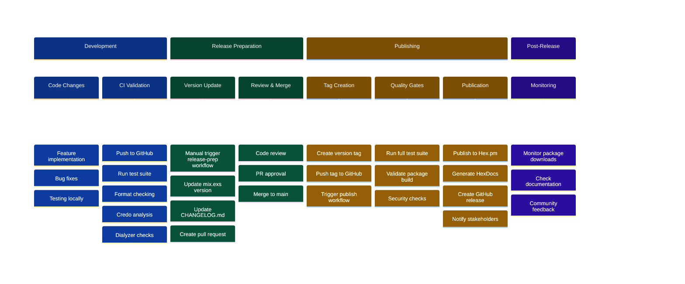

# CI/CD Setup Summary

## 🎉 Automated Publishing System Complete!

Your `ex_presto` repository now has a comprehensive CI/CD setup for automated publishing to Hex.pm.

## 📁 Files Created/Modified

### GitHub Workflows
- `.github/workflows/ci.yml` - ✅ Existing (comprehensive CI pipeline)
- `.github/workflows/publish.yml` - ✨ **NEW** (automated publishing)
- `.github/workflows/release-prep.yml` - ✨ **NEW** (release preparation)

### Documentation
- `docs/PUBLISHING.md` - ✨ **NEW** (complete publishing guide)
- `docs/CI-CD-SETUP.md` - ✨ **NEW** (this file)
- `.github/ISSUE_TEMPLATE/release.md` - ✨ **NEW** (release checklist template)

### Scripts
- `scripts/setup-publishing.sh` - ✨ **NEW** (automated setup script)

### Package Configuration
- `mix.exs` - ✅ Updated (package name: `ex_presto`)
- `README.md` - ✅ Updated (publishing section added)
- `config/config.exs` - ✅ Updated (app name: `:ex_presto`)
- `lib/presto/rule_registry.ex` - ✅ Updated (config reference)

## 🚀 What You Get

### 1. Automated Publishing Pipeline
- **Trigger**: Push version tags (`v0.1.0`, `v1.2.3`, etc.)
- **Process**: Validate → Test → Build → Publish → Release
- **Output**: Package on Hex.pm + GitHub release + HexDocs



### 2. Release Preparation Workflow
- **Trigger**: Manual GitHub Action
- **Process**: Update version → Update changelog → Create PR
- **Output**: Ready-to-merge release PR

### 3. Quality Gates
- ✅ All tests must pass
- ✅ Code formatting must be correct
- ✅ Credo analysis must pass
- ✅ Package must build successfully
- ✅ Version consistency validation

### 4. Security Features
- 🔐 Protected environment support
- 🔑 Secure API key management
- 👥 Optional approval requirements
- 🧪 Dry run capabilities

## 🛠️ Setup Required

### 1. Generate Hex API Key
```bash
mix hex.user key generate --key-name github-actions --permission api:write
```

### 2. Add GitHub Secret
1. Go to repository Settings → Secrets → Actions
2. Add secret: `HEX_API_KEY` with the generated key

### 3. Run Setup Script (Optional)
```bash
./scripts/setup-publishing.sh
```

## 📋 Release Workflow

### Git Flow Diagram
```mermaid
%%{init: {'theme':'base', 'themeVariables': {'primaryColor':'#2563eb','primaryTextColor':'#ffffff','primaryBorderColor':'#1e40af','lineColor':'#374151','cScale0':'#10b981','cScale1':'#3b82f6','cScale2':'#f59e0b','cScale3':'#ef4444'}}}%%
gitgraph
    commit id: "Feature work"
    commit id: "Bug fixes"
    commit id: "Ready for release"
    
    branch release-prep
    checkout release-prep
    commit id: "Update version"
    commit id: "Update CHANGELOG"
    commit id: "Create release PR"
    
    checkout main
    merge release-prep
    commit id: "Release v1.0.0" tag: "v1.0.0"
    
    branch publishing
    checkout publishing
    commit id: "Trigger CI/CD"
    commit id: "Run tests"
    commit id: "Build package"
    commit id: "Publish to Hex"
    commit id: "Generate docs"
    commit id: "GitHub release"
    
    checkout main
    commit id: "Continue development"
```

### Automated (Recommended)
```bash
# 1. Prepare release (GitHub Actions)
# 2. Review and merge PR
# 3. Tag and push
git tag v0.2.0 && git push origin v0.2.0
# 4. Automated publishing! 🎉
```

### Manual
```bash
# Update version in mix.exs and CHANGELOG.md
git commit -m "chore: prepare release v0.2.0"
git tag v0.2.0
git push origin main v0.2.0
```

## 🔍 Workflow Features

### Deployment Timeline


### Publish Workflow (`publish.yml`)
- **Triggers**: Version tags, manual dispatch
- **Validation**: Version matching, full test suite
- **Publishing**: Hex.pm + GitHub release
- **Security**: Environment protection support

### Release Prep Workflow (`release-prep.yml`)
- **Triggers**: Manual dispatch
- **Updates**: Version, changelog, validation
- **Output**: Pull request with all changes

### CI Workflow (`ci.yml`)
- **Triggers**: Push, pull requests
- **Checks**: Tests, formatting, Credo, Dialyzer
- **Matrix**: Multiple Elixir/OTP versions

## 🎯 Benefits

1. **Zero-Downtime Releases**: Automated, reliable publishing
2. **Quality Assurance**: Multiple validation steps
3. **Consistency**: Standardized release process
4. **Security**: Protected secrets and optional approvals
5. **Transparency**: Clear audit trail and documentation
6. **Flexibility**: Manual override capabilities

## 📚 Documentation

- **Publishing Guide**: `docs/PUBLISHING.md`
- **Release Checklist**: `.github/ISSUE_TEMPLATE/release.md`
- **Setup Script**: `scripts/setup-publishing.sh`

## 🔧 Troubleshooting

### Common Issues
1. **API Key**: Ensure `HEX_API_KEY` secret is set
2. **Permissions**: API key needs `api:write` permission
3. **Version Mismatch**: Tag version must match `mix.exs`
4. **Tests**: All quality gates must pass

### Support
- Check workflow logs in GitHub Actions
- Review `docs/PUBLISHING.md` for detailed guidance
- Use dry run mode for testing

## ✅ Ready to Publish!

Your repository is now ready for professional-grade automated publishing:

1. **Current State**: Package builds successfully as `ex_presto v0.1.0`
2. **Next Step**: Set up Hex API key and publish!
3. **Future Releases**: Use the automated workflows

**Happy publishing! 🚀**