# ExPresto Documentation Overview

Welcome to the comprehensive documentation for ExPresto, a high-performance RETE rules engine for Elixir.

## 📚 Documentation Structure

### Getting Started
- **[README](README.html)** - Quick start guide and basic usage
- **[CHANGELOG](CHANGELOG.html)** - Version history and changes

### Architecture & Design
- **[Project Overview](specs/presto.html)** - Why RETE + Elixir is a perfect match
- **[Architecture Specification](specs/architecture.html)** - Detailed system architecture and hybrid rule creation
- **[RETE Algorithm](specs/rete_algorithm.html)** - Deep dive into the RETE algorithm implementation

### Implementation Details
- **[API Design](specs/api_design.html)** - Comprehensive API specification and usage patterns
- **[Elixir Implementation](specs/elixir_implementation.html)** - Elixir-specific optimizations and patterns
- **[Performance Guide](specs/performance.html)** - Optimization strategies and benchmarking

### Publishing & Development
- **[Publishing Guide](docs/PUBLISHING.html)** - How to contribute and publish releases

## 🎯 Quick Navigation

```mermaid
flowchart TD
    Start([👋 New to ExPresto?]) --> UserType{What's your role?}
    
    UserType -->|New User| NewUser[🆕 Getting Started]
    UserType -->|Advanced User| AdvUser[🔧 Advanced Topics]
    UserType -->|Contributor| Contrib[🤝 Contributing]
    
    NewUser --> README[📖 README<br/>Installation & Examples]
    README --> Overview[🎯 Project Overview<br/>Core Concepts]
    Overview --> API[⚡ API Design<br/>Usage Patterns]
    
    AdvUser --> Arch[🏗️ Architecture Specification<br/>System Design]
    AdvUser --> Perf[⚡ Performance Guide<br/>Optimization]
    AdvUser --> Impl[💎 Elixir Implementation<br/>Language Features]
    
    Contrib --> Pub[📚 Publishing Guide<br/>Development Process]
    Contrib --> ArchC[🏗️ Architecture Specification<br/>Codebase Understanding]
    Contrib --> APIC[⚡ API Design<br/>Design Principles]
    
    API --> Advanced{Need more depth?}
    Advanced -->|Yes| AdvUser
    Advanced -->|No| Done[✅ Ready to Code!]
    
    Arch --> Ready[🚀 Implementation Ready]
    Perf --> Ready
    Impl --> Ready
    
    classDef startNode fill:#e1f5fe,stroke:#0277bd,stroke-width:3px
    classDef userPath fill:#f3e5f5,stroke:#7b1fa2,stroke-width:2px
    classDef docNode fill:#e8f5e8,stroke:#2e7d32,stroke-width:2px
    classDef endNode fill:#fff3e0,stroke:#f57c00,stroke-width:2px
    
    class Start startNode
    class NewUser,AdvUser,Contrib userPath
    class README,Overview,API,Arch,Perf,Impl,Pub,ArchC,APIC docNode
    class Done,Ready endNode
```

### For New Users
1. Start with the **[README](README.html)** for installation and basic examples
2. Read **[Project Overview](specs/presto.html)** to understand the concepts
3. Explore the **[API Design](specs/api_design.html)** for detailed usage

### For Advanced Users
1. **[Architecture Specification](specs/architecture.html)** - System design and optimization strategies
2. **[Performance Guide](specs/performance.html)** - Tuning and benchmarking
3. **[Elixir Implementation](specs/elixir_implementation.html)** - Language-specific optimizations

### For Contributors
1. **[Publishing Guide](docs/PUBLISHING.html)** - Development and release process
2. **[Architecture Specification](specs/architecture.html)** - Understanding the codebase
3. **[API Design](specs/api_design.html)** - Design principles and patterns

## 🔍 Key Concepts

### RETE Algorithm
ExPresto implements the RETE (Rapid, Efficient, Threaded Execution) algorithm, which provides:
- **O(RFP) complexity** instead of naive O(RF^P)
- **Incremental processing** of fact changes
- **Memory-speed tradeoff** for optimal performance

### Elixir Integration
The implementation leverages Elixir's strengths:
- **Pattern matching** for alpha network conditions
- **ETS tables** for high-performance memory management
- **OTP supervision** for fault tolerance
- **Concurrent processing** for rule execution

### Hybrid Architecture
ExPresto uses a hybrid approach:
- **Compile-time rules** for performance-critical logic
- **Runtime configuration** for business policies
- **Dynamic updates** without engine restart

## 🚀 Performance Characteristics

### Target Metrics
- **10,000+ facts/second** for simple patterns
- **1,000+ rule fires/second** with complex conditions
- **<100MB memory** for 10,000 facts with 100 rules
- **<1ms latency** for simple rule activation

### Optimization Features
- **ETS table optimization** for concurrent access
- **Network node sharing** to reduce memory usage
- **Token pooling** to minimize allocations
- **Incremental compilation** for dynamic rules

## 📖 Module Organization

### Core Engine
- `Presto` - Main API and engine management
- `Presto.RuleEngine` - Core rule processing
- `Presto.WorkingMemory` - Fact storage and management
- `Presto.AlphaNetwork` / `Presto.BetaNetwork` - RETE network implementation

### Rules & Registry
- `Presto.RuleRegistry` - Configuration-driven rule management
- `Presto.RuleBehaviour` - Rule implementation interface
- `Presto.RuleAnalyzer` - Rule analysis and optimization

### Examples
- `Presto.Examples.PayrollRules` - Payroll processing examples
- `Presto.Examples.ComplianceRules` - Compliance checking examples
- `Presto.Examples.CaliforniaSpikeBreakRules` - Jurisdiction-specific rules

### Benchmarking
- `Presto.Benchmarks.*` - Performance testing and analysis tools

## 🛠️ Development Tools

### Testing
- Comprehensive test suite with 249+ tests
- Integration tests for real-world scenarios
- Performance benchmarks and regression tests

### Quality Assurance
- Credo for code quality analysis
- Dialyzer for type checking
- Automated formatting with `mix format`

### CI/CD
- GitHub Actions for continuous integration
- Automated publishing to Hex.pm
- Documentation generation and publishing

## 🤝 Contributing

ExPresto welcomes contributions! See the **[Publishing Guide](docs/PUBLISHING.html)** for:
- Development setup
- Testing guidelines
- Release process
- Code quality standards

## 📞 Support

- **GitHub Issues**: Report bugs and request features
- **Documentation**: Comprehensive guides and API reference
- **Examples**: Real-world usage patterns and best practices

---

**Happy rule processing with ExPresto!** 🚀