# Automated Publishing Setup

This document explains how to set up and use the automated publishing system for `ex_presto`.

## 🔧 Initial Setup

### 1. Generate Hex API Key

First, you need to generate a Hex API key for automated publishing:

```bash
# Generate a key with publishing permissions
mix hex.user key generate --key-name github-actions --permission api:write

# You'll be prompted for your username and password
# Save the generated key - you'll need it for GitHub secrets
```

### 2. Add GitHub Secret

1. Go to your GitHub repository: https://github.com/hl/presto
2. Navigate to **Settings** → **Secrets and variables** → **Actions**
3. Click **New repository secret**
4. Name: `HEX_API_KEY`
5. Value: The API key from step 1
6. Click **Add secret**

### 3. Create Publishing Environment (Optional but Recommended)

For additional security, create a protected environment:

1. Go to **Settings** → **Environments**
2. Click **New environment**
3. Name: `hex-publishing`
4. Add protection rules:
   - ✅ Required reviewers (add yourself)
   - ✅ Wait timer: 5 minutes (optional)
5. Add the `HEX_API_KEY` secret to this environment

## 🚀 Publishing Workflows

```mermaid
flowchart TD
    A[Start Release Process] --> B{Choose Method}
    B -->|Automated| C[Run 'Prepare Release' Workflow]
    B -->|Manual| D[Update Version & Changelog Manually]
    
    C --> E[Review Generated PR]
    D --> F[Validate Changes]
    
    E --> G{PR Approved?}
    G -->|No| H[Address Feedback]
    H --> E
    G -->|Yes| I[Merge PR]
    
    F --> J[Commit Changes]
    J --> I
    
    I --> K[Create & Push Tag]
    K --> L[Automatic Publishing Triggered]
    L --> M[Quality Gates]
    M --> N{All Checks Pass?}
    N -->|No| O[Fix Issues]
    O --> P[Re-tag if Needed]
    P --> L
    N -->|Yes| Q[Publish to Hex.pm]
    Q --> R[Create GitHub Release]
    R --> S[Update Documentation]
    S --> T[Release Complete ✅]
    
    style A fill:#e1f5fe
    style T fill:#c8e6c9
    style O fill:#ffcdd2
    style H fill:#fff3e0
```



### Automatic Publishing (Recommended)

**Triggered by:** Git tags matching `v*` pattern

```bash
# 1. Prepare release (creates PR with version updates)
# Go to GitHub Actions → "Prepare Release" → Run workflow
# Enter version (e.g., "0.2.0") and changelog entry

# 2. Review and merge the release PR

# 3. Create and push the version tag
git checkout main
git pull origin main
git tag v0.2.0
git push origin v0.2.0

# 4. Publishing happens automatically! 🎉
```

### Manual Publishing

**Triggered by:** Manual workflow dispatch

1. Go to **Actions** → **Publish to Hex.pm**
2. Click **Run workflow**
3. Enter version and choose dry run option
4. Click **Run workflow**

## 📋 Release Process


### Option A: Automated Release Preparation

1. **Prepare Release**:
   - Go to GitHub Actions
   - Run "Prepare Release" workflow
   - Enter new version (e.g., `0.2.0`)
   - Enter changelog description
   - This creates a PR with all necessary updates

2. **Review & Merge**:
   - Review the generated PR
   - Ensure all checks pass
   - Merge the PR

3. **Tag & Publish**:
   ```bash
   git checkout main
   git pull origin main
   git tag v0.2.0
   git push origin v0.2.0
   ```

4. **Automated Publishing**:
   - Publishing workflow triggers automatically
   - Package is published to Hex.pm
   - GitHub release is created
   - Documentation is published to HexDocs

### Option B: Manual Release Preparation

1. **Update Version**:
   ```bash
   # Update version in mix.exs
   sed -i 's/version: "0.1.0"/version: "0.2.0"/' mix.exs
   ```

2. **Update Changelog**:
   ```bash
   # Add new section to CHANGELOG.md
   ## [0.2.0] - 2024-12-16
   ### Added
   - New feature description
   ### Fixed
   - Bug fix description
   ```

3. **Validate**:
   ```bash
   mix deps.get
   mix test
   mix format --check-formatted
   mix credo --strict
   mix hex.build
   ```

4. **Commit & Tag**:
   ```bash
   git add .
   git commit -m "chore: prepare release v0.2.0"
   git push origin main
   git tag v0.2.0
   git push origin v0.2.0
   ```

## 🔍 Workflow Details

### Quality Gates Validation

```mermaid
flowchart LR
    A[Code Changes] --> B[Dependencies Check]
    B --> C[Test Suite]
    C --> D[Code Formatting]
    D --> E[Static Analysis]
    E --> F[Package Build]
    F --> G[Version Validation]
    G --> H{All Gates Pass?}
    H -->|Yes| I[✅ Ready to Publish]
    H -->|No| J[❌ Fix Issues]
    J --> A
    
    subgraph "Quality Gates"
        B
        C
        D
        E
        F
        G
    end
    
    style I fill:#c8e6c9
    style J fill:#ffcdd2
    style B fill:#e3f2fd
    style C fill:#e3f2fd
    style D fill:#e3f2fd
    style E fill:#e3f2fd
    style F fill:#e3f2fd
    style G fill:#e3f2fd
```



### Publish Workflow (`publish.yml`)

**Triggers:**
- Git tags: `v*` (e.g., `v0.1.0`, `v1.2.3`)
- Manual dispatch with version input

**Jobs:**
1. **Validate**: Runs full test suite and validates package
2. **Publish**: Publishes to Hex.pm (requires approval if environment protection is enabled)
3. **Notify**: Sends success notification

**Features:**
- ✅ Version validation (tag must match mix.exs)
- ✅ Full test suite execution
- ✅ Package validation
- ✅ Automatic GitHub release creation
- ✅ Dry run support for testing

### Release Prep Workflow (`release-prep.yml`)

**Triggers:**
- Manual dispatch with version and changelog inputs

**Features:**
- ✅ Updates `mix.exs` version
- ✅ Updates `CHANGELOG.md`
- ✅ Validates all changes
- ✅ Creates pull request with changes
- ✅ Provides clear next steps

## 🛡️ Security Features

- **Environment Protection**: Optional approval required for publishing
- **Secret Management**: API key stored securely in GitHub secrets
- **Validation**: Multiple validation steps before publishing
- **Dry Run**: Test publishing without actually publishing

## 🔧 Troubleshooting

### Error Recovery Process

```mermaid
flowchart TD
    A[Publishing Failed ❌] --> B{What Type of Error?}
    
    B -->|API Key Issue| C[Check HEX_API_KEY Secret]
    C --> D[Regenerate Key if Needed]
    D --> E[Update GitHub Secret]
    E --> F[Retry Publishing]
    
    B -->|Version Mismatch| G[Delete Incorrect Tag]
    G --> H[Update mix.exs Version]
    H --> I[Commit Version Fix]
    I --> J[Create New Tag]
    J --> F
    
    B -->|Test Failures| K[Fix Failing Tests]
    K --> L[Run Tests Locally]
    L --> M{Tests Pass?}
    M -->|No| K
    M -->|Yes| N[Commit Fixes]
    N --> F
    
    B -->|Build Issues| O[Fix Build Problems]
    O --> P[Test with mix hex.build]
    P --> Q{Build Success?}
    Q -->|No| O
    Q -->|Yes| R[Commit Build Fixes]
    R --> F
    
    B -->|Permission Issues| S[Check Repository Permissions]
    S --> T[Verify Workflow Permissions]
    T --> U[Contact Admin if Needed]
    U --> F
    
    F --> V{Publishing Successful?}
    V -->|Yes| W[Release Complete ✅]
    V -->|No| X[Investigate Further]
    X --> Y[Check Logs]
    Y --> Z[Seek Help]
    
    style A fill:#ffcdd2
    style W fill:#c8e6c9
    style F fill:#fff3e0
    style X fill:#ffcdd2
    style Z fill:#e1bee7
```



### Common Issues & Solutions

```mermaid
sequenceDiagram
    participant Dev as Developer
    participant GH as GitHub Actions
    participant Hex as Hex.pm
    participant Logs as Error Logs
    
    Dev->>GH: Push tag v0.2.0
    GH->>GH: Validate version
    
    alt Version mismatch
        GH-->>Dev: ❌ Tag version ≠ mix.exs
        Note over Dev: Delete tag, fix version, re-tag
        Dev->>GH: Push corrected tag
    end
    
    GH->>GH: Run tests
    
    alt Tests fail
        GH-->>Dev: ❌ Test failures
        Note over Dev: Fix tests, commit, re-tag
        Dev->>GH: Push fixes
    end
    
    GH->>Hex: Attempt publish
    
    alt API key invalid
        Hex-->>GH: ❌ Authentication failed
        GH-->>Dev: Publishing failed
        Note over Dev: Check HEX_API_KEY secret
        Dev->>GH: Update secret & retry
    end
    
    alt Success
        Hex-->>GH: ✅ Package published
        GH->>Dev: 🎉 Release complete
    end
```



### Publishing Fails

1. **Check API Key**: Ensure `HEX_API_KEY` secret is set correctly
2. **Check Permissions**: API key needs `api:write` permission
3. **Check Version**: Version in tag must match `mix.exs`
4. **Check Tests**: All tests must pass

### Version Mismatch

```bash
# If tag version doesn't match mix.exs:
git tag -d v0.2.0  # Delete local tag
git push origin :refs/tags/v0.2.0  # Delete remote tag

# Fix version in mix.exs, commit, then re-tag
```

### Workflow Not Triggering

1. **Check Tag Format**: Must be `v*` (e.g., `v0.1.0`)
2. **Check Permissions**: Ensure workflows have necessary permissions
3. **Check Branch**: Tag should be on main branch

## 📚 Additional Resources

- [Hex.pm Publishing Guide](https://hex.pm/docs/publish)
- [GitHub Actions Documentation](https://docs.github.com/en/actions)
- [Semantic Versioning](https://semver.org/)

## 🎯 Quick Commands

```bash
# Check current version
grep 'version:' mix.exs

# List existing tags
git tag -l

# Check if package builds
mix hex.build

# Test publish (dry run)
mix hex.publish --dry-run
```