# Presto Examples

This directory contains examples showing how to build domain-specific applications using Presto as a generic RETE rules engine.

## Architecture Philosophy

**Presto is a generic RETE rules engine library** that can be used to build various rule-based systems. The examples in this directory demonstrate how to use Presto to build specific applications while maintaining proper separation of concerns:

- **Presto Core**: Generic RETE algorithm implementation, rule management, and optimization
- **Domain Examples**: Specific applications built on top of Presto (like payroll processing)


## Examples

### 1. Payroll Processing System

A complete payroll processing system that demonstrates enterprise-scale usage of Presto.

**Files:**
- `payroll_system.ex` - Complete payroll system using Presto internally
- `payroll_aggregator.ex` - Cross-employee aggregation utilities  
- `payroll_demo.exs` - Comprehensive demonstration script
- `enhanced_payroll_demo.exs` - Advanced demo (work in progress)

**Capabilities:**
- Processes 10,000+ employees with 1,000+ rules per employee
- Handles 48 shifts per employee per month
- Cross-employee aggregation and reporting
- Progress tracking and performance metrics
- Single-employee processing model with final aggregation

**Usage:**
```elixir
# Start the payroll system (which uses Presto internally)
{:ok, system} = Examples.PayrollSystem.start_link()

# Start a payroll run for 10,000 employees
:ok = Examples.PayrollSystem.start_payroll_run(system, "payroll_2025_01", 10_000)

# Process each employee (called 10,000 times)
{:ok, result} = Examples.PayrollSystem.process_employee(
  system, 
  "payroll_2025_01", 
  employee_id, 
  employee_time_entries
)

# Monitor progress
{:ok, progress} = Examples.PayrollSystem.get_progress(system, "payroll_2025_01")

# Generate final report
{:ok, report} = Examples.PayrollSystem.finalize_run(system, "payroll_2025_01")
```

**Run the demo:**
```bash
mix run examples/payroll_demo.exs
```


### 2. Basic Payroll Rules

Simple payroll rule implementations showing how to define business logic using Presto.

**Files:**
- `../lib/presto/examples/payroll_rules.ex` - Basic time calculation and overtime rules

**Features:**
- Time duration calculation
- Overtime detection and calculation
- Integration with Presto RETE engine

## Key Architectural Principles

### 1. Generic Core, Specific Applications

```mermaid
graph TD
    subgraph "Domain Applications"
        PS["PayrollSystem<br/>🏢 Business Logic<br/>📊 Aggregation<br/>📈 Reporting"]
        FD["Fraud Detection<br/>🔍 Pattern Analysis<br/>⚠️ Alert Generation<br/>📋 Risk Assessment"]
        BPA["Process Automation<br/>⚙️ Workflow Logic<br/>🔄 State Management<br/>📬 Notifications"]
    end
    
    subgraph "Presto Core"
        RE["RETE Engine<br/>🧠 Pattern Matching<br/>⚡ Rule Evaluation<br/>🔧 Optimization"]
    end
    
    PS --> RE
    FD --> RE
    BPA --> RE
    
    style PS fill:#e8f5e8,stroke:#2e7d32,stroke-width:2px
    style FD fill:#fff3e0,stroke:#ef6c00,stroke-width:2px
    style BPA fill:#e3f2fd,stroke:#1565c0,stroke-width:2px
    style RE fill:#f8f9ff,stroke:#3f51b5,stroke-width:3px
```



### 2. Proper Separation of Concerns

**What's in Presto Core:**
- ✅ RETE algorithm implementation
- ✅ Generic rule management (add/remove/fire rules)
- ✅ Working memory management
- ✅ Alpha and beta network processing
- ✅ Generic bulk rule loading
- ✅ Performance optimizations

**What's in Examples:**
- ✅ Domain-specific aggregation (PayrollAggregator)
- ✅ Business logic applications (PayrollSystem)
- ✅ Domain-specific API layers
- ✅ Progress tracking for specific use cases
- ✅ Reporting and visualization

### 3. Reusability

The same Presto core can be used for different domains:
- **Payroll Processing** (this example)
- **Fraud Detection** (potential example)
- **Business Process Automation** (potential example)
- **Configuration Management** (potential example)
- **Real-time Event Processing** (potential example)

```mermaid
graph LR
    subgraph "One Core Engine"
        PC["Presto Core<br/>RETE Implementation"]
    end
    
    subgraph "Multiple Applications"
        PP["💰 Payroll<br/>Processing"]
        FD["🔍 Fraud<br/>Detection"]
        BPA["⚙️ Business Process<br/>Automation"]
        CM["⚙️ Configuration<br/>Management"]
        REP["⚡ Real-time Event<br/>Processing"]
    end
    
    PC --> PP
    PC --> FD
    PC --> BPA
    PC --> CM
    PC --> REP
    
    style PC fill:#f8f9ff,stroke:#3f51b5,stroke-width:3px
    style PP fill:#e8f5e8,stroke:#2e7d32,stroke-width:2px
    style FD fill:#fff3e0,stroke:#ef6c00,stroke-width:2px
    style BPA fill:#e3f2fd,stroke:#1565c0,stroke-width:2px
    style CM fill:#fce4ec,stroke:#c2185b,stroke-width:2px
    style REP fill:#f3e5f5,stroke:#7b1fa2,stroke-width:2px
```



## Performance Characteristics

The payroll example demonstrates Presto's capabilities at scale:

- **Scale**: 10,000 employees × 48 shifts × 1,000 rules = 480M rule evaluations
- **Performance**: ~1-2ms per employee with optimization
- **Memory**: ~100MB per employee processing session
- **Total Processing Time**: ~10-20 seconds for full payroll run

## Getting Started

1. **Study the PayrollSystem example** to understand how to build applications on Presto
2. **Run the demo** to see it in action
3. **Examine the PayrollRules** to understand how business logic maps to Presto rules
4. **Use as a template** for your own domain-specific applications

## Best Practices

### 1. Keep Presto Generic
- Don't add domain-specific functions to the main Presto API
- Use Presto for rule processing, build domain logic on top

### 2. Leverage Bulk Loading
- Use `Presto.bulk_load_rules_from_*` functions for large rule sets
- Enable optimization for production workloads

### 3. Design for Scale
- Use single-entity processing patterns (like single-employee processing)
- Build aggregation layers separate from rule processing
- Monitor performance and optimize rule complexity

### 4. Maintain Clear Boundaries
- Domain logic stays in examples/applications
- Generic rule engine functionality stays in Presto core
- Use composition, not inheritance

## Contributing Examples

When adding new examples:

1. Create a new subdirectory or file in `examples/`
2. Follow the pattern of building domain-specific applications on top of Presto
3. Include both the application code and a demonstration script
4. Document the architecture and usage patterns
5. Keep the Presto core generic and unchanged

## Architecture Validation

Run the architecture test to verify proper separation:

```bash
mix run test_corrected_architecture.exs
```

This ensures:
- Presto remains generic
- Examples work as separate layers
- No domain-specific functions leak into the core