# Presto Examples

This directory contains examples showing how to build domain-specific applications using Presto as a generic RETE rules engine.

## Architecture Philosophy

**Presto is a generic RETE rules engine library** that can be used to build various rule-based systems. The examples in this directory demonstrate how to use Presto to build specific applications while maintaining proper separation of concerns:

- **Presto Core**: Generic RETE algorithm implementation, rule management, and optimization
- **Domain Examples**: Specific applications built on top of Presto (like payroll processing)


## Getting Started with Presto

### Basic Usage

```elixir
# Start a rule engine
{:ok, engine} = Presto.start_engine()

# Create a rule using the new Rule helper
rule = Presto.Rule.new(
  :adult_rule,
  [
    {:person, :name, :age},
    {:age, :>, 18}
  ],
  fn facts -> [{:adult, facts[:name]}] end
)

# Add rule and facts using the simplified batch API
:ok = Presto.add_rules(engine, [rule])
:ok = Presto.assert_facts(engine, [
  {:person, "Alice", 25},
  {:person, "Bob", 16}
])

# Execute rules
results = Presto.fire_rules(engine)
# => [{:adult, "Alice"}]
```

### Aggregation Rules

Presto now supports RETE-native aggregations for efficient data processing:

```elixir
# Sum aggregation by group
sum_rule = Presto.Rule.aggregation(
  :employee_hours,
  [{:timesheet, :id, :employee_id, :hours}],
  [:employee_id],           # Group by employee_id
  :sum,                     # Aggregate function
  :hours                    # Field to aggregate
)

# Count aggregation
count_rule = Presto.Rule.aggregation(
  :shift_count,
  [{:shift, :id, :department}],
  [:department],
  :count,
  nil                       # No field needed for count
)

# Average with custom output
avg_rule = Presto.Rule.aggregation(
  :avg_score,
  [{:score, :student, :value}],
  [:student],
  :avg,
  :value,
  output: {:student_avg, :student, :score}
)

# Add aggregation rules
:ok = Presto.add_rules(engine, [sum_rule, count_rule, avg_rule])

# Add facts
:ok = Presto.assert_facts(engine, [
  {:timesheet, "t1", "emp1", 8},
  {:timesheet, "t2", "emp1", 6},
  {:timesheet, "t3", "emp2", 7},
  {:shift, "s1", "kitchen"},
  {:shift, "s2", "kitchen"},
  {:shift, "s3", "bar"},
  {:score, "alice", 85},
  {:score, "alice", 90}
])

results = Presto.fire_rules(engine)
# => [
#      {:aggregate_result, {"emp1"}, 14},
#      {:aggregate_result, {"emp2"}, 7},
#      {:aggregate_result, {"kitchen"}, 2},
#      {:aggregate_result, {"bar"}, 1},
#      {:student_avg, "alice", 87.5}
#    ]
```

### Multi-field Grouping

```elixir
# Group by multiple fields
sales_rule = Presto.Rule.aggregation(
  :regional_sales,
  [{:sale, :region, :product, :amount}],
  [:region, :product],      # Group by both region and product
  :sum,
  :amount
)

:ok = Presto.add_rules(engine, [sales_rule])
:ok = Presto.assert_facts(engine, [
  {:sale, "north", "widget", 100},
  {:sale, "north", "widget", 150},
  {:sale, "south", "widget", 200}
])

results = Presto.fire_rules(engine)
# => [
#      {:aggregate_result, {"north", "widget"}, 250},
#      {:aggregate_result, {"south", "widget"}, 200}
#    ]
```

### Available Aggregation Functions

- `:sum` - Sum of numeric values
- `:count` - Count of facts in each group
- `:avg` - Average of numeric values
- `:min` - Minimum value in each group
- `:max` - Maximum value in each group
- `:collect` - Collect all values into a list

## Examples

### 1. Payroll Processing System

A complete payroll processing system that demonstrates enterprise-scale usage of Presto.

**Files:**
- `payroll_system.ex` - Complete payroll system using Presto internally
- `payroll_aggregator.ex` - Cross-employee aggregation utilities  
- `payroll_demo.exs` - Comprehensive demonstration script
- `enhanced_payroll_demo.exs` - Advanced demo (work in progress)

**Capabilities:**
- Processes 10,000+ employees with 1,000+ rules per employee
- Handles 48 shifts per employee per month
- Cross-employee aggregation and reporting
- Progress tracking and performance metrics
- Single-employee processing model with final aggregation

**Usage:**
```elixir
# Start the payroll system (which uses Presto internally)
{:ok, system} = Examples.PayrollSystem.start_link()

# Start a payroll run for 10,000 employees
:ok = Examples.PayrollSystem.start_payroll_run(system, "payroll_2025_01", 10_000)

# Process each employee (called 10,000 times)
{:ok, result} = Examples.PayrollSystem.process_employee(
  system, 
  "payroll_2025_01", 
  employee_id, 
  employee_time_entries
)

# Monitor progress
{:ok, progress} = Examples.PayrollSystem.get_progress(system, "payroll_2025_01")

# Generate final report
{:ok, report} = Examples.PayrollSystem.finalize_run(system, "payroll_2025_01")
```

**Run the demo:**
```bash
mix run examples/payroll_demo.exs
```


### 2. Basic Payroll Rules

Simple payroll rule implementations showing how to define business logic using Presto.

**Files:**
- `../lib/presto/examples/payroll_rules.ex` - Basic time calculation and overtime rules

**Features:**
- Time duration calculation
- Overtime detection and calculation
- Integration with Presto RETE engine

**Updated Example with New API:**
```elixir
# Create payroll rules using the new Rule helpers
overtime_rule = Presto.Rule.new(
  :overtime_calculation,
  [
    {:shift_segment, :id, :data},
    Presto.Rule.test(:hours, :>, 8)
  ],
  fn facts -> 
    overtime_hours = facts[:hours] - 8
    [{:overtime, facts[:id], overtime_hours}]
  end
)

# Aggregation rule for total hours by employee
total_hours_rule = Presto.Rule.aggregation(
  :employee_total_hours,
  [{:shift_segment, :id, :data}],
  [:employee_id],
  :sum,
  :hours
)

# Add rules using batch API
:ok = Presto.add_rules(engine, [overtime_rule, total_hours_rule])

# Add facts using batch API
:ok = Presto.assert_facts(engine, [
  {:shift_segment, "seg1", %{employee_id: "emp1", hours: 10}},
  {:shift_segment, "seg2", %{employee_id: "emp1", hours: 6}},
  {:shift_segment, "seg3", %{employee_id: "emp2", hours: 9}}
])
```

## Key Architectural Principles

### 1. Generic Core, Specific Applications

```mermaid
graph TD
    subgraph "Domain Applications"
        PS["PayrollSystem<br/>🏢 Business Logic<br/>📊 Aggregation<br/>📈 Reporting"]
        FD["Fraud Detection<br/>🔍 Pattern Analysis<br/>⚠️ Alert Generation<br/>📋 Risk Assessment"]
        BPA["Process Automation<br/>⚙️ Workflow Logic<br/>🔄 State Management<br/>📬 Notifications"]
    end
    
    subgraph "Presto Core"
        RE["RETE Engine<br/>🧠 Pattern Matching<br/>⚡ Rule Evaluation<br/>🔧 Optimization"]
    end
    
    PS --> RE
    FD --> RE
    BPA --> RE
    
    style PS fill:#e8f5e8,stroke:#2e7d32,stroke-width:2px
    style FD fill:#fff3e0,stroke:#ef6c00,stroke-width:2px
    style BPA fill:#e3f2fd,stroke:#1565c0,stroke-width:2px
    style RE fill:#f8f9ff,stroke:#3f51b5,stroke-width:3px
```



### 2. Proper Separation of Concerns

**What's in Presto Core:**
- ✅ RETE algorithm implementation
- ✅ Generic rule management (add/remove/fire rules)
- ✅ Working memory management
- ✅ Alpha and beta network processing
- ✅ **NEW**: Simplified batch API (`assert_facts/2`, `add_rules/2`)
- ✅ **NEW**: RETE-native aggregations with incremental updates
- ✅ **NEW**: Rule construction helpers (`Presto.Rule` module)
- ✅ Performance optimizations

**What's in Examples:**
- ✅ Domain-specific aggregation (PayrollAggregator)
- ✅ Business logic applications (PayrollSystem)
- ✅ Domain-specific API layers
- ✅ Progress tracking for specific use cases
- ✅ Reporting and visualization

### 3. Reusability

The same Presto core can be used for different domains:
- **Payroll Processing** (this example)
- **Fraud Detection** (potential example)
- **Business Process Automation** (potential example)
- **Configuration Management** (potential example)
- **Real-time Event Processing** (potential example)

```mermaid
graph LR
    subgraph "One Core Engine"
        PC["Presto Core<br/>RETE Implementation"]
    end
    
    subgraph "Multiple Applications"
        PP["💰 Payroll<br/>Processing"]
        FD["🔍 Fraud<br/>Detection"]
        BPA["⚙️ Business Process<br/>Automation"]
        CM["⚙️ Configuration<br/>Management"]
        REP["⚡ Real-time Event<br/>Processing"]
    end
    
    PC --> PP
    PC --> FD
    PC --> BPA
    PC --> CM
    PC --> REP
    
    style PC fill:#f8f9ff,stroke:#3f51b5,stroke-width:3px
    style PP fill:#e8f5e8,stroke:#2e7d32,stroke-width:2px
    style FD fill:#fff3e0,stroke:#ef6c00,stroke-width:2px
    style BPA fill:#e3f2fd,stroke:#1565c0,stroke-width:2px
    style CM fill:#fce4ec,stroke:#c2185b,stroke-width:2px
    style REP fill:#f3e5f5,stroke:#7b1fa2,stroke-width:2px
```



## New API Features

### Rule Construction Helpers

The `Presto.Rule` module provides explicit functions for building rules:

```elixir
# Basic rule construction
rule = Presto.Rule.new(
  :rule_id,
  conditions,
  action_function,
  priority: 10  # Optional priority
)

# Pattern matching helper
pattern = Presto.Rule.pattern(:person, [:name, :age])
# => {:person, :name, :age}

# Test condition helper
test = Presto.Rule.test(:age, :>, 18)
# => {:age, :>, 18}

# Aggregation rule
agg_rule = Presto.Rule.aggregation(
  :rule_id,
  conditions,
  group_by_fields,
  aggregate_function,
  field_to_aggregate,
  output: custom_output_pattern  # Optional
)
```

### Simplified Batch API

```elixir
# Add multiple rules at once
:ok = Presto.add_rules(engine, [rule1, rule2, rule3])

# Assert multiple facts at once
:ok = Presto.assert_facts(engine, [fact1, fact2, fact3])

# Combined workflow
rules = [
  Presto.Rule.new(:rule1, conditions1, action1),
  Presto.Rule.aggregation(:agg1, patterns1, group_by1, :sum, :field1)
]

facts = [
  {:person, "Alice", 25},
  {:employment, "Alice", "TechCorp"},
  {:salary, "Alice", 50000}
]

:ok = Presto.add_rules(engine, rules)
:ok = Presto.assert_facts(engine, facts)
results = Presto.fire_rules(engine)
```

## Performance Characteristics

The payroll example demonstrates Presto's capabilities at scale:

- **Scale**: 10,000 employees × 48 shifts × 1,000 rules = 480M rule evaluations
- **Performance**: ~1-2ms per employee with optimization
- **Memory**: ~100MB per employee processing session
- **Total Processing Time**: ~10-20 seconds for full payroll run
- **NEW**: Incremental aggregation updates reduce computational overhead

## Getting Started

1. **Study the basic API examples** to understand rule construction and batch operations
2. **Explore aggregation rules** for efficient data processing
3. **Study the PayrollSystem example** to understand how to build applications on Presto
4. **Run the demo** to see it in action
5. **Examine the PayrollRules** to understand how business logic maps to Presto rules
6. **Use as a template** for your own domain-specific applications

## Best Practices

### 1. Keep Presto Generic
- Don't add domain-specific functions to the main Presto API
- Use Presto for rule processing, build domain logic on top

### 2. Leverage New API Features
- Use `Presto.Rule.new/4` for clear rule construction
- Use `Presto.Rule.aggregation/6` for efficient data aggregation
- Use batch APIs (`add_rules/2`, `assert_facts/2`) for better performance
- Use pattern and test helpers for readable rule conditions

### 3. Design for Scale
- Use single-entity processing patterns (like single-employee processing)
- Leverage RETE-native aggregations instead of post-processing
- Build aggregation layers separate from rule processing
- Monitor performance and optimize rule complexity

### 4. Maintain Clear Boundaries
- Domain logic stays in examples/applications
- Generic rule engine functionality stays in Presto core
- Use composition, not inheritance

## Contributing Examples

When adding new examples:

1. Create a new subdirectory or file in `examples/`
2. Follow the pattern of building domain-specific applications on top of Presto
3. Use the new `Presto.Rule` helpers for rule construction
4. Leverage aggregation rules where appropriate
5. Include both the application code and a demonstration script
6. Document the architecture and usage patterns
7. Keep the Presto core generic and unchanged

## Architecture Validation

Run the architecture test to verify proper separation:

```bash
mix run test_corrected_architecture.exs
```

This ensures:
- Presto remains generic
- Examples work as separate layers
- No domain-specific functions leak into the core
- New API features maintain proper abstraction boundaries