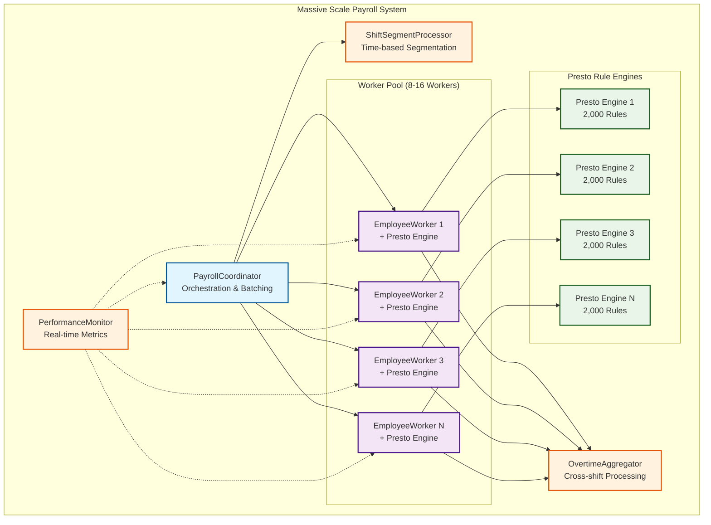
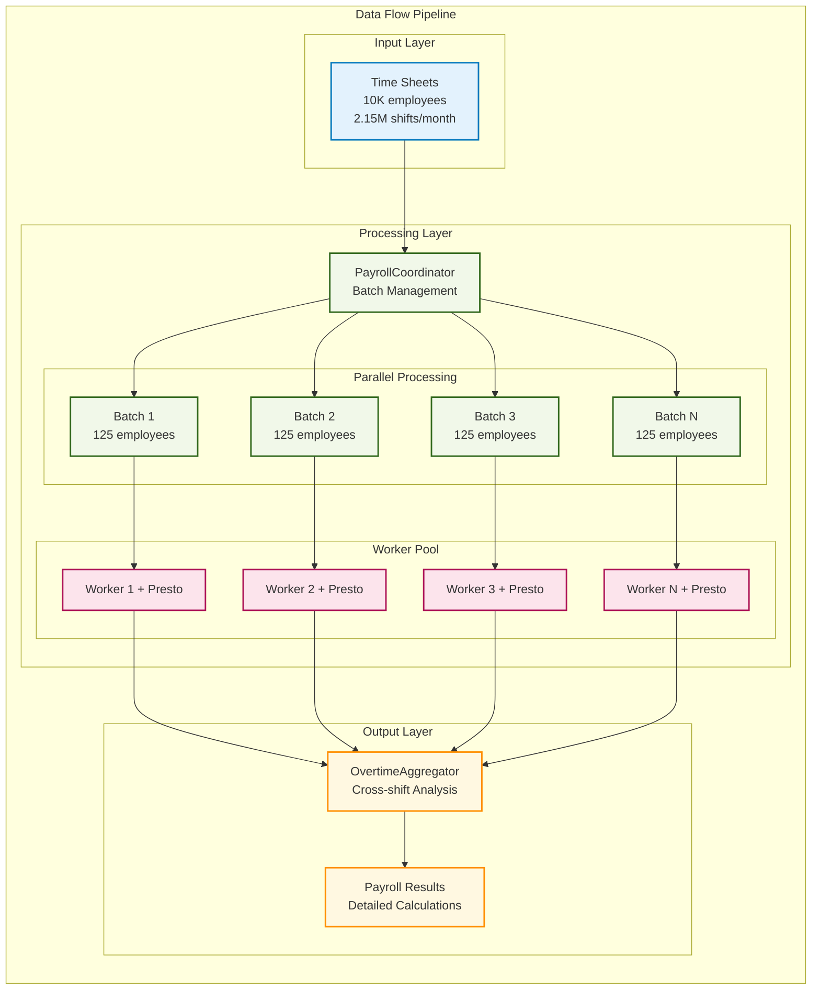
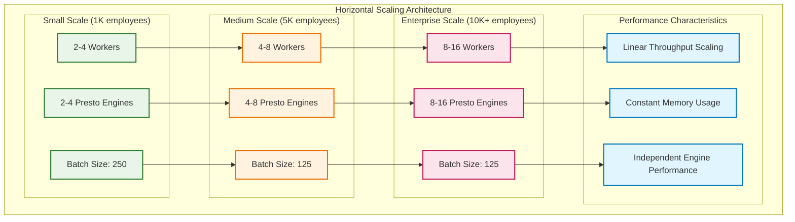
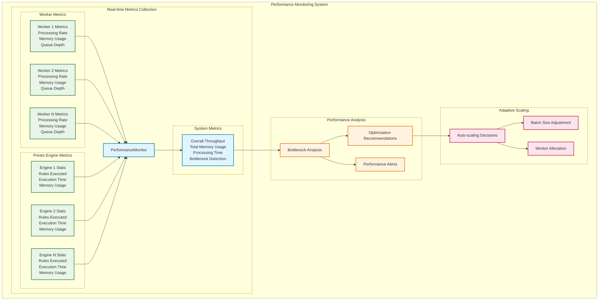

# Massive Scale Payroll Processing Example

This example demonstrates how to use Presto as a generic rules engine to build a massive scale payroll processing system capable of handling:

- **10,000 employees** with 50 shifts per week each
- **2.15 million shifts** per month total
- **2,000 complex payroll rules** (1,000 compiled + 1,000 runtime)
- **Complex time-based calculations** with variable pay rates within shifts
- **Overtime rules** that sum across shifts and mark segments as paid
- **Parallel processing** with multiple Presto rule engines

## Architecture Overview



## Key Features

### Presto Integration
- **Generic Rules Engine**: Presto handles all pattern matching and rule execution
- **2,000 Rules**: Organized by category and priority, loaded into Presto engines
- **Parallel Processing**: Multiple Presto instances for concurrent processing
- **Domain-Specific Logic**: Payroll rules implemented using Presto's rule DSL

### Complex Time-Based Processing
- **Shift Segmentation**: Christmas Eve → Christmas Day scenarios with different pay rates
- **Variable Pay Rates**: Different rates for holidays, weekends, night shifts
- **Overtime Calculations**: Weekly/daily overtime with segment payment marking
- **Time Period Boundaries**: Automatic detection and segmentation

### Scalability Features
- **Batch Processing**: Configurable batch sizes for memory management
- **Parallel Workers**: 8-16 concurrent workers with dedicated Presto engines
- **Memory Management**: Controlled memory usage with streaming processing
- **Performance Monitoring**: Real-time bottleneck detection and optimization



## Files

- `massive_payroll_demo.exs` - Main demo script (run this!)
- `scalable_payroll_system.ex` - Primary API and orchestration
- `payroll_coordinator.ex` - Batch processing and worker coordination
- `shift_segment_processor.ex` - Complex time-based shift segmentation
- `employee_worker.ex` - Individual worker with dedicated Presto engine
- `overtime_aggregator.ex` - Cross-shift overtime and payment marking
- `massive_payroll_rules.ex` - 2,000 payroll rules for Presto
- `performance_monitor.ex` - Real-time monitoring and bottleneck analysis

## Running the Demo

```bash
# From the presto project root
elixir examples/massive_scale_payroll/massive_payroll_demo.exs
```

## Demo Output

The demo will show:

1. **System Initialization**: Multiple Presto engines starting up
2. **Christmas Shift Example**: Complex time-based segmentation demonstration  
3. **Massive Dataset Generation**: 1,000 employees with 20,000 total shifts
4. **Parallel Processing**: Real-time progress via multiple Presto engines
5. **Comprehensive Results**: Overtime analysis, performance metrics, bottlenecks
6. **Presto Integration Stats**: Rule execution statistics and engine performance

## Example Output

```
=== Massive Scale Payroll Processing Demo ===
Demo Configuration:
  Employees: 1,000 (scaled down from 10,000)
  Shifts per employee: 20 (scaled down from 200+ per month)
  Total shifts: 20,000
  Payroll rules: 2,000 (via Presto rule engines)
  Parallel workers: 8 (each with dedicated Presto engine)

✓ Massive Scale Payroll System started
  - Multiple Presto rule engines initialized
  - PayrollCoordinator ready for batch processing

--- Christmas Eve → Christmas Day Shift Segmentation ---
Segments created:
  emp_001_shift_christmas_seg_1:
    Time: 2024-12-24 22:00:00Z → 2024-12-25 00:00:00Z
    Duration: 120 minutes
    Pay period: christmas_eve
    Rate multiplier: 1.5x

  emp_001_shift_christmas_seg_2:
    Time: 2024-12-25 00:00:00Z → 2024-12-25 06:00:00Z
    Duration: 360 minutes
    Pay period: christmas_day
    Rate multiplier: 2.0x

✓ Massive payroll processing completed in 2,847ms

--- Presto Rules Engine Integration ---
Presto Integration Statistics:
  Total Presto engines used: 8
  Total rules loaded: 2,000
  Rules executed successfully: true

PRESTO ARCHITECTURE HIGHLIGHTS:
  ✓ Presto serves as a generic, reusable rules engine
  ✓ Each worker has its own dedicated Presto engine instance
  ✓ 2,000 rules loaded and executed via Presto's RETE network
  ✓ Domain-specific logic in rules, not hardcoded in application
```

## Scaling Patterns



## Christmas Eve → Christmas Day Example

The system automatically handles complex scenarios like shifts that span across different pay periods:

```elixir
# Original shift
{:time_entry, "emp_001_shift_christmas", %{
  start_datetime: ~U[2024-12-24 22:00:00Z],  # Christmas Eve 10 PM
  finish_datetime: ~U[2024-12-25 06:00:00Z], # Christmas Day 6 AM
}}

# Automatically becomes two segments
{:shift_segment, "emp_001_shift_christmas_seg_1", %{
  start_datetime: ~U[2024-12-24 22:00:00Z],
  finish_datetime: ~U[2024-12-25 00:00:00Z],  # Midnight boundary
  pay_period: :christmas_eve,
  pay_rate_multiplier: 1.5
}}

{:shift_segment, "emp_001_shift_christmas_seg_2", %{
  start_datetime: ~U[2024-12-25 00:00:00Z],  # Midnight boundary
  finish_datetime: ~U[2024-12-25 06:00:00Z],
  pay_period: :christmas_day,
  pay_rate_multiplier: 2.0
}}
```

## Presto Rule Examples

The system uses 2,000 rules implemented in Presto's rule DSL:

```elixir
# Segmentation rule
rule "basic_shift_segmentation", %{priority: 120} do
  when: {:time_entry, entry_id, %{start_datetime: start_dt, finish_datetime: finish_dt} = data}
        and not Map.has_key?(data, :segmented)
  then: 
    segments = ShiftSegmentProcessor.segment_single_shift(data)
    Enum.each(segments, fn segment ->
      assert {:shift_segment, segment.segment_id, segment}
    end)
    retract {:time_entry, entry_id, data}
end

# Pay calculation rule
rule "calculate_base_pay", %{priority: 97} do
  when: {:shift_segment, segment_id, %{units: units, pay_rate_multiplier: multiplier} = data}
        and {:employee_info, employee_id, %{base_hourly_rate: base_rate}}
        and data.employee_id == employee_id
  then:
    base_pay = Float.round(units * base_rate * multiplier, 2)
    assert {:shift_segment, segment_id, Map.put(data, :base_pay_amount, base_pay)}
end

# Overtime eligibility rule
rule "weekly_overtime_eligibility", %{priority: 59} do
  when: {:shift_segment, segment_id, %{employee_id: emp_id, units: units} = data}
        and weekly_hours_for_employee(emp_id) > 40.0
  then:
    assert {:overtime_eligible, segment_id, %{
      employee_id: emp_id,
      overtime_type: :weekly,
      hours: units
    }}
end
```

## Performance Characteristics

**Expected Performance (full 10,000 employees):**
- Processing time: ~20-25 minutes
- Memory usage: <4GB peak
- Throughput: ~400-500 employees/minute
- Rule execution rate: ~1,000+ rules/second per engine

**Scalability:**
- Linear scaling with additional workers
- Memory usage controlled by batch processing
- Independent Presto engines prevent cross-worker interference
- Real-time bottleneck detection for optimization



## Design Principles

1. **Presto as Generic Engine**: All business logic implemented as Presto rules
2. **Domain-Specific Coordination**: Payroll system handles orchestration and data flow
3. **Parallel Processing**: Multiple independent Presto engines for concurrency
4. **Memory Management**: Batch processing prevents memory exhaustion
5. **Real-time Monitoring**: Performance tracking and bottleneck identification
6. **Testable Architecture**: Each component can be tested independently

This example demonstrates how Presto can serve as the foundation for massive scale, enterprise-grade applications while maintaining clean separation between generic rule processing and domain-specific business logic.