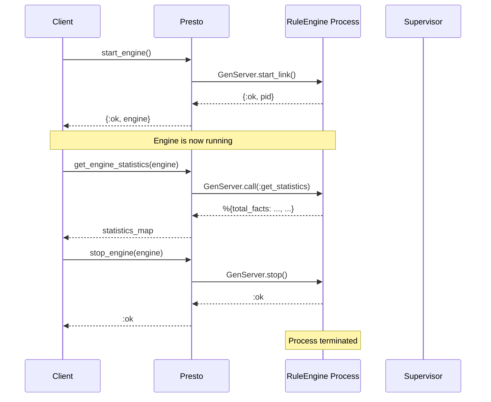
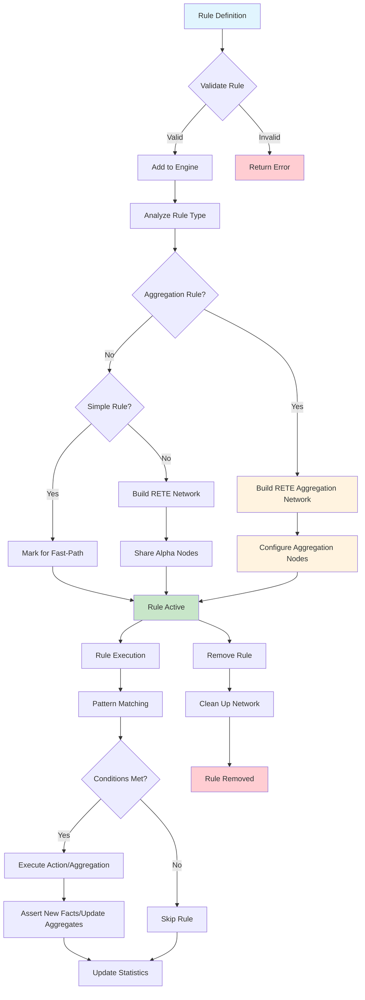
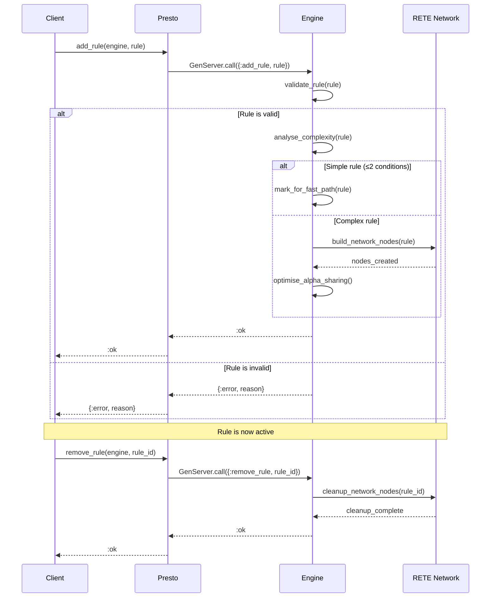
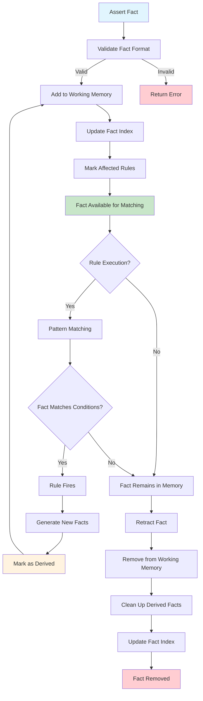
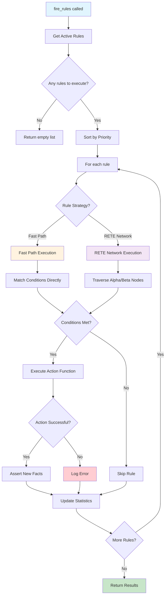
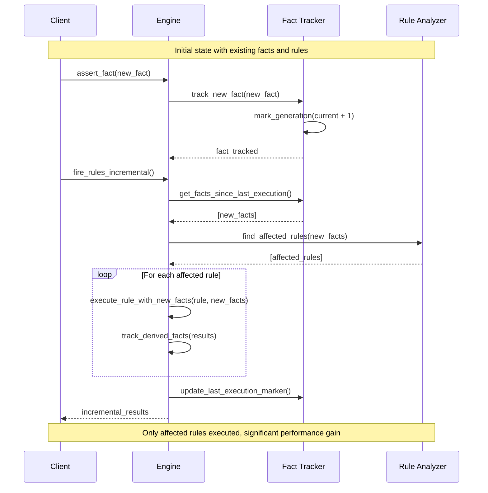
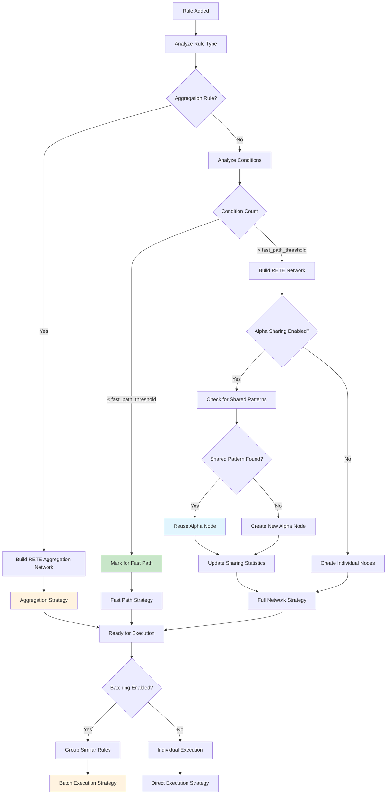
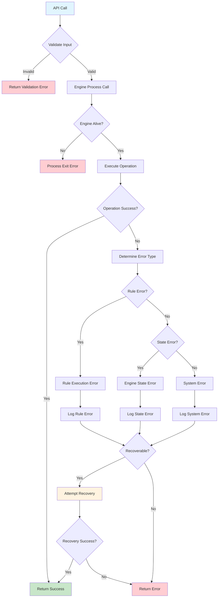
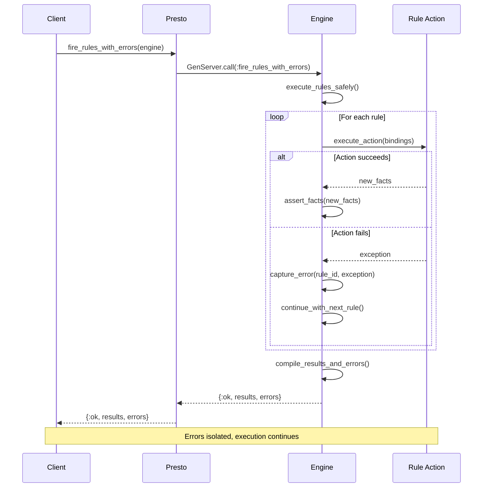

# Presto API Design Specification

## Design Philosophy

The Presto API follows Elixir conventions and the "Best Simple System for Now" (BSSN) principle:

- **Start Simple**: Core functionality first, advanced features later
- **Elixir Idiomatic**: Follow OTP patterns and Elixir naming conventions
- **Process-Safe**: All operations safe for concurrent access
- **Explicit Errors**: Clear error handling with `{:ok, result}` | `{:error, reason}` patterns
- **Simplified API**: Direct batch operations without intermediate batch objects

## Core API

### Engine Management

#### Engine Lifecycle Overview



#### Starting an Engine

```elixir
# Simple start with no options
{:ok, engine} = Presto.start_engine()

# Start with options (currently no options supported)
{:ok, engine} = Presto.start_engine([])

# Start supervised
children = [
  {Presto.RuleEngine, []}
]
Supervisor.start_link(children, strategy: :one_for_one)
```

#### Engine Operations

```elixir
# Stop engine
:ok = Presto.stop_engine(engine)

# Get engine statistics
%{
  total_facts: 1234,
  total_rules: 56,
  total_rule_firings: 789,
  last_execution_time: 1500, # microseconds
  fast_path_executions: 45,
  rete_network_executions: 11,
  alpha_nodes_saved_by_sharing: 12
} = Presto.get_engine_statistics(engine)
```

### Rule Definition

#### Rule Lifecycle



#### Rule Structure

The Presto.Rule module provides helper functions for creating well-formed rules:

```elixir
# Basic rule using Presto.Rule helper
rule = Presto.Rule.new(
  :adult_rule,
  [
    {:person, :name, :age},             # Pattern: bind variables
    {:age, :>, 18}                      # Test: age must be > 18
  ],
  fn bindings ->                        # Function taking bindings map
    [{:adult, bindings[:name]}]         # Return list of new facts
  end
)

# Rule with priority
rule_with_priority = Presto.Rule.new(
  :high_priority_rule,
  conditions,
  action_fn,
  priority: 100
)

# Complex rule with multiple conditions
rule_with_function = Presto.Rule.new(
  :complex_action,
  [
    {:person, :name, :age},
    {:employment, :name, :company},
    {:age, :>, 25}
  ],
  fn bindings -> 
    name = bindings[:name]
    company = bindings[:company]
    [{:senior_employee, name, company}]
  end
)

# Raw map structure still supported
rule_map = %{
  id: :legacy_rule,
  conditions: [{:person, :name, :age}, {:age, :>, 18}],
  action: fn bindings -> [{:adult, bindings[:name]}] end,
  priority: 10
}
```

#### Aggregation Rules

Presto supports RETE-native aggregations for efficient computation over groups of facts:

```elixir
# Sum aggregation by group
sum_rule = Presto.Rule.aggregation(
  :weekly_hours,
  [{:shift_segment, :id, :data}],       # Conditions to match
  [:employee_id, :week],                # Group by fields
  :sum,                                 # Aggregate function
  :hours                                # Field to aggregate
)

# Count aggregation with custom output
count_rule = Presto.Rule.aggregation(
  :department_shift_count,
  [{:shift, :id, :data}],
  [:department],
  :count,
  nil,                                  # No field needed for count
  output: {:dept_shifts, :department, :count}
)

# Supported aggregate functions: :sum, :count, :avg, :min, :max, :collect
avg_rule = Presto.Rule.aggregation(
  :avg_salary_by_dept,
  [{:employee, :id, :data}],
  [:department],
  :avg,
  :salary
)
```

#### Presto.Rule Helper Functions

The Presto.Rule module provides additional helper functions for building conditions:

```elixir
# Pattern helper - creates fact patterns
pattern = Presto.Rule.pattern(:person, [:name, :age])
# => {:person, :name, :age}

# Test helper - creates test conditions  
test = Presto.Rule.test(:age, :>, 18)
# => {:age, :>, 18}

# Using helpers in rule construction
rule = Presto.Rule.new(
  :adult_employee,
  [
    Presto.Rule.pattern(:person, [:name, :age]),
    Presto.Rule.pattern(:employment, [:name, :company]),
    Presto.Rule.test(:age, :>=, 18)
  ],
  fn bindings ->
    [{:adult_employee, bindings[:name], bindings[:company]}]
  end
)

# Rule validation
case Presto.Rule.validate(rule) do
  :ok -> 
    IO.puts("Rule is valid")
  {:error, reason} ->
    IO.puts("Rule validation failed: #{reason}")
end
```

#### Rule Management



```elixir
# Add single rule to running engine
:ok = Presto.add_rule(engine, rule)

# Add multiple rules at once (simplified batch operation)
rules = [
  Presto.Rule.new(:rule1, conditions1, action1),
  Presto.Rule.new(:rule2, conditions2, action2),
  Presto.Rule.aggregation(:agg_rule, patterns, [:group_field], :sum, :value_field)
]
:ok = Presto.add_rules(engine, rules)

# Remove rule
:ok = Presto.remove_rule(engine, :adult_rule)

# Get all rules
rules = Presto.get_rules(engine)
# Returns: %{adult_rule: %{id: :adult_rule, conditions: [...], ...}}
```

### Fact Management

#### Fact Lifecycle and Working Memory



#### Asserting Facts

```elixir
# Assert single fact
:ok = Presto.assert_fact(engine, {:person, "John", 25})

# Facts are tuples representing structured information
:ok = Presto.assert_fact(engine, {:employment, "John", "TechCorp"})
:ok = Presto.assert_fact(engine, {:order, "ORDER-123", 150})

# Assert multiple facts at once (simplified batch operation)
facts = [
  {:person, "Alice", 25},
  {:person, "Bob", 30},
  {:employment, "Alice", "TechCorp"},
  {:employment, "Bob", "StartupInc"}
]
:ok = Presto.assert_facts(engine, facts)
```

#### Retracting Facts

```elixir
# Retract specific fact (exact match required)
:ok = Presto.retract_fact(engine, {:person, "John", 25})
```

#### Querying Facts

```elixir
# Get all facts currently in working memory
facts = Presto.get_facts(engine)
# Returns: [{:person, "John", 25}, {:employment, "John", "TechCorp"}, ...]

# Clear all facts
:ok = Presto.clear_facts(engine)
```

### Rule Execution

#### Rule Execution Flow



#### Basic Execution

```elixir
# Execute all applicable rules
results = Presto.fire_rules(engine)
# Returns: [{:adult, "John"}, {:senior_employee, "John", "TechCorp"}]

# Execute with options
results = Presto.fire_rules(engine, concurrent: true)        # Parallel execution
results = Presto.fire_rules(engine, auto_chain: true)       # Automatic rule chaining
```

### Performance Monitoring

#### Rule Statistics

```elixir
# Get execution statistics for each rule
%{
  adult_rule: %{
    executions: 45,
    total_time: 1500,      # microseconds
    average_time: 33,      # microseconds
    facts_processed: 120,
    strategy_used: :fast_path,
    complexity: :simple
  },
  senior_rule: %{
    executions: 12,
    total_time: 890,
    average_time: 74,
    facts_processed: 36,
    strategy_used: :rete_network,
    complexity: :moderate
  }
} = Presto.get_rule_statistics(engine)
```

#### Engine Statistics

```elixir
# Get overall engine performance metrics
%{
  total_facts: 1234,
  total_rules: 56,
  total_rule_firings: 789,
  last_execution_time: 1500,
  fast_path_executions: 45,         # Rules executed via fast-path optimisation
  rete_network_executions: 11,      # Rules executed via full RETE network
  alpha_nodes_saved_by_sharing: 12  # Optimization metric
} = Presto.get_engine_statistics(engine)
```

## Advanced Features

### Simplified Batch Operations

The API provides direct batch operations without requiring intermediate batch objects:

```elixir
# Batch assert facts - more efficient than individual assertions
facts = [
  {:person, "Alice", 25},
  {:person, "Bob", 30},
  {:employment, "Alice", "TechCorp"},
  {:employment, "Bob", "StartupInc"},
  {:shift_segment, "seg1", %{employee_id: "Alice", week: 1, hours: 8}},
  {:shift_segment, "seg2", %{employee_id: "Bob", week: 1, hours: 10}}
]
:ok = Presto.assert_facts(engine, facts)

# Batch add rules - including aggregation rules
rules = [
  Presto.Rule.new(:adult_rule, adult_conditions, adult_action),
  Presto.Rule.new(:senior_rule, senior_conditions, senior_action),
  Presto.Rule.aggregation(:weekly_hours, hour_conditions, [:employee_id, :week], :sum, :hours)
]
:ok = Presto.add_rules(engine, rules)

# Operations are executed atomically - if any fail, none are applied
case Presto.add_rules(engine, rules) do
  :ok -> 
    IO.puts("All rules added successfully")
  {:error, reason} ->
    IO.puts("Failed to add rules: #{inspect(reason)}")
end
```

### Incremental Processing

#### Incremental Execution Strategy



For performance-critical applications processing continuous fact streams:

```elixir
# Fire only rules affected by facts added since last incremental execution
incremental_results = Presto.RuleEngine.fire_rules_incremental(engine)
```

### Error Handling in Rule Execution

```elixir
# Execute rules with detailed error reporting
{:ok, results, errors} = Presto.RuleEngine.fire_rules_with_errors(engine)

# errors format: [{:error, rule_id, exception}, ...]
```

### Rule Analysis and Optimization

#### Optimization Decision Tree



```elixir
# Analyze individual rule complexity and strategy
analysis = Presto.RuleEngine.analyse_rule(engine, :adult_rule)
# Returns: %{strategy: :fast_path, complexity: :simple, ...}

# Analyze entire rule set
rule_set_analysis = Presto.RuleEngine.analyse_rule_set(engine)

# Configure optimisation settings
:ok = Presto.RuleEngine.configure_optimisation(engine, [
  enable_fast_path: true,
  enable_alpha_sharing: true,
  enable_rule_batching: true,
  fast_path_threshold: 2
])

# Get current optimisation configuration
config = Presto.RuleEngine.get_optimisation_config(engine)
```

### Execution Order Tracking

```elixir
# Get the order in which rules were executed in the last cycle
execution_order = Presto.RuleEngine.get_last_execution_order(engine)
# Returns: [:high_priority_rule, :medium_priority_rule, :low_priority_rule]
```

## Error Handling

### Error Handling Flow



### Error Propagation and Recovery



### Common Error Patterns

```elixir
# Rule definition errors - using Presto.Rule helpers reduce these
{:error, "Rule must be a map"} = Presto.add_rule(engine, "invalid")
{:error, "Rule is missing required field: id"} = Presto.add_rule(engine, %{})
{:error, "Rule 'string_id': id must be an atom"} = Presto.add_rule(engine, %{id: "string_id", conditions: [], action: fn _ -> [] end})
{:error, "Rule conditions must be a list"} = Presto.add_rule(engine, %{id: :test, conditions: :invalid, action: fn _ -> [] end})
{:error, "Rule action must be a function"} = Presto.add_rule(engine, %{id: :test, conditions: [], action: "invalid"})

# Aggregation rule errors
{:error, "Aggregation rule missing required fields: [:group_by, :aggregate, :output]"} = 
  Presto.add_rule(engine, %{id: :bad_agg, type: :aggregation, conditions: []})
{:error, "Unknown aggregate function: :invalid"} = 
  Presto.Rule.aggregation(:bad_rule, [], [], :invalid, nil)

# Batch operation errors
{:error, reason} = Presto.add_rules(engine, [valid_rule, invalid_rule])
# Returns error for first invalid rule encountered

# Engine state errors
** (EXIT) Process not alive - engine process has stopped
```

### Error Recovery

```elixir
# Graceful error handling
case Presto.add_rule(engine, rule) do
  :ok -> 
    Logger.info("Rule added successfully")
  {:error, reason} ->
    Logger.warning("Failed to add rule: #{inspect(reason)}")
    :error
end

# Rule execution with error isolation
{:ok, results, errors} = Presto.RuleEngine.fire_rules_with_errors(engine)
unless Enum.empty?(errors) do
  Logger.error("Rule execution errors: #{inspect(errors)}")
end
```

## Rule Engine Configuration

### Engine Configuration

Currently, the engine has minimal configuration options. Optimization settings can be configured at runtime:

```elixir
# Default optimisation configuration
default_config = %{
  enable_fast_path: false,           # Fast-path execution for simple rules
  enable_alpha_sharing: true,        # Share alpha nodes between rules
  enable_rule_batching: true,        # Batch rule execution for efficiency
  fast_path_threshold: 2,            # Max conditions for fast-path eligibility
  sharing_threshold: 2               # Min rules sharing pattern for alpha node sharing
}

# Update optimisation settings
Presto.RuleEngine.configure_optimisation(engine, [
  enable_fast_path: true,
  fast_path_threshold: 3
])
```

## Implementation Notes

### Rule Execution Strategy

The engine automatically chooses between two execution strategies:

1. **Fast-Path Execution**: For simple rules (≤ 2 conditions), bypasses full RETE network
2. **RETE Network Execution**: For complex rules, uses full alpha/beta network processing

### Fact Lineage Tracking

The engine tracks fact derivation for incremental processing:

- Input facts: Facts directly asserted by users
- Derived facts: Facts produced by rule execution
- Generation numbers: Track fact creation order
- Lineage relationships: Track which facts derived from which

### Performance Characteristics

```mermaid
flowchart LR
    subgraph "Execution Strategies"
        A[Fact Assertion] --> B{Rule Type}
        B -->|Simple ≤2 conditions| C[Fast Path O(F)]
        B -->|Complex >2 conditions| D[RETE Network O(F×P)]
        B -->|Aggregation| E[RETE Aggregation O(F×G)]
        
        C --> F[Direct Pattern Match]
        D --> G[Alpha/Beta Node Traversal]
        E --> H[Incremental Aggregate Update]
        
        F --> I[Execute Action]
        G --> J[Shared Alpha Nodes]
        H --> K[Update Aggregate Values]
        
        J --> I
        I --> L[Assert New Facts]
        K --> M[Update Aggregate Facts]
    end
    
    subgraph "Optimization Benefits"
        N[Alpha Node Sharing] --> O[Reduced Memory O(N)]
        P[Fast Path Execution] --> Q[Lower Latency O(1)]
        R[RETE Aggregations] --> S[Incremental Updates O(G)]
        T[Batch Operations] --> U[Better Throughput]
    end
    
    style C fill:#c8e6c9
    style D fill:#fff3e0
    style E fill:#fff3e0
    style O fill:#e1f5fe
    style Q fill:#e1f5fe
    style S fill:#e1f5fe
    style U fill:#e1f5fe
```

- **Fact Assertion**: O(1) for most cases, O(R) where R = rules matching fact type
- **Rule Execution**: O(F) for fast-path rules, O(F×P) for RETE rules where F=facts, P=patterns
- **Aggregation Rules**: O(F×G) where G = number of groups, with incremental updates
- **Memory Usage**: Linear with fact count, shared alpha nodes reduce rule network size
- **Batch Operations**: Reduced overhead for multiple facts/rules

This API provides a solid foundation for building rules engines in Elixir, balancing simplicity for basic use cases with performance optimisations and advanced features like RETE-native aggregations for production scenarios.

## Recent Enhancements

The following features have been implemented with the new simplified API:

- **✅ RETE-native aggregations**: Efficient sum, count, avg, min, max, collect operations
- **✅ Simplified batch operations**: Direct `assert_facts/2` and `add_rules/2` without batch objects  
- **✅ Rule helper functions**: `Presto.Rule.new/4`, `Presto.Rule.aggregation/6`, validation
- **✅ Improved error handling**: Clear validation messages and atomic batch operations

## Future Considerations

The following features are planned for future versions but not currently implemented:

- **Pattern-based fact queries**: Query facts by partial patterns
- **Rule enable/disable**: Temporarily enable or disable specific rules
- **Event subscription**: Subscribe to rule firing and fact assertion events
- **Network introspection**: Examine internal RETE network structure for debugging
- **Health checks**: Engine health monitoring and diagnostics
- **Hot rule updates**: Modify rule definitions without engine restart
- **Complex pattern matching**: Nested patterns and advanced guards
- **Rule templates**: Reusable rule generation patterns
- **Additional aggregation functions**: Custom aggregate functions and windowing