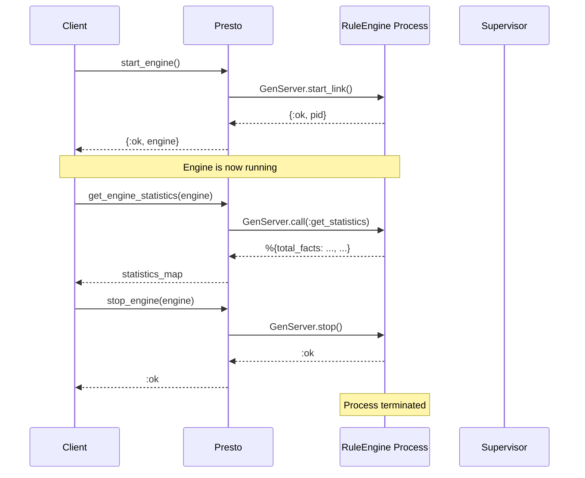
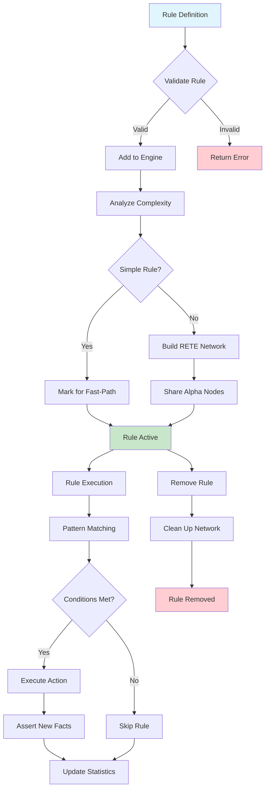
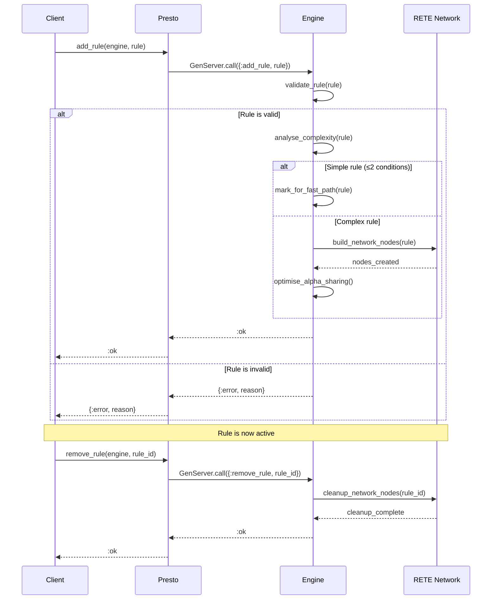
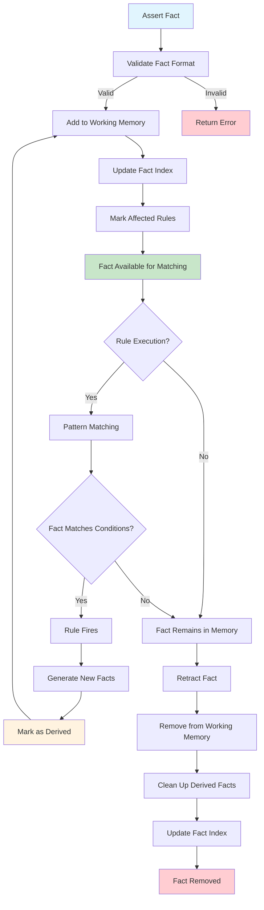
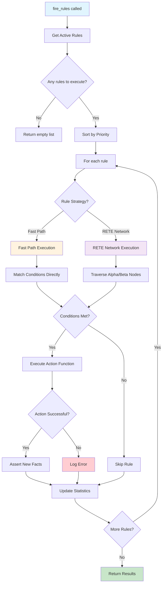
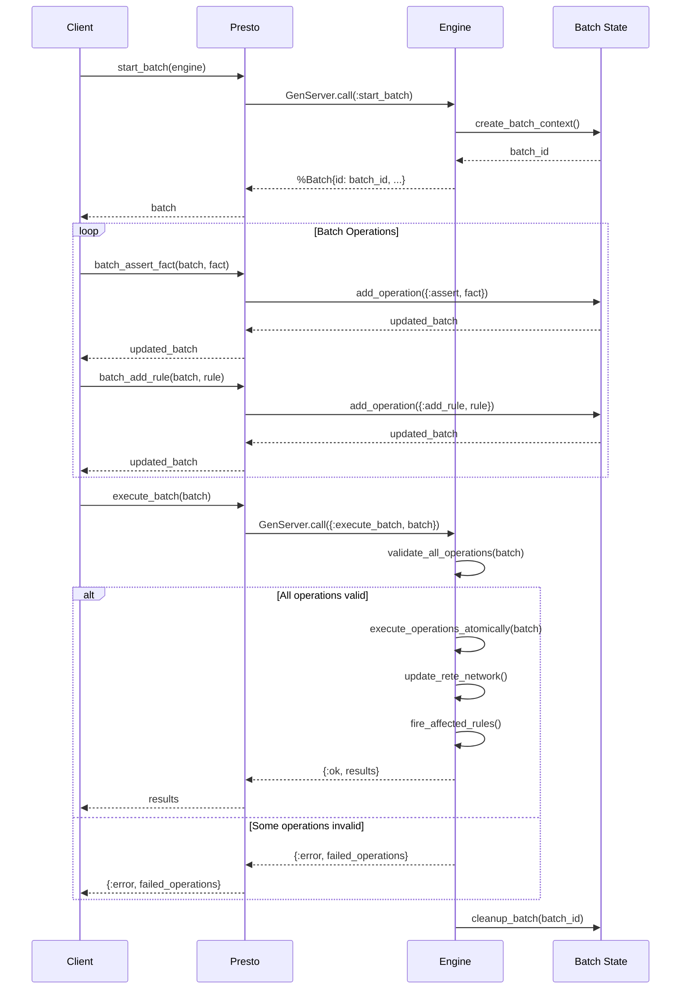
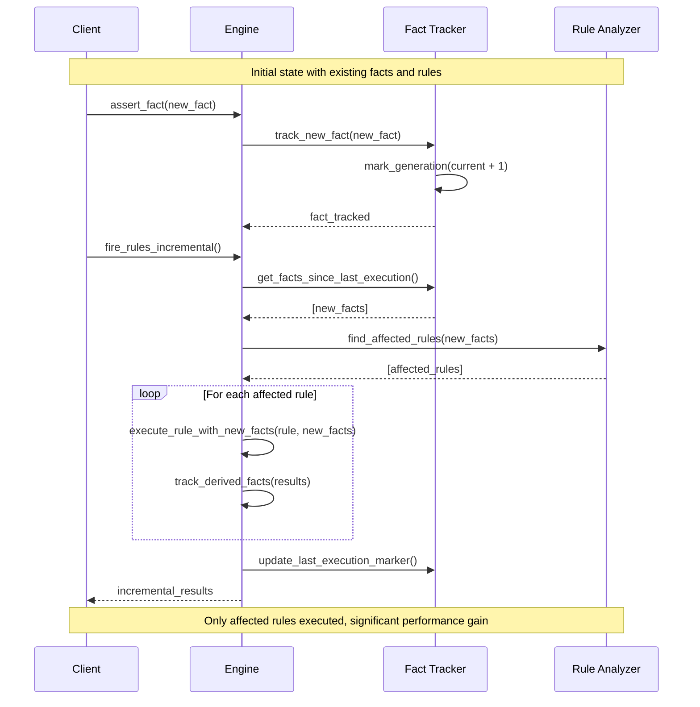
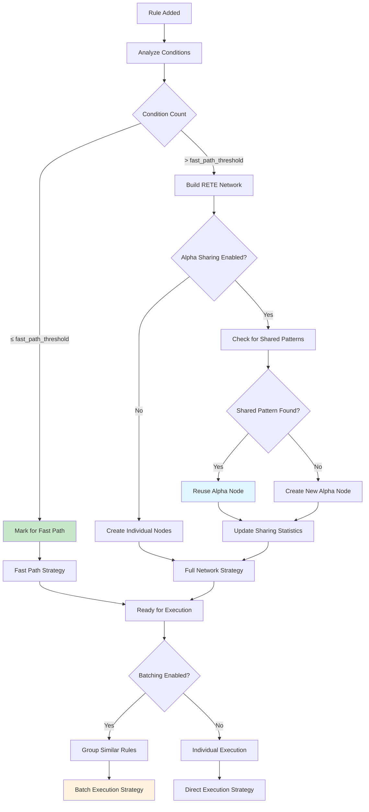
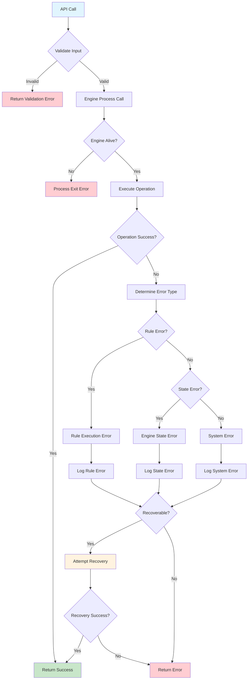
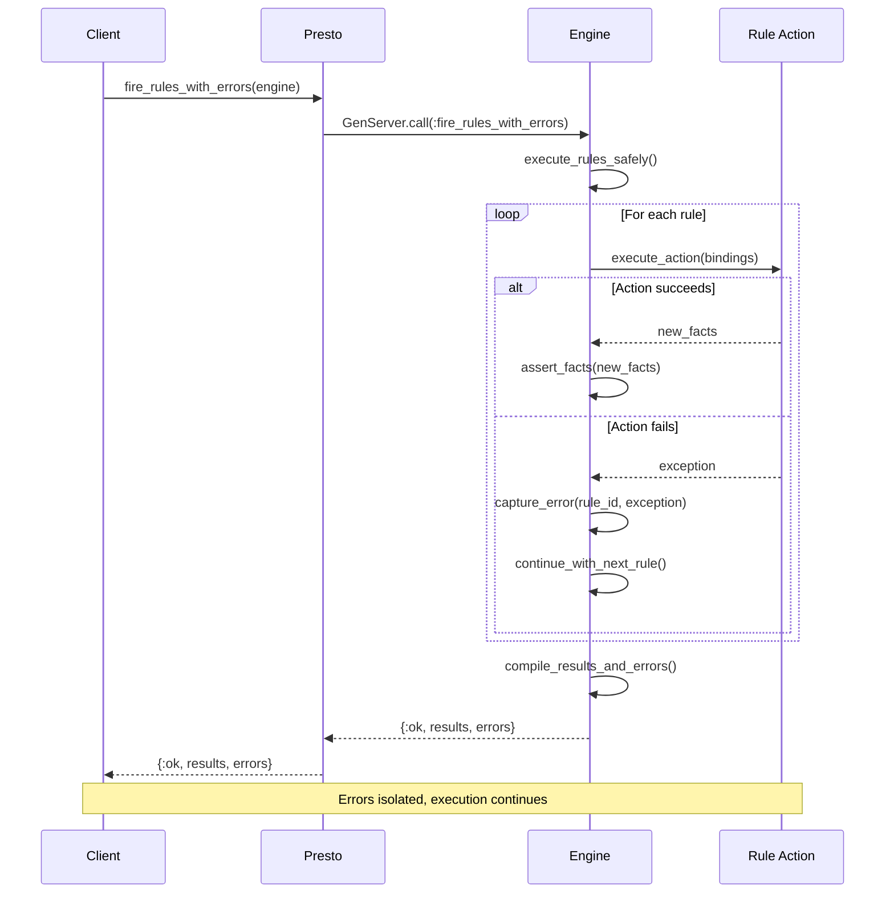

# Presto API Design Specification

## Design Philosophy

The Presto API follows Elixir conventions and the "Best Simple System for Now" (BSSN) principle:

- **Start Simple**: Core functionality first, advanced features later
- **Elixir Idiomatic**: Follow OTP patterns and Elixir naming conventions
- **Process-Safe**: All operations safe for concurrent access
- **Explicit Errors**: Clear error handling with `{:ok, result}` | `{:error, reason}` patterns

## Core API

### Engine Management

#### Engine Lifecycle Overview



#### Starting an Engine

```elixir
# Simple start with no options
{:ok, engine} = Presto.start_engine()

# Start with options (currently no options supported)
{:ok, engine} = Presto.start_engine([])

# Start supervised
children = [
  {Presto.RuleEngine, []}
]
Supervisor.start_link(children, strategy: :one_for_one)
```

#### Engine Operations

```elixir
# Stop engine
:ok = Presto.stop_engine(engine)

# Get engine statistics
%{
  total_facts: 1234,
  total_rules: 56,
  total_rule_firings: 789,
  last_execution_time: 1500, # microseconds
  fast_path_executions: 45,
  rete_network_executions: 11,
  alpha_nodes_saved_by_sharing: 12
} = Presto.get_engine_statistics(engine)
```

### Rule Definition

#### Rule Lifecycle



#### Rule Structure

```elixir
# Basic rule definition
rule = %{
  id: :adult_rule,                      # Required: unique atom identifier
  conditions: [                         # Required: list of conditions
    {:person, :name, :age},             # Pattern: bind variables
    {:age, :>, 18}                      # Test: age must be > 18
  ],
  action: fn bindings ->                # Required: function taking bindings map
    [{:adult, bindings[:name]}]         # Return list of new facts
  end,
  priority: 10                          # Optional: higher priority = earlier execution
}

# Action as anonymous function with explicit bindings
rule_with_function = %{
  id: :complex_action,
  conditions: [
    {:person, :name, :age},
    {:employment, :name, :company},
    {:age, :>, 25}
  ],
  action: fn bindings -> 
    name = bindings[:name]
    company = bindings[:company]
    [{:senior_employee, name, company}]
  end
}
```

#### Rule Management



```elixir
# Add single rule to running engine
:ok = Presto.add_rule(engine, rule)

# Remove rule
:ok = Presto.remove_rule(engine, :adult_rule)

# Get all rules
rules = Presto.get_rules(engine)
# Returns: %{adult_rule: %{id: :adult_rule, conditions: [...], ...}}
```

### Fact Management

#### Fact Lifecycle and Working Memory



#### Asserting Facts

```elixir
# Assert single fact
:ok = Presto.assert_fact(engine, {:person, "John", 25})

# Facts are tuples representing structured information
:ok = Presto.assert_fact(engine, {:employment, "John", "TechCorp"})
:ok = Presto.assert_fact(engine, {:order, "ORDER-123", 150})
```

#### Retracting Facts

```elixir
# Retract specific fact (exact match required)
:ok = Presto.retract_fact(engine, {:person, "John", 25})
```

#### Querying Facts

```elixir
# Get all facts currently in working memory
facts = Presto.get_facts(engine)
# Returns: [{:person, "John", 25}, {:employment, "John", "TechCorp"}, ...]

# Clear all facts
:ok = Presto.clear_facts(engine)
```

### Rule Execution

#### Rule Execution Flow



#### Basic Execution

```elixir
# Execute all applicable rules
results = Presto.fire_rules(engine)
# Returns: [{:adult, "John"}, {:senior_employee, "John", "TechCorp"}]

# Execute with options
results = Presto.fire_rules(engine, concurrent: true)        # Parallel execution
results = Presto.fire_rules(engine, auto_chain: true)       # Automatic rule chaining
```

### Performance Monitoring

#### Rule Statistics

```elixir
# Get execution statistics for each rule
%{
  adult_rule: %{
    executions: 45,
    total_time: 1500,      # microseconds
    average_time: 33,      # microseconds
    facts_processed: 120,
    strategy_used: :fast_path,
    complexity: :simple
  },
  senior_rule: %{
    executions: 12,
    total_time: 890,
    average_time: 74,
    facts_processed: 36,
    strategy_used: :rete_network,
    complexity: :moderate
  }
} = Presto.get_rule_statistics(engine)
```

#### Engine Statistics

```elixir
# Get overall engine performance metrics
%{
  total_facts: 1234,
  total_rules: 56,
  total_rule_firings: 789,
  last_execution_time: 1500,
  fast_path_executions: 45,         # Rules executed via fast-path optimisation
  rete_network_executions: 11,      # Rules executed via full RETE network
  alpha_nodes_saved_by_sharing: 12  # Optimization metric
} = Presto.get_engine_statistics(engine)
```

## Advanced Features

### Batch Operations

#### Batch Processing Sequence



Batch operations provide efficient bulk processing of multiple facts and rules:

```elixir
# Start a batch operation
batch = Presto.start_batch(engine)

# Add multiple operations to the batch
batch = batch
  |> Presto.batch_assert_fact({:person, "Alice", 30})
  |> Presto.batch_assert_fact({:person, "Bob", 25})
  |> Presto.batch_retract_fact({:old_person, "Charlie", 65})
  |> Presto.batch_add_rule(new_rule)

# Execute all batched operations at once
results = Presto.execute_batch(batch)
```

### Incremental Processing

#### Incremental Execution Strategy



For performance-critical applications processing continuous fact streams:

```elixir
# Fire only rules affected by facts added since last incremental execution
incremental_results = Presto.RuleEngine.fire_rules_incremental(engine)
```

### Error Handling in Rule Execution

```elixir
# Execute rules with detailed error reporting
{:ok, results, errors} = Presto.RuleEngine.fire_rules_with_errors(engine)

# errors format: [{:error, rule_id, exception}, ...]
```

### Rule Analysis and Optimization

#### Optimization Decision Tree



```elixir
# Analyze individual rule complexity and strategy
analysis = Presto.RuleEngine.analyse_rule(engine, :adult_rule)
# Returns: %{strategy: :fast_path, complexity: :simple, ...}

# Analyze entire rule set
rule_set_analysis = Presto.RuleEngine.analyse_rule_set(engine)

# Configure optimisation settings
:ok = Presto.RuleEngine.configure_optimisation(engine, [
  enable_fast_path: true,
  enable_alpha_sharing: true,
  enable_rule_batching: true,
  fast_path_threshold: 2
])

# Get current optimisation configuration
config = Presto.RuleEngine.get_optimisation_config(engine)
```

### Execution Order Tracking

```elixir
# Get the order in which rules were executed in the last cycle
execution_order = Presto.RuleEngine.get_last_execution_order(engine)
# Returns: [:high_priority_rule, :medium_priority_rule, :low_priority_rule]
```

## Error Handling

### Error Handling Flow



### Error Propagation and Recovery



### Common Error Patterns

```elixir
# Rule definition errors
{:error, :rule_must_be_map} = Presto.add_rule(engine, "invalid")
{:error, :missing_required_fields} = Presto.add_rule(engine, %{})
{:error, :id_must_be_atom} = Presto.add_rule(engine, %{id: "string_id", conditions: [], action: fn _ -> [] end})
{:error, :conditions_must_be_list} = Presto.add_rule(engine, %{id: :test, conditions: :invalid, action: fn _ -> [] end})
{:error, :action_must_be_function} = Presto.add_rule(engine, %{id: :test, conditions: [], action: "invalid"})

# Engine state errors
** (EXIT) Process not alive - engine process has stopped
```

### Error Recovery

```elixir
# Graceful error handling
case Presto.add_rule(engine, rule) do
  :ok -> 
    Logger.info("Rule added successfully")
  {:error, reason} ->
    Logger.warning("Failed to add rule: #{inspect(reason)}")
    :error
end

# Rule execution with error isolation
{:ok, results, errors} = Presto.RuleEngine.fire_rules_with_errors(engine)
unless Enum.empty?(errors) do
  Logger.error("Rule execution errors: #{inspect(errors)}")
end
```

## Rule Engine Configuration

### Engine Configuration

Currently, the engine has minimal configuration options. Optimization settings can be configured at runtime:

```elixir
# Default optimisation configuration
default_config = %{
  enable_fast_path: false,           # Fast-path execution for simple rules
  enable_alpha_sharing: true,        # Share alpha nodes between rules
  enable_rule_batching: true,        # Batch rule execution for efficiency
  fast_path_threshold: 2,            # Max conditions for fast-path eligibility
  sharing_threshold: 2               # Min rules sharing pattern for alpha node sharing
}

# Update optimisation settings
Presto.RuleEngine.configure_optimisation(engine, [
  enable_fast_path: true,
  fast_path_threshold: 3
])
```

## Implementation Notes

### Rule Execution Strategy

The engine automatically chooses between two execution strategies:

1. **Fast-Path Execution**: For simple rules (≤ 2 conditions), bypasses full RETE network
2. **RETE Network Execution**: For complex rules, uses full alpha/beta network processing

### Fact Lineage Tracking

The engine tracks fact derivation for incremental processing:

- Input facts: Facts directly asserted by users
- Derived facts: Facts produced by rule execution
- Generation numbers: Track fact creation order
- Lineage relationships: Track which facts derived from which

### Performance Characteristics

```mermaid
flowchart LR
    subgraph "Execution Strategies"
        A[Fact Assertion] --> B{Rule Complexity}
        B -->|Simple ≤2 conditions| C[Fast Path O(F)]
        B -->|Complex >2 conditions| D[RETE Network O(F×P)]
        
        C --> E[Direct Pattern Match]
        D --> F[Alpha/Beta Node Traversal]
        
        E --> G[Execute Action]
        F --> H[Shared Alpha Nodes]
        H --> G
        
        G --> I[Assert New Facts]
    end
    
    subgraph "Optimization Benefits"
        J[Alpha Node Sharing] --> K[Reduced Memory O(N)]
        L[Fast Path Execution] --> M[Lower Latency O(1)]
        N[Rule Batching] --> O[Better Throughput]
    end
    
    style C fill:#c8e6c9
    style D fill:#fff3e0
    style K fill:#e1f5fe
    style M fill:#e1f5fe
    style O fill:#e1f5fe
```

- **Fact Assertion**: O(1) for most cases, O(R) where R = rules matching fact type
- **Rule Execution**: O(F) for fast-path rules, O(F×P) for RETE rules where F=facts, P=patterns
- **Memory Usage**: Linear with fact count, shared alpha nodes reduce rule network size

This API provides a solid foundation for building rules engines in Elixir, balancing simplicity for basic use cases with performance optimisations for production scenarios.

## Future Considerations

The following features are planned for future versions but not currently implemented:

- **Pattern-based fact queries**: Query facts by partial patterns
- **Rule enable/disable**: Temporarily enable or disable specific rules
- **Event subscription**: Subscribe to rule firing and fact assertion events
- **Network introspection**: Examine internal RETE network structure for debugging
- **Health checks**: Engine health monitoring and diagnostics
- **Hot rule updates**: Modify rule definitions without engine restart
- **Complex pattern matching**: Nested patterns and advanced guards
- **Rule templates**: Reusable rule generation patterns