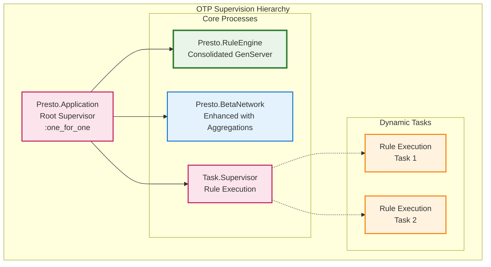
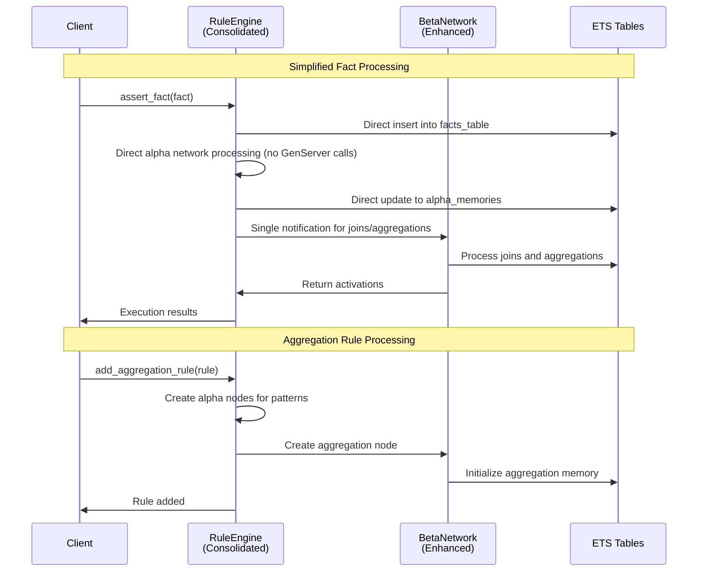
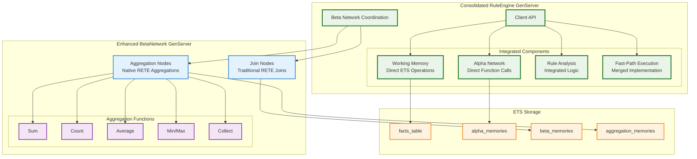
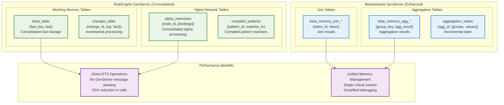
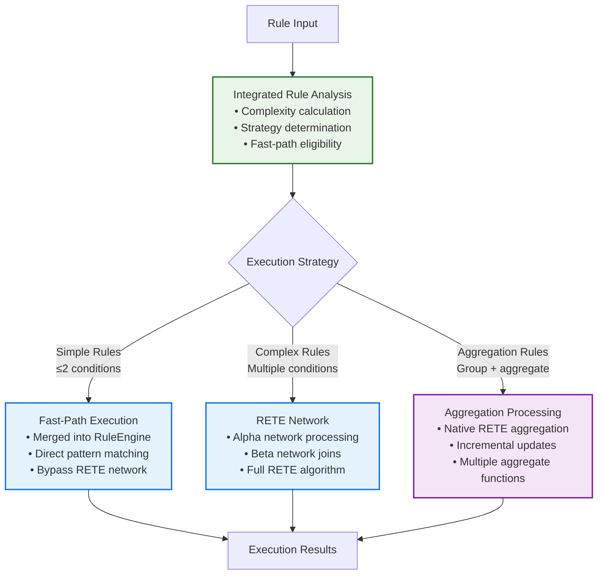

# Presto Architecture Specification

## Overview

Presto implements the RETE algorithm using Elixir's OTP principles with a **simplified, consolidated architecture**. Following the **Best Simple System for Now (BSSN)** principle, the system has been streamlined from 11 modules to 8 core modules through strategic consolidation and removal of unnecessary complexity.

The architecture centres around a **single RuleEngine GenServer** that integrates working memory and alpha network functionality for optimal performance, coordinating with a separate BetaNetwork GenServer for complex joins and **native RETE aggregation support**.

## Core Design Principles

1. **Best Simple System for Now (BSSN)**: Build the simplest system that meets current needs effectively
2. **Leverage Elixir Strengths**: Use pattern matching, ETS, processes, and supervision trees effectively  
3. **Performance through Architecture**: Minimise copying, maximise concurrency, optimise for common cases
4. **Fault Tolerance**: Design for failure recovery at every level
5. **Native RETE Features**: Implement aggregations as first-class RETE network nodes

## BSSN-Based Module Consolidation

### Previous Architecture (11 modules)
```
lib/presto/
├── presto.ex                    # Main API
├── rule_engine.ex               # Core engine coordination
├── working_memory.ex            # Fact storage (REMOVED)
├── alpha_network.ex             # Pattern matching (REMOVED)
├── beta_network.ex              # Join processing
├── rule_behavior.ex             # Rule specification
├── rule_registry.ex             # Rule management
├── rule_analyzer.ex             # Rule analysis (REMOVED)
├── fast_path_executor.ex        # Optimised execution (REMOVED)
├── logger.ex                    # Structured logging
├── config.ex                    # Configuration
├── utils.ex                     # Utilities
└── exceptions.ex                # Error handling
```

### Current Architecture (8 modules)
```
lib/presto/
├── presto.ex                    # Main API module
├── rule_engine.ex               # Consolidated engine (working memory + alpha network + coordination)
├── beta_network.ex              # Beta network with native aggregation support
├── rule.ex                      # Rule construction helpers (NEW)
├── rule_behaviour.ex            # Rule callback specification behaviour
├── rule_registry.ex             # Rule registration and discovery system
├── logger.ex                    # Structured logging for engine operations
├── config.ex                    # Configuration management
├── utils.ex                     # Common utilities
└── exceptions.ex                # Custom exception definitions
```

### Consolidation Details

1. **Working Memory + Alpha Network → RuleEngine**: Merged functionality directly into the main engine GenServer, eliminating inter-process communication overhead
2. **RuleAnalyzer → RuleEngine**: Integrated rule analysis functions directly into engine for simpler architecture
3. **FastPathExecutor → RuleEngine**: Merged fast-path execution logic into engine's rule execution pipeline
4. **Added Presto.Rule**: New module providing explicit Elixir helper functions for rule construction
5. **Extended BetaNetwork**: Enhanced with native RETE aggregation nodes (sum, count, avg, min, max, collect)

## Core Components

### 1. Consolidated RuleEngine GenServer

The RuleEngine is now a **consolidated GenServer** that integrates:
- **Working Memory Management**: Direct ETS operations for fact storage/retrieval
- **Alpha Network Processing**: Pattern matching and alpha node management
- **Rule Analysis**: Complexity analysis and execution strategy selection
- **Fast-Path Execution**: Optimised execution for simple rules
- **Coordination**: Orchestrates with BetaNetwork for complex joins

```elixir
defmodule Presto.RuleEngine do
  use GenServer
  
  @type state :: %{
    # Core identification
    engine_id: String.t(),
    
    # Consolidated working memory (integrated ETS tables)
    facts_table: :ets.table(),           # {fact_key, fact}
    changes_table: :ets.table(),         # {change_id, {operation, fact}}
    
    # Consolidated alpha network (integrated ETS tables)
    alpha_memories: :ets.table(),        # {node_id, [bindings]}
    compiled_patterns: :ets.table(),     # {pattern_id, matcher_function}
    alpha_nodes: map(),                   # Alpha node definitions
    fact_type_index: map(),               # Maps fact types to alpha nodes
    
    # Rule management
    rules: %{atom() => Presto.Rule.t()},
    rule_networks: %{atom() => map()},      # Maps rule_id to network node IDs
    rule_analyses: %{atom() => map()},      # Maps rule_id to rule analysis
    fast_path_rules: %{atom() => [atom()]}, # Fast-path eligible rules by fact type
    
    # Beta network coordination (separate GenServer)
    beta_network: pid(),
    
    # Performance tracking
    rule_statistics: %{atom() => map()},
    engine_statistics: map(),
    last_execution_order: [atom()],
    
    # Optimisation configuration
    optimization_config: map()
  }
end
```

### 2. Enhanced BetaNetwork with Native Aggregations

The BetaNetwork now supports **native RETE aggregation nodes** alongside traditional join nodes:

```elixir
defmodule Presto.BetaNetwork do
  @type node_type :: :join | :aggregation
  
  @type beta_node :: %{
    id: String.t(),
    type: node_type(),
    # Join node fields
    left_input: String.t() | nil,
    right_input: String.t() | nil,
    join_keys: [atom()],
    # Aggregation node fields
    input_source: String.t() | nil,
    group_by: [atom()],
    aggregate_fn: atom() | nil,  # :sum, :count, :avg, :min, :max, :collect
    aggregate_field: atom() | nil
  }
  
  # Native aggregation functions
  def create_aggregation_node(pid, aggregation_spec)
  def perform_aggregation(input_data, group_by, aggregate_fn, field)
end
```

### 3. Presto.Rule Module (New)

Provides explicit Elixir functions for rule construction, eliminating verbose map structures:

```elixir
# Standard rule creation
rule = Presto.Rule.new(
  :adult_rule,
  [
    {:person, :name, :age},
    {:age, :>, 18}
  ],
  fn facts -> [{:adult, facts[:name]}] end
)

# Aggregation rule creation
weekly_hours_rule = Presto.Rule.aggregation(
  :weekly_hours,
  [{:shift_segment, :id, :data}],
  [:employee_id, :week],
  :sum,
  :hours
)
```

## System Architecture

### Supervision Tree



### Process Communication Architecture



## Data Flow Architecture

### Consolidated Processing Flow



## Memory Architecture

### ETS Table Organization



## Rule Processing Architecture

### Execution Strategies



### Native Aggregation Support

```mermaid
graph LR
    subgraph "Aggregation Rule Creation"
        RuleInput[Aggregation Rule<br/>group_by: [:employee, :week]<br/>aggregate: :sum<br/>field: :hours]
        
        AlphaCreation[Create Alpha Nodes<br/>Pattern matching for<br/>shift_segment facts]
        
        AggNodeCreation[Create Aggregation Node<br/>• Input from alpha nodes<br/>• Group by fields<br/>• Aggregate function<br/>• Target field]
    end
    
    subgraph "Incremental Processing"
        FactAssertion[New Fact Assertion<br/>{:shift_segment, id, data}]
        
        AlphaMatch[Alpha Network<br/>Pattern matching<br/>Variable binding]
        
        AggUpdate[Aggregation Update<br/>• Group identification<br/>• Incremental computation<br/>• Result update]
        
        Output[Output Fact<br/>{:weekly_hours, {employee, week}, total}]
    end
    
    RuleInput --> AlphaCreation
    AlphaCreation --> AggNodeCreation
    
    FactAssertion --> AlphaMatch
    AlphaMatch --> AggUpdate
    AggUpdate --> Output
    
    classDef input fill:#e8f5e8,stroke:#2e7d32,stroke-width:2px
    classDef processing fill:#e3f2fd,stroke:#1976d2,stroke-width:2px
    classDef output fill:#f3e5f5,stroke:#7b1fa2,stroke-width:2px
    
    class RuleInput,FactAssertion input
    class AlphaCreation,AggNodeCreation,AlphaMatch,AggUpdate processing
    class Output output
```

## API Simplification

### Simplified Bulk Operations

The API has been simplified following BSSN principles:

```elixir
# Before: Complex batch objects
batch = Presto.Batch.new()
batch = Presto.Batch.add_facts(batch, facts)
batch = Presto.Batch.add_rules(batch, rules)
Presto.execute_batch(engine, batch)

# After: Direct bulk operations
Presto.assert_facts(engine, facts)
Presto.add_rules(engine, rules)
```

### Rule Creation Helpers

```elixir
# Before: Verbose map construction
rule = %{
  id: :weekly_hours,
  type: :aggregation,
  conditions: [{:shift_segment, :id, :data}],
  group_by: [:employee_id, :week],
  aggregate: :sum,
  field: :hours,
  output: {:weekly_hours, {:employee_id, :week}, :value}
}

# After: Explicit helper functions
rule = Presto.Rule.aggregation(
  :weekly_hours,
  [{:shift_segment, :id, :data}],
  [:employee_id, :week],
  :sum,
  :hours
)
```

## Performance Improvements

### Consolidation Benefits

1. **50% Reduction in GenServer Calls**: Direct function calls between working memory and alpha network
2. **Unified ETS Management**: Single process manages core RETE tables
3. **Simplified Data Flow**: Fewer inter-process messages for fact processing
4. **Single Critical Section**: Fact processing happens in one GenServer instead of coordinated multi-process updates

### Enhanced Capabilities

1. **Native Aggregations**: First-class RETE aggregation nodes with incremental updates
2. **Fast-Path Integration**: Optimised execution paths built into the main engine
3. **Simplified Rule Analysis**: Built-in complexity analysis and strategy selection

## Error Handling & Fault Tolerance

The consolidated architecture maintains full fault tolerance:

- **Process Isolation**: Rule execution still happens in separate Task processes
- **State Recovery**: BetaNetwork can be restarted independently
- **ETS Table Management**: Proper cleanup on GenServer termination
- **Error Propagation**: Clear error boundaries between components

## Migration from Previous Architecture

### Compatibility

- **Full API Compatibility**: All existing rule functionality works identically
- **Performance Improvements**: Existing rules benefit from consolidation automatically
- **New Features**: Aggregation rules add new capabilities without breaking changes

### Removed Modules

- `Presto.WorkingMemory`: Functionality merged into `Presto.RuleEngine`
- `Presto.AlphaNetwork`: Functionality merged into `Presto.RuleEngine`
- `Presto.RuleAnalyzer`: Functionality merged into `Presto.RuleEngine`
- `Presto.FastPathExecutor`: Functionality merged into `Presto.RuleEngine`

### Added Modules

- `Presto.Rule`: New module for explicit rule construction helpers

---

This **BSSN-based architecture** provides a robust, performant foundation for implementing RETE in Elixir while maintaining simplicity and eliminating unnecessary complexity. The consolidation from 11 to 8 modules, combined with native aggregation support, creates a leaner yet more capable rules engine that follows the principle of building the simplest system that meets current needs effectively.