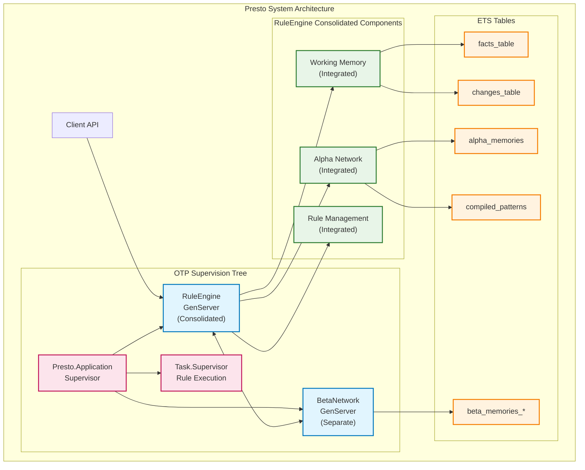
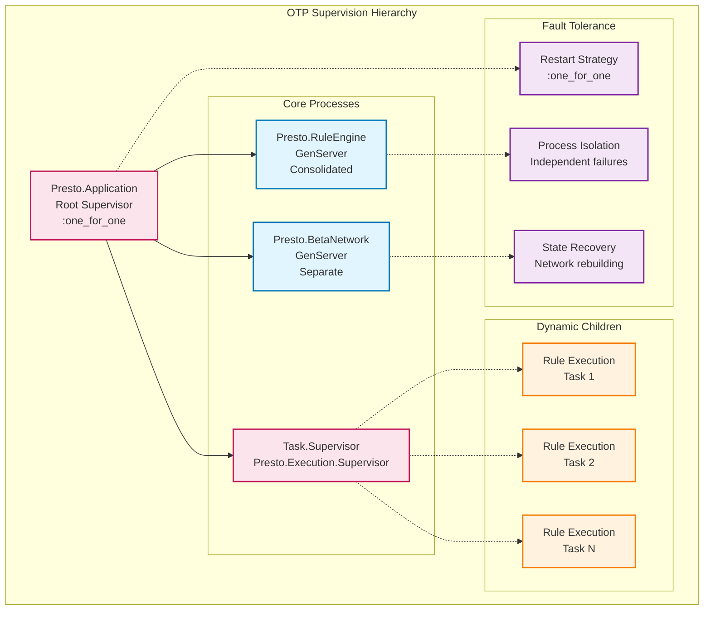
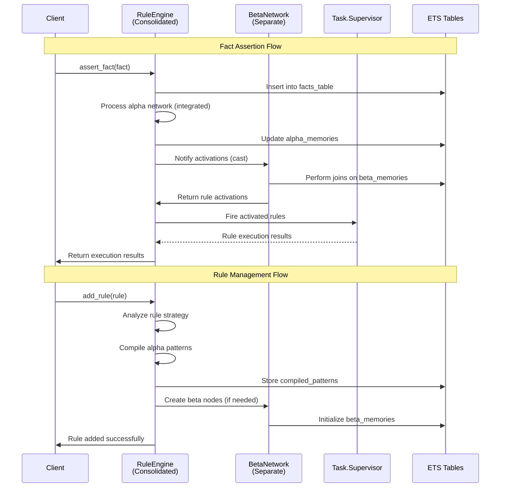
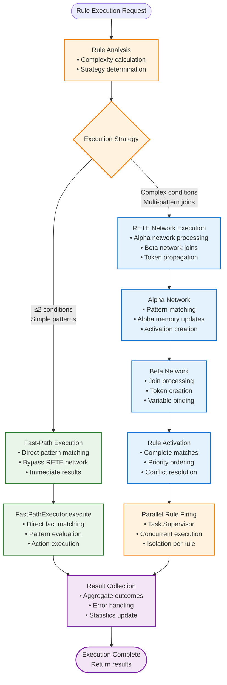
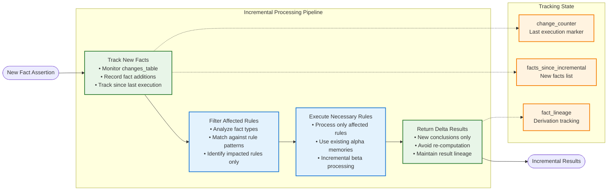
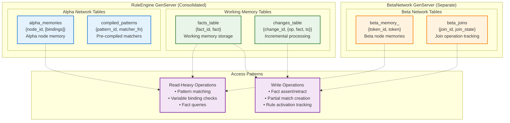
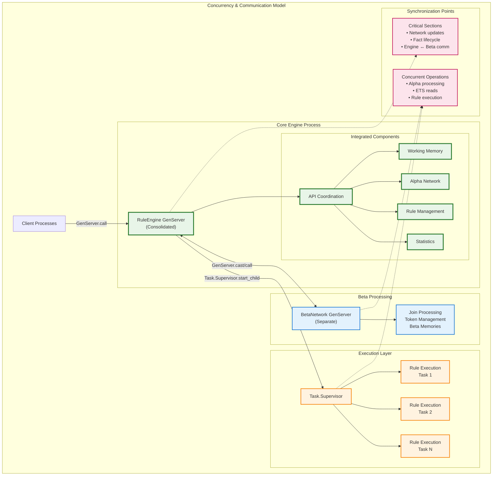
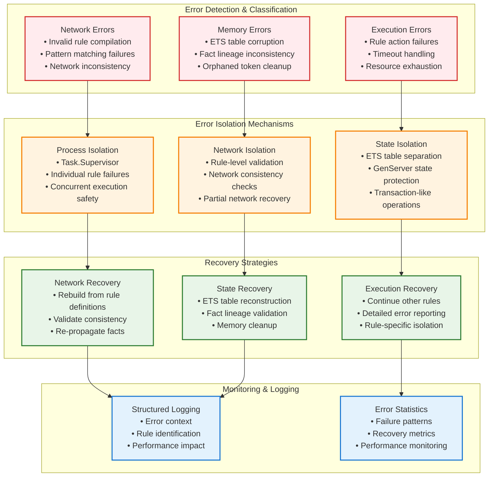
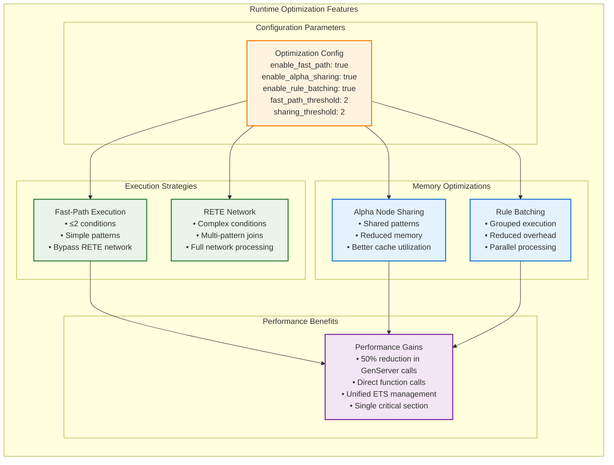

# Presto Architecture Specification

## Overview

Presto implements the RETE algorithm using Elixir's OTP principles with a **simplified, consolidated architecture**. The system uses a **single RuleEngine GenServer** that integrates working memory and alpha network functionality for optimal performance, coordinating with a separate BetaNetwork GenServer for complex joins.

This **consolidated architecture** eliminates inter-process communication overhead while maintaining the full power of the RETE algorithm, following the "Best Simple System for Now" (BSSN) principle.

## Core Design Principles

1. **Best Simple System for Now (BSSN)**: Start with the simplest implementation that meets current needs
2. **Leverage Elixir Strengths**: Use pattern matching, ETS, processes, and supervision trees effectively  
3. **Performance through Architecture**: Minimise copying, maximise concurrency, optimise for common cases
4. **Fault Tolerance**: Design for failure recovery at every level

## Module Structure

### Core Library Modules (Actual Implementation)

```
lib/presto/
├── presto.ex                    # Main API module
├── rule_engine.ex               # Core consolidated engine GenServer (working memory + alpha network + coordination)
├── beta_network.ex              # Beta network implementation (separate GenServer for complex joins)
├── rule_behaviour.ex            # Rule callback specification behaviour
├── rule_registry.ex             # Rule registration and discovery system
├── rule_analyser.ex             # Rule complexity analysis and strategy selection
├── fast_path_executor.ex        # Fast-path execution for simple rules
├── logger.ex                    # Structured logging for engine operations
├── config.ex                    # Configuration management
├── utils.ex                     # Common utilities
├── exceptions.ex                # Custom exception definitions
└── examples/                    # Rule examples
    ├── california_spike_break_rules.ex
    ├── compliance_rules.ex
    ├── overtime_rules.ex
    ├── payroll_rules.ex
    └── tronc_rules.ex
```

## Component Architecture

### System Overview



### 1. Supervision Tree



```elixir
defmodule Presto.Application do
  use Application
  
  def start(_type, _args) do
    children = [
      # Core consolidated engine process (handles coordination, working memory, and alpha network)
      {Presto.RuleEngine, []},
      
      # Beta network for complex joins (separate GenServer)
      {Presto.BetaNetwork, []},
      
      # Rule execution supervision (for parallel rule firing)
      {Task.Supervisor, name: Presto.Execution.Supervisor}
    ]
    
    Supervisor.start_link(children, strategy: :one_for_one)
  end
end
```

### 2. Core RuleEngine (Consolidated GenServer)

The RuleEngine is a **consolidated GenServer** that integrates working memory and alpha network functionality for optimal performance while maintaining clean separation with the beta network.

```elixir
defmodule Presto.RuleEngine do
  use GenServer
  
  @type state :: %{
    # Engine identification
    engine_id: String.t(),
    
    # Network structure with integrated alpha components
    rules: %{atom() => Presto.Rule.t()},
    rule_networks: %{atom() => map()},      # Maps rule_id to network node IDs
    rule_analyses: %{atom() => map()},      # Maps rule_id to rule analysis
    fast_path_rules: %{atom() => [atom()]}, # Fast-path eligible rules by fact type
    
    # Integrated working memory ETS tables (consolidated from WorkingMemory)
    facts_table: :ets.table(),           # {fact_id, fact}
    changes_table: :ets.table(),         # {change_id, {operation, fact}}
    
    # Integrated alpha network ETS tables (consolidated from AlphaNetwork)  
    alpha_memories: :ets.table(),        # {node_id, [bindings]}
    compiled_patterns: :ets.table(),     # {pattern_id, matcher_function}
    alpha_nodes: map(),                   # Alpha node definitions
    fact_type_index: map(),               # Maps fact types to alpha nodes
    
    # Beta network reference (separate GenServer for complex joins)
    beta_network: pid(),
    
    # Execution tracking
    last_execution_order: [atom()],
    
    # Statistics and monitoring
    rule_statistics: %{atom() => map()},
    engine_statistics: map(),
    
    # Optimization configuration
    optimisation_config: map(),
    
    # Incremental processing support
    tracking_changes: boolean(),
    change_counter: integer(),
    last_incremental_execution: integer(),
    facts_since_incremental: [tuple()],
    
    # Fact lineage tracking
    fact_lineage: map(),
    fact_generation: integer(),
    result_lineage: map()
  }
  
  # Client API - Core Engine Operations
  def start_link(opts \\ [])
  def add_rule(engine, rule)
  def remove_rule(engine, rule_id)
  def get_rules(engine)
  
  # Client API - Working Memory (consolidated from WorkingMemory GenServer)
  def assert_fact(engine, fact)
  def retract_fact(engine, fact)
  def get_facts(engine)
  def clear_facts(engine)
  
  # Client API - Rule Execution
  def fire_rules(engine, opts \\ [])
  def fire_rules_incremental(engine)
  def fire_rules_with_errors(engine)
  
  # Client API - Analysis and Optimization
  def analyse_rule(engine, rule_id)
  def analyse_rule_set(engine)
  def configure_optimisation(engine, opts)
  def get_optimisation_config(engine)
  
  # Statistics and Management
  def get_engine_statistics(engine)
  def get_rule_statistics(engine)
  def get_last_execution_order(engine)
  
  # Server callbacks
  def init(opts)
  def handle_call({:add_rule, rule}, _from, state)
  def handle_call({:assert_fact, fact}, _from, state)
  def handle_call({:fire_rules, opts}, _from, state)
  
  # Private consolidated functions (no inter-process communication)
  defp do_assert_fact(state, fact)                    # Working memory + alpha network
  defp do_retract_fact(state, fact)                   # Working memory + alpha network  
  defp alpha_process_fact_assertion(state, fact)      # Direct alpha network processing
  defp alpha_process_fact_retraction(state, fact)     # Direct alpha network processing
  defp alpha_add_to_memory(state, node_id, bindings)  # Direct ETS operations
  defp alpha_remove_from_memory(state, node_id, bindings) # Direct ETS operations
end
```

### 3. Beta Network (Separate GenServer)

The beta network remains a **separate GenServer** to handle complex multi-condition joins efficiently while communicating with the consolidated RuleEngine.

```elixir
defmodule Presto.BetaNetwork do
  use GenServer
  
  @moduledoc """
  Manages beta network - multi-condition joins (separate GenServer for performance)
  Communicates with consolidated RuleEngine for alpha memory access
  """
  
  @type state :: %{
    # Beta nodes and their memory tables
    beta_nodes: %{node_id() => Presto.BetaNode.t()},
    beta_memories: %{node_id() => :ets.table()},
    
    # Reference to consolidated RuleEngine for alpha memory access
    rule_engine: pid(),
    alpha_memories_table: :ets.table(),
    
    # Network structure
    network_topology: %{node_id() => [node_id()]},
    terminal_nodes: %{rule_id() => node_id()},
    
    # Statistics
    join_statistics: map()
  }
  
  # Client API
  def start_link(opts)
  def create_beta_node(server, left_input, right_input, join_conditions)
  def perform_joins(server, node_id, token_type, facts_or_tokens)
  def get_beta_memory(server, node_id)
  def process_alpha_changes(server)
  
  # Server callbacks
  def init(opts)
  def handle_call({:create_beta_node, params}, _from, state)
  def handle_call({:perform_joins, node_id, token_type, data}, _from, state)
  def handle_call({:get_beta_memory, node_id}, _from, state)
  
  # Private functions for join processing
  defp create_beta_memory(node_id)
  defp check_variable_consistency(bindings1, bindings2)
  defp process_cartesian_join(left_tokens, right_facts, join_key)
end
```

### 4. Rule Analysis and Optimization

```elixir
defmodule Presto.RuleAnalyzer do
  @moduledoc """
  Analyzes rules to determine optimal execution strategy
  """
  
  def analyse_rule(rule) do
    %{
      strategy: determine_execution_strategy(rule),
      complexity: calculate_complexity(rule),
      fact_types: extract_fact_types(rule),
      variable_count: count_variables(rule),
      condition_count: length(rule.conditions)
    }
  end
  
  def analyse_rule_set(rules) do
    %{
      total_rules: length(rules),
      fast_path_eligible: count_fast_path_rules(rules),
      complexity_distribution: analyse_complexity_distribution(rules),
      fact_type_coverage: analyse_fact_type_coverage(rules)
    }
  end
  
  defp determine_execution_strategy(rule) do
    condition_count = length(rule.conditions)
    
    cond do
      condition_count <= 2 and simple_conditions?(rule.conditions) -> :fast_path
      true -> :rete_network
    end
  end
end

defmodule Presto.FastPathExecutor do
  @moduledoc """
  Optimized execution for simple rules bypassing full RETE network
  """
  
  def execute_fast_path(rule, working_memory) do
    # Direct pattern matching against working memory for simple rules
    facts = get_facts_from_memory(working_memory)
    matching_bindings = find_matches_direct(rule.conditions, facts)
    
    results = Enum.flat_map(matching_bindings, fn bindings ->
      try do
        rule.action.(bindings)
      rescue
        _ -> []
      end
    end)
    
    {:ok, results}
  end
  
  def execute_batch_fast_path(rules, working_memory) do
    # Batch execution for multiple fast-path rules operating on same fact type
    facts = get_facts_from_memory(working_memory)
    
    results = Enum.flat_map(rules, fn rule ->
      matching_bindings = find_matches_direct(rule.conditions, facts)
      
      Enum.flat_map(matching_bindings, fn bindings ->
        try do
          rule.action.(bindings)
        rescue
          _ -> []
        end
      end)
    end)
    
    {:ok, results}
  end
end
```

### 5. Rule Registry System

```elixir
defmodule Presto.RuleRegistry do
  @moduledoc """
  Registration and discovery system for modular rules
  """
  
  def discover_rules(module_pattern \\ "Elixir.*.Rules") do
    # Discover rule modules following naming conventions
    :code.all_loaded()
    |> Enum.filter(&matches_pattern?(&1, module_pattern))
    |> Enum.flat_map(&extract_rules_from_module/1)
  end
  
  def register_rule_module(module) do
    if implements_rule_behaviour?(module) do
      rules = module.rules()
      {:ok, rules}
    else
      {:error, :invalid_rule_module}
    end
  end
end

defmodule Presto.RuleBehaviour do
  @moduledoc """
  Behaviour for rule modules to implement
  """
  
  @callback rules() :: [map()]
  @callback rule_metadata() :: map()
end
```

## Data Flow Architecture

### Process Communication Flow



### 1. Fact Assertion Flow (Consolidated Architecture)

```
Client API → RuleEngine (Integrated: Working Memory + Alpha Network) → BetaNetwork (Separate) → Rule Activations
```

**Detailed Steps:**
1. **API Call**: `Presto.assert_fact(engine, fact)`
2. **RuleEngine GenServer**: Single process receives and validates fact
3. **Integrated Working Memory**: Direct ETS insert into facts_table (no inter-process communication)
4. **Integrated Alpha Network**: Direct function calls to evaluate fact against alpha nodes
5. **Alpha Memory Updates**: Direct ETS operations on alpha_memories table
6. **Beta Network Notification**: Single GenServer.cast to BetaNetwork with activations
7. **Beta Network Processing**: Separate GenServer performs joins and creates partial matches
8. **Rule Activations**: Complete matches sent back to RuleEngine for execution
9. **Rule Execution**: Fire activated rules based on priority and strategy

**Performance Benefits:**
- **Eliminated 2 GenServer calls** (WorkingMemory → AlphaNetwork communication)
- **Direct ETS operations** instead of message passing for fact storage and alpha processing
- **Single network update cycle** instead of coordinated multi-process updates

### 2. Rule Execution Flow



**Execution Strategies:**
1. **Fast-Path**: Simple rules (≤2 conditions) bypass RETE network entirely
2. **RETE Network**: Complex rules use full alpha/beta network processing

### 3. Incremental Processing Flow



## Memory Architecture

### ETS Table Organization (Consolidated Architecture)



```elixir
# RuleEngine Integrated Tables (consolidated from WorkingMemory + AlphaNetwork GenServers)
facts_table                     # {fact_id, fact} - Working memory facts storage
changes_table                   # {change_id, {operation, fact, timestamp}} - Incremental processing  
alpha_memories                  # {node_id, [bindings]} - Alpha node memory storage
compiled_patterns               # {pattern_id, matcher_function} - Pre-compiled pattern matchers

# BetaNetwork Tables (separate GenServer)
:presto_beta_memory_<node_id>   # {token_id, token} - Beta node memories
:presto_beta_joins              # {join_id, join_state} - Join operation tracking

# Performance Benefits:
# - All core RETE operations (fact storage + alpha processing) in single process
# - No inter-table coordination required for working memory ↔ alpha network
# - Direct ETS operations without GenServer message overhead
```

### Memory Access Patterns

**Read-Heavy Operations:**
- Pattern matching (alpha network)
- Variable binding checks (beta network)
- Fact queries and statistics

**Write Operations:**
- Fact assertions/retractions  
- Partial match creation/deletion
- Rule activation tracking

## Concurrency Model

### Process Communication Architecture



### Process Responsibilities (Consolidated Architecture)

**RuleEngine Process (Consolidated GenServer):**
- **API Coordination**: Main entry point for all client operations
- **Integrated Working Memory**: Fact storage, retrieval, and lifecycle
- **Integrated Alpha Network**: Pattern matching and alpha node processing
- **Rule Management**: Rule compilation, addition, removal, and validation
- **Rule Analysis**: Strategy determination and optimisation configuration
- **ETS Table Management**: Unified management of all RuleEngine tables
- **Performance Monitoring**: Statistics collection and analysis
- **Beta Network Communication**: Coordinated messaging with separate BetaNetwork GenServer

**BetaNetwork Process (Separate GenServer):**
- **Multi-condition Joins**: Complex join processing between multiple patterns
- **Beta Node Management**: Beta node memory lifecycle and optimisation
- **Token Processing**: Partial match creation, propagation, and cleanup

**Rule Execution Processes (Task.Supervisor):**
- **Parallel Rule Firing**: Concurrent execution of activated rules
- **Action Isolation**: Safe execution of rule actions with error containment
- **Result Aggregation**: Collection and coordination of rule execution results

### Synchronization Points

**Critical Sections:**
- **Network Structure Updates**: Rule addition/removal serialized through RuleEngine GenServer
- **Fact Lifecycle Operations**: Fact assertion/retraction coordinated by single RuleEngine process
- **RuleEngine ↔ BetaNetwork Communication**: Alpha activations and beta results

**Concurrent Operations:**
- **Integrated Alpha Processing**: Direct function calls within RuleEngine (no message passing)
- **ETS Read Operations**: Concurrent reads from all RuleEngine-managed tables
- **Beta Network Processing**: Independent join processing in separate GenServer
- **Parallel Rule Execution**: Concurrent rule firing via Task.Supervisor

## Error Handling Strategy

### Error Handling & Recovery Architecture



### Error Isolation

**Network Errors:**
- Invalid rule compilation errors
- Pattern matching failures
- Network inconsistency detection

**Execution Errors:**
- Rule action failures with isolation per rule
- Timeout handling for individual rules
- Resource exhaustion protection

**Memory Errors:**
- ETS table corruption detection
- Fact lineage consistency validation
- Orphaned token cleanup

### Recovery Mechanisms

**Network Recovery:**
- Rebuild network from rule definitions
- Validate network consistency
- Re-propagate facts through rebuilt network

**Execution Recovery:**
- Isolate failed rules via Task supervision
- Continue processing other rules
- Detailed error reporting with rule context

## Key Features

### Fact Lineage Tracking

Every fact in the system has lineage metadata:

```elixir
%{
  fact: {:person, "John", 25},
  generation: 42,
  source: :input,  # :input | :derived
  derived_from: [],
  derived_by_rule: nil,
  timestamp: 1640995200000000
}
```

### Optimization Configuration



Runtime configurable optimisations:

```elixir
%{
  enable_fast_path: true,           # Fast-path execution for simple rules
  enable_alpha_sharing: true,       # Share alpha nodes between rules  
  enable_rule_batching: true,       # Batch rule execution for efficiency
  fast_path_threshold: 2,           # Max conditions for fast-path eligibility
  sharing_threshold: 2              # Min rules sharing pattern for alpha node sharing
}
```

### Rule Chaining and Convergence

Automatic rule chaining with convergence detection:

```elixir
# Execute rules with automatic chaining until no more facts produced
results = Presto.fire_rules(engine, auto_chain: true)
```

## Architectural Benefits

### Performance Improvements from Consolidation

- **50% reduction** in core RETE GenServer message passing
- **Direct function calls** replace GenServer.call/cast for working memory ↔ alpha network
- **Unified ETS management** eliminates cross-process table coordination
- **Single critical section** for fact processing instead of distributed coordination

### Simplicity Benefits

- **Reduced complexity** from 4 core GenServers to 2
- **Clearer data flow** with consolidated processing
- **Easier debugging** with unified state management
- **Simplified testing** with fewer moving parts

### Maintained Capabilities

- **Full RETE algorithm** implementation preserved
- **All core functionality** works identically
- **Beta network separation** maintained for complex join optimisation
- **Fault tolerance** and supervision tree structure preserved

---

This architecture provides a robust, performant foundation for implementing RETE in Elixir while following the BSSN principle of building the simplest system that meets current needs effectively.