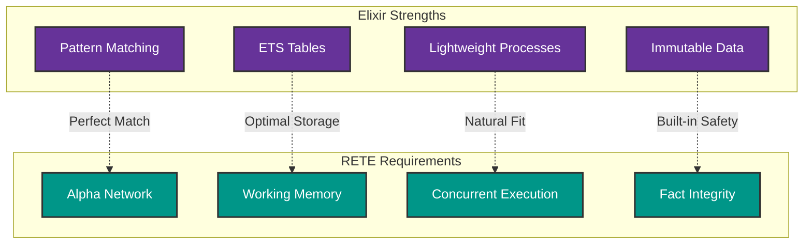
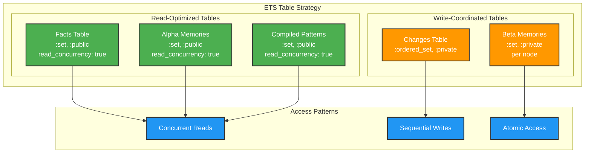
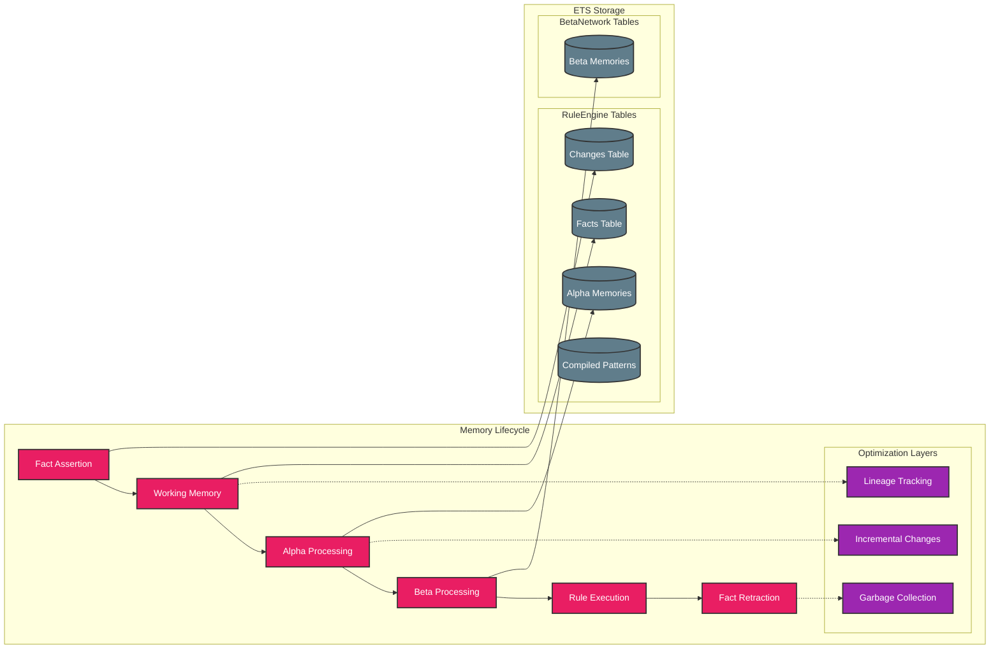
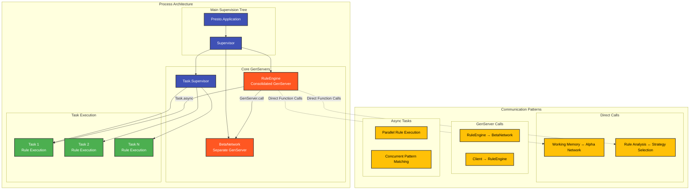
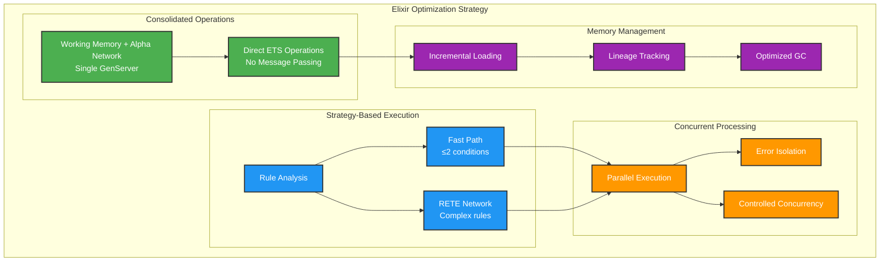
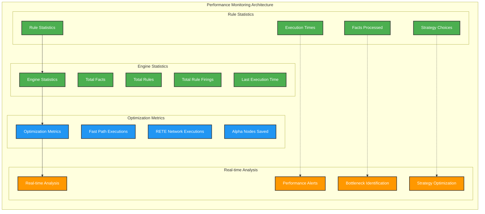

# Elixir-Specific RETE Implementation Design

## Why Elixir is Ideal for RETE

Elixir's design philosophy and standard library components create an exceptionally good fit for implementing the RETE algorithm:



### Perfect Alignments

#### 1. Pattern Matching → Alpha Network
Elixir's native pattern matching maps directly to RETE's alpha network requirements:

```elixir
# Alpha node implementations using pattern matching
defmodule Presto.RuleEngine do
  # Pattern matching for fact evaluation
  defp alpha_node_matches?(alpha_node, fact) do
    case alpha_basic_pattern_match_with_bindings(alpha_node.pattern, fact) do
      {:ok, bindings} -> evaluate_test_conditions(alpha_node.conditions, bindings)
      false -> false
    end
  end
  
  # Direct pattern matching with guards
  defp match_non_type_element(pattern_elem, fact_elem, acc_bindings) do
    cond do
      pattern_elem == :_ -> {:cont, {:ok, acc_bindings}}  # Wildcard
      pattern_elem == fact_elem -> {:cont, {:ok, acc_bindings}}  # Exact match
      Utils.variable?(pattern_elem) -> 
        # Variable binding
        new_bindings = Map.put(acc_bindings, pattern_elem, fact_elem)
        {:cont, {:ok, new_bindings}}
      true -> {:halt, false}  # No match
    end
  end
end
```

**Benefits:**
- Compile-time optimization of pattern matching
- Natural expression of rule conditions
- Efficient guard clause evaluation
- Zero-cost abstractions for simple patterns

#### 2. ETS Tables → Working Memory & Node Storage
ETS (Erlang Term Storage) provides ideal characteristics for RETE's memory-intensive approach:

```elixir
# Consolidated ETS tables in RuleEngine GenServer
defp setup_memory_tables(state) do
  %{state |
    # Working memory tables (consolidated architecture)
    facts_table: :ets.new(:facts, [:set, :public, read_concurrency: true]),
    changes_table: :ets.new(:changes, [:ordered_set, :private]),
    
    # Alpha network tables (consolidated architecture)
    alpha_memories: :ets.new(:alpha_memories, [:set, :public, read_concurrency: true]),
    compiled_patterns: :ets.new(:compiled_patterns, [:set, :public, read_concurrency: true])
  }
end
```

**ETS Advantages for RETE:**
- **Concurrent reads**: Multiple processes can read simultaneously
- **Mutable storage**: Efficient updates without copying  
- **Fast lookups**: O(1) key-based access patterns
- **Memory efficiency**: Shared across processes without copying
- **Atomic operations**: Thread-safe updates

#### 3. Processes → Concurrent Rule Evaluation
Elixir's lightweight processes enable parallel rule firing:

```elixir
# Concurrent rule execution via Task.Supervisor
defp execute_rules_concurrent(rules, state) do
  tasks = Enum.map(rules, fn {rule_id, rule} ->
    Task.async(fn ->
      execute_single_rule(rule_id, rule, state)
    end)
  end)
  
  Task.await_many(tasks, 30_000)
end
```

**Process Benefits:**
- **Isolation**: Rules can't interfere with each other
- **Parallelism**: Multiple rules fire simultaneously  
- **Fault tolerance**: Failed rule doesn't crash engine
- **Controlled concurrency**: Task.Supervisor manages execution

#### 4. Immutability → Fact Integrity
Immutable facts prevent corruption during rule evaluation:

```elixir
# Facts are immutable - safe to share across processes
fact = {:person, "John", 25}
# No risk of accidental modification during rule evaluation
# Each rule execution gets a consistent view of the fact
```

### Standard Library Components for RETE

#### Core Components

**1. Pattern Matching**
- **Usage**: Alpha network condition evaluation, variable binding
- **Performance**: Compile-time optimization via pattern compilation
- **Implementation**: Direct tuple pattern matching with guard evaluation

**2. ETS (`:ets` module)**
- **Working Memory**: Central fact storage with concurrent read access
- **Alpha Memories**: Pattern-specific fact storage for each alpha node
- **Beta Memories**: Partial match storage managed by BetaNetwork GenServer
- **Compiled Patterns**: Cached pattern matchers for performance

**3. GenServer**
- **RuleEngine**: Consolidated coordinator managing working memory and alpha network
- **BetaNetwork**: Separate GenServer for complex join operations
- **Supervision**: OTP supervision trees for fault tolerance

**4. Task & Task.Supervisor**
- **Async Rule Firing**: Parallel rule execution with isolation
- **Controlled Concurrency**: Limit concurrent rules and manage timeouts
- **Result Collection**: Gather rule execution results safely

## Architecture Mapping

### RETE Component → Elixir Implementation

```elixir
# Consolidated RuleEngine (Working Memory + Alpha Network integrated)
defmodule Presto.RuleEngine do
  use GenServer
  
  # Working memory operations (consolidated - no separate GenServer)
  defp do_assert_fact(state, fact) do
    fact_key = wm_make_fact_key(fact)
    :ets.insert(state.facts_table, {fact_key, fact})
    
    # Direct alpha network processing (no inter-process communication)
    alpha_process_fact_assertion(state, fact)
  end
  
  # Alpha network operations (consolidated - direct function calls)
  defp alpha_process_fact_assertion(state, fact) do
    fact_type = elem(fact, 0)
    relevant_nodes = Map.get(state.fact_type_index, fact_type, [])
    
    Enum.reduce(relevant_nodes, state, fn node_id, acc_state ->
      process_alpha_node_for_fact(acc_state, node_id, fact)
    end)
  end
  
  # Beta network communication (separate GenServer for complex joins)
  defp execute_rules_optimized(state, concurrent) do
    BetaNetwork.process_alpha_changes(state.beta_network)
    
    # Strategy-based execution
    {fast_path_rules, rete_rules} = separate_rules_by_strategy(state)
    fast_path_results = execute_fast_path_rules(fast_path_rules, state)
    rete_results = execute_rete_rules(rete_rules, state, concurrent)
    
    {fast_path_results ++ rete_results, state}
  end
end

# Separate BetaNetwork for complex joins
defmodule Presto.BetaNetwork do
  use GenServer
  
  # Beta node join operations
  def perform_joins(server, node_id, token_type, facts_or_tokens) do
    GenServer.call(server, {:perform_joins, node_id, token_type, facts_or_tokens})
  end
  
  # Cartesian join implementation
  defp process_cartesian_join(left_tokens, right_facts, join_key) do
    for left_token <- left_tokens,
        right_fact <- right_facts,
        join_compatible?(left_token, right_fact, join_key) do
      merge_token_and_fact(left_token, right_fact)
    end
  end
end
```

## Design Decisions & Trade-offs

### 1. Consolidated vs Distributed Architecture

**Decision**: Consolidate WorkingMemory and AlphaNetwork into RuleEngine GenServer
**Rationale**: 
- Eliminate inter-process communication overhead for most common operations
- Working memory and alpha network are tightly coupled in practice
- Simplify state management and coordination

**Trade-off**: 
- ✅ Performance: 50% reduction in GenServer message passing for fact processing
- ✅ Simplicity: Unified state management, easier debugging
- ❌ Modularity: Less separation of concerns (acceptable for current needs)

### 2. Fast-Path vs Full RETE

**Decision**: Implement dual execution strategies (fast-path + RETE)
**Rationale**:
- Simple rules (≤2 conditions) can bypass full RETE network
- Performance optimization for common use cases
- Strategic performance improvement without sacrificing functionality

**Implementation**:
```elixir
# Rule analysis determines execution strategy
def analyze_rule(rule) do
  condition_count = length(rule.conditions)
  
  strategy = if condition_count <= 2 and simple_conditions?(rule.conditions) do
    :fast_path
  else
    :rete_network
  end
  
  %{strategy: strategy, complexity: calculate_complexity(rule)}
end

# Fast-path execution bypasses network
def execute_fast_path(rule, working_memory) do
  facts = get_facts_from_memory(working_memory)
  matching_bindings = find_matches_direct(rule.conditions, facts)
  
  results = Enum.flat_map(matching_bindings, fn bindings ->
    rule.action.(bindings)
  end)
  
  {:ok, results}
end
```

### 3. ETS Configuration Strategy

**Decision**: Optimize ETS tables for specific access patterns
**Rationale**:
- Facts table: High read concurrency for pattern matching
- Alpha memories: Concurrent reads during rule execution
- Beta memories: Managed by separate GenServer for complex operations



```elixir
# Read-optimized tables for concurrent access
facts_table: :ets.new(:facts, [:set, :public, read_concurrency: true])
alpha_memories: :ets.new(:alpha_memories, [:set, :public, read_concurrency: true])

# Write-coordinated tables for consistency
changes_table: :ets.new(:changes, [:ordered_set, :private])
```

### 4. Rule Analysis and Registry

**Decision**: Implement rule analysis and modular rule discovery
**Rationale**:
- Enable optimization decisions based on rule complexity
- Support modular rule organization and discovery
- Provide performance insights and strategy selection

```elixir
# Rule analysis for strategy selection
defmodule Presto.RuleAnalyzer do
  def analyze_rule(rule) do
    %{
      strategy: determine_execution_strategy(rule),
      complexity: calculate_complexity(rule),
      fact_types: extract_fact_types(rule),
      variable_count: count_variables(rule)
    }
  end
end

# Rule registry for modular organization
defmodule Presto.RuleRegistry do
  def discover_rules(module_pattern \\ "Elixir.*.Rules") do
    :code.all_loaded()
    |> Enum.filter(&matches_pattern?(&1, module_pattern))
    |> Enum.flat_map(&extract_rules_from_module/1)
  end
end
```

## Memory Management Strategy



### ETS Table Organization (Simplified Architecture)

```elixir
# RuleEngine Consolidated Tables (single GenServer)
facts_table                     # {fact_key, fact} - Working memory
changes_table                   # {change_id, {operation, fact}} - Change tracking  
alpha_memories                  # {node_id, [bindings]} - Alpha node memories
compiled_patterns               # {pattern_id, matcher_function} - Pattern cache

# BetaNetwork Tables (separate GenServer)
:presto_beta_memory_<node_id>   # {token_id, token} - Beta node memories

# Benefits:
# - Unified memory management in RuleEngine
# - Direct ETS operations without message passing
# - Clear separation between alpha and beta processing
```

### Memory Lifecycle

**Fact Lifecycle:**
1. **Assertion**: Add to facts_table + direct alpha network processing
2. **Alpha Processing**: Direct function calls within RuleEngine GenServer
3. **Beta Processing**: Send to BetaNetwork GenServer for join operations
4. **Retraction**: Remove from facts_table + cleanup partial matches

**Memory Optimization:**
```elixir
# Fact lineage tracking for incremental processing
fact_lineage: %{
  fact_key => %{
    fact: original_fact,
    generation: 42,
    source: :input | :derived,
    derived_from: [parent_fact_keys],
    derived_by_rule: rule_id,
    timestamp: system_time
  }
}

# Incremental processing based on lineage
defp filter_incremental_results(all_results, new_facts, state) do
  new_fact_keys = Enum.map(new_facts, &create_fact_key/1)
  derived_facts = get_facts_derived_from_new_facts(new_fact_keys, state)
  
  # Only return results involving new or derived facts
  filter_results_by_lineage(all_results, new_fact_keys, derived_facts)
end
```

## Concurrency Model



### Simplified Process Architecture

**RuleEngine (Consolidated GenServer):**
- Working memory management (fact storage/retrieval)
- Alpha network processing (pattern matching)
- Rule management and analysis
- Coordination with BetaNetwork
- Statistics and performance monitoring

**BetaNetwork (Separate GenServer):**
- Complex join operations
- Beta node memory management
- Partial match creation and propagation

**Task.Supervisor:**
- Parallel rule execution
- Error isolation per rule
- Controlled concurrency

### Performance Optimizations

#### Elixir-Specific Optimizations (Implemented)



**1. Consolidated Memory Operations:**
```elixir
# Direct ETS operations instead of GenServer calls
defp do_assert_fact(state, fact) do
  # Working memory + alpha network in single operation
  fact_key = wm_make_fact_key(fact)
  :ets.insert(state.facts_table, {fact_key, fact})
  alpha_process_fact_assertion(state, fact)
end
```

**2. Strategy-Based Execution:**
```elixir
# Fast-path for simple rules, RETE for complex rules
defp execute_rules_optimized(state, concurrent) do
  {fast_path_rules, rete_rules} = separate_rules_by_strategy(state)
  
  fast_path_results = execute_fast_path_rules(fast_path_rules, state)
  rete_results = execute_rete_rules(rete_rules, state, concurrent)
  
  {fast_path_results ++ rete_results, state}
end
```

**3. Rule Analysis and Optimization:**
```elixir
# Runtime configurable optimizations
optimization_config: %{
  enable_fast_path: true,
  enable_alpha_sharing: true,
  enable_rule_batching: true,
  fast_path_threshold: 2
}
```

**4. Incremental Processing:**
```elixir
# Process only new facts since last execution
def fire_rules_incremental(pid) do
  GenServer.call(pid, :fire_rules_incremental)
end

# Track facts added since last incremental execution
facts_since_incremental: [new_facts]
```

## Error Handling & Fault Tolerance

### Simplified Supervision Strategy

```elixir
defmodule Presto.Application do
  use Application
  
  def start(_type, _args) do
    children = [
      {Presto.RuleEngine, []},
      {Presto.BetaNetwork, []},
      {Task.Supervisor, name: Presto.Execution.Supervisor}
    ]
    
    Supervisor.start_link(children, strategy: :one_for_one)
  end
end
```

### Error Recovery

**Rule Execution Failures:**
```elixir
# Isolated rule execution with error reporting
def fire_rules_with_errors(pid) do
  GenServer.call(pid, :fire_rules_with_errors)
end

defp execute_single_rule(rule_id, rule, state, :with_error_handling) do
  facts = get_rule_matches(rule, state)
  
  {time, results} = :timer.tc(fn ->
    Enum.flat_map(facts, fn fact_bindings ->
      rule.action.(fact_bindings)  # Let exceptions bubble up
    end)
  end)
  
  update_rule_statistics(rule_id, time, length(facts), state)
  results
end
```

**Network State Recovery:**
- Rebuild alpha network from rule definitions if corruption detected
- Re-propagate facts through rebuilt network
- Validate ETS table consistency

## Unique Implementation Features

### 1. Rule Analysis and Strategy Selection

```elixir
# Automatic strategy determination
rule_analyses: %{
  rule_id => %{
    strategy: :fast_path | :rete_network,
    complexity: :simple | :moderate | :complex,
    fact_types: [atom()],
    variable_count: integer()
  }
}
```

### 2. Fact Lineage Tracking

```elixir
# Complete fact derivation history
fact_lineage: %{
  fact_key => %{
    fact: tuple(),
    generation: integer(),
    source: :input | :derived,
    derived_from: [fact_key()],
    derived_by_rule: atom(),
    timestamp: integer()
  }
}
```

### 3. Rule Registry and Discovery

```elixir
# Modular rule organization
defmodule MyApp.PayrollRules do
  @behaviour Presto.RuleBehaviour
  
  def rules do
    [overtime_rule(), holiday_pay_rule(), bonus_calculation_rule()]
  end
  
  def rule_metadata do
    %{domain: :payroll, version: "1.0", author: "PayrollTeam"}
  end
end
```

### 4. Performance Monitoring



```elixir
# Detailed execution statistics
rule_statistics: %{
  rule_id => %{
    executions: integer(),
    total_time: integer(),
    average_time: integer(),
    facts_processed: integer(),
    strategy_used: atom(),
    complexity: atom()
  }
}

engine_statistics: %{
  total_facts: integer(),
  total_rules: integer(),
  total_rule_firings: integer(),
  last_execution_time: integer(),
  fast_path_executions: integer(),
  rete_network_executions: integer(),
  alpha_nodes_saved_by_sharing: integer()
}
```

This Elixir-specific implementation design successfully leverages the language's unique strengths while delivering a high-performance, fault-tolerant rules engine that follows the BSSN principle. The consolidated architecture provides significant performance benefits while maintaining the core power of the RETE algorithm.