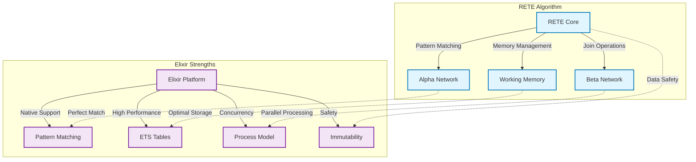
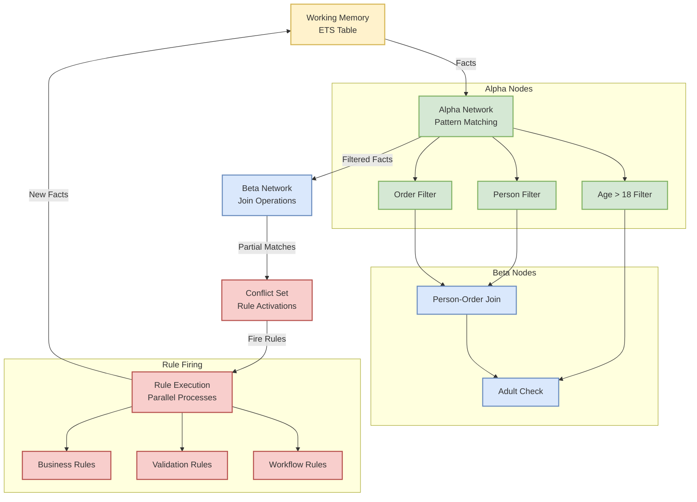
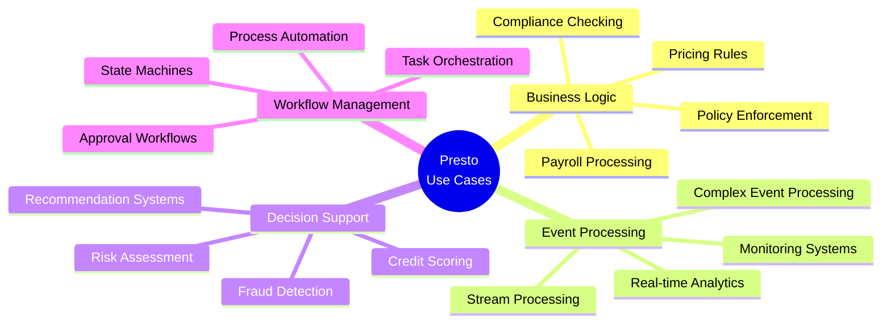

# Presto: RETE Algorithm Rules Engine for Elixir

## Overview

Presto is a rules engine library for Elixir implementing the RETE (Rapid, Efficient, Threaded Execution) algorithm. RETE is a pattern matching algorithm designed for efficient rule-based systems that can apply many rules to many facts with optimal performance characteristics.

## Why RETE for Elixir?



The RETE algorithm is particularly well-suited for Elixir due to several key alignments:

### Perfect Matches

1. **Pattern Matching**: Elixir's native pattern matching maps directly to RETE's alpha network, where individual facts are filtered by conditions.

2. **ETS Storage**: RETE's memory-intensive approach (trading memory for speed) aligns perfectly with ETS tables for:
   - Working memory (fact storage)
   - Partial match storage in beta nodes
   - Fast concurrent reads with minimal copying

3. **Process Model**: RETE's network structure can leverage Elixir's lightweight processes for:
   - Concurrent rule evaluation
   - Distributed network nodes
   - Fault-tolerant supervision trees

4. **Immutable Facts**: Elixir's immutability prevents accidental fact corruption during rule evaluation, a common source of bugs in imperative rule engines.

### Key Benefits

- **Performance**: O(RFP) complexity instead of naive O(RF^P) where R=rules, F=facts, P=patterns per rule
- **Incremental Processing**: Only processes changes (deltas) to working memory
- **Concurrency**: Rules can fire in parallel processes
- **Fault Tolerance**: Supervision trees protect against network component failures
- **Hot Updates**: Rules can be modified without stopping the engine

## Algorithm Overview



RETE constructs a discrimination network with two main components:

### Alpha Network
- **Purpose**: Filter individual facts based on single conditions
- **Implementation**: Elixir pattern matching functions + ETS storage
- **Example**: `{:person, name, age} when age > 18`

### Beta Network  
- **Purpose**: Join facts from different types and store partial matches
- **Implementation**: ETS tables for partial matches + GenServer coordination
- **Example**: Join `:person` facts with `:order` facts on matching IDs

### Working Memory
- **Purpose**: Store all facts currently in the system
- **Implementation**: ETS table with read concurrency
- **Operations**: Assert facts, retract facts, incremental updates

## Core Design Principles

1. **Best Simple System for Now (BSSN)**: Start with the simplest implementation that meets current needs
2. **Leverage Elixir Strengths**: Use pattern matching, ETS, processes, and supervision trees effectively  
3. **Performance through Architecture**: Minimize copying, maximize concurrency, optimize for common cases
4. **Fault Tolerance**: Design for failure recovery at every level

## Implementation Strategy

The library will be implemented as a standard OTP application with the following approach:

1. **Compile-time Network Construction**: Build RETE network when rules are loaded
2. **Runtime Fact Processing**: Efficient insertion and delta propagation
3. **Concurrent Rule Evaluation**: Parallel rule firing with proper coordination
4. **Dynamic Rule Updates**: Support for adding/removing rules at runtime

## Target Use Cases



**Primary Applications:**
- Business rule processing
- Event stream processing  
- Complex event processing (CEP)
- Decision support systems
- Workflow engines
- Real-time recommendation systems

## Repository Structure

```
presto/
├── lib/presto/           # Core implementation
├── specs/               # Detailed specifications  
├── test/               # Comprehensive test suite
├── bench/              # Performance benchmarks
└── examples/           # Usage examples
```

This specification serves as the foundation for implementing a production-ready RETE rules engine that leverages Elixir's unique strengths while maintaining the algorithm's core performance characteristics.