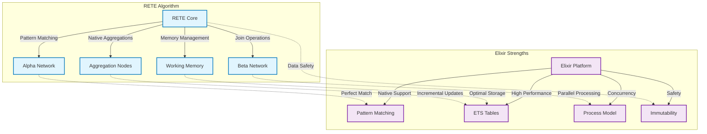
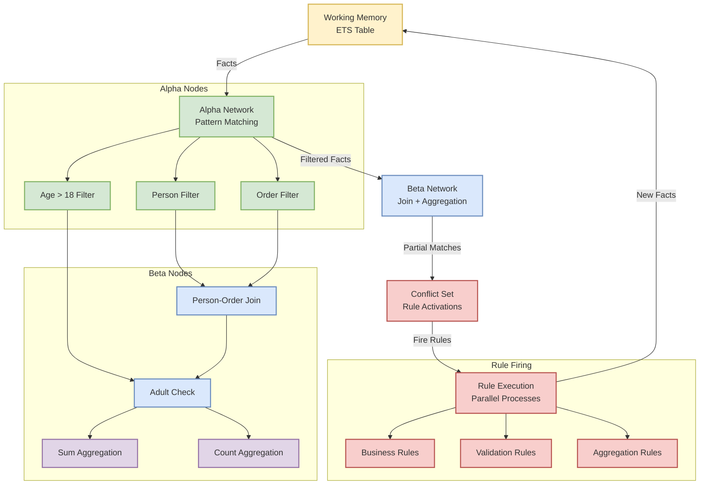
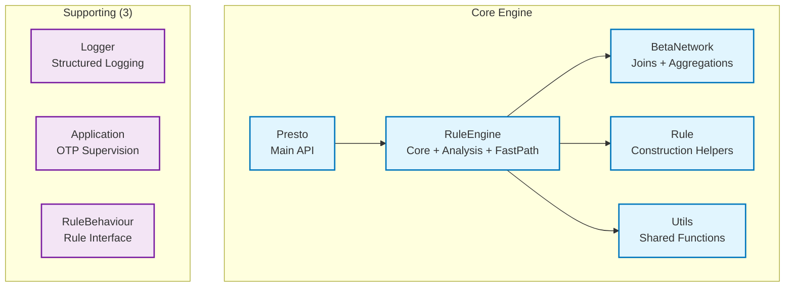
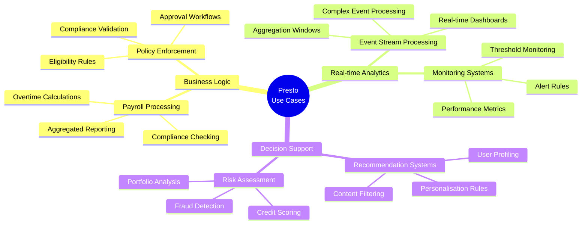

# Presto: RETE Algorithm Rules Engine for Elixir

## Overview

Presto is a production-ready rules engine library for Elixir implementing the RETE (Rapid, Efficient, Threaded Execution) algorithm. Built following Best Simple System for Now (BSSN) principles, Presto provides a lean yet powerful system that leverages Elixir's strengths in pattern matching, concurrency, and fault tolerance.

## Why RETE for Elixir?



The RETE algorithm is particularly well-suited for Elixir due to several key alignments:

### Perfect Matches

1. **Pattern Matching**: Elixir's native pattern matching maps directly to RETE's alpha network, where individual facts are filtered by conditions.

2. **ETS Storage**: RETE's memory-intensive approach (trading memory for speed) aligns perfectly with ETS tables for:
   - Working memory (fact storage)
   - Partial match storage in beta nodes
   - Aggregation state tracking
   - Fast concurrent reads with minimal copying

3. **Process Model**: RETE's network structure can leverage Elixir's lightweight processes for:
   - Concurrent rule evaluation
   - Distributed network nodes
   - Fault-tolerant supervision trees

4. **Immutable Facts**: Elixir's immutability prevents accidental fact corruption during rule evaluation, a common source of bugs in imperative rule engines.

### Key Benefits

- **Performance**: O(RFP) complexity instead of naive O(RF^P) where R=rules, F=facts, P=patterns per rule
- **Incremental Processing**: Only processes changes (deltas) to working memory
- **Native Aggregations**: Built-in support for sum, count, avg, min, max, and collect operations
- **Concurrency**: Rules can fire in parallel processes
- **Fault Tolerance**: Supervision trees protect against network component failures
- **Hot Updates**: Rules can be modified without stopping the engine

## Algorithm Overview



RETE constructs a discrimination network with three main components:

### Alpha Network
- **Purpose**: Filter individual facts based on single conditions
- **Implementation**: Elixir pattern matching functions + ETS storage
- **Example**: `{:person, name, age} when age > 18`

### Beta Network  
- **Purpose**: Join facts from different types, store partial matches, and compute aggregations
- **Implementation**: ETS tables for partial matches + GenServer coordination + aggregation nodes
- **Examples**: 
  - Join `:person` facts with `:order` facts on matching IDs
  - Sum hours by employee from timesheet facts
  - Count shifts by department

### Working Memory
- **Purpose**: Store all facts currently in the system
- **Implementation**: ETS table with read concurrency
- **Operations**: Assert facts, retract facts, incremental updates

## Core Design Principles

1. **Best Simple System for Now (BSSN)**: Build the simplest system that meets current needs with appropriate quality standards
2. **Leverage Elixir Strengths**: Use pattern matching, ETS, processes, and supervision trees effectively  
3. **Performance through Architecture**: Minimise copying, maximise concurrency, optimise for common cases
4. **Fault Tolerance**: Design for failure recovery at every level
5. **Explicit over Magic**: Prefer clear, explicit Elixir code over DSLs or complex abstractions

## BSSN-Based Architecture

Following the recent BSSN-based simplification, Presto now uses a streamlined 8-module architecture (reduced from 11):

### Core Modules (5)



**Key Simplifications:**
- **Consolidated Analysis**: Rule analysis functionality merged into RuleEngine
- **Integrated Fast-Path**: Fast-path execution merged into RuleEngine for better locality
- **Explicit Rule Construction**: New `Presto.Rule` module provides clear helpers
- **Simplified Batch API**: Direct bulk operations instead of complex batch objects

## RETE-Native Aggregations

Presto includes native support for aggregations as part of the RETE algorithm:

### Supported Aggregation Functions

```elixir
# Sum aggregation
Rule.aggregation(:total_hours, patterns, [:employee], :sum, :hours)

# Count aggregation  
Rule.aggregation(:shift_count, patterns, [:department], :count, nil)

# Average aggregation
Rule.aggregation(:avg_score, patterns, [:student], :avg, :score)

# Min/Max aggregations
Rule.aggregation(:min_price, patterns, [:category], :min, :price)
Rule.aggregation(:max_price, patterns, [:category], :max, :price)

# Collection aggregation
Rule.aggregation(:all_employees, patterns, [:department], :collect, :name)
```

### Multi-Field Grouping

```elixir
# Group by multiple fields
Rule.aggregation(
  :regional_sales,
  [{:sale, :region, :product, :amount}],
  [:region, :product],  # Group by both region and product
  :sum,
  :amount
)
```

### Incremental Updates

Aggregations update incrementally as facts are asserted or retracted:

```elixir
# Initial state: sum = 300
Presto.assert_fact(engine, {:sale, "s1", 100})
Presto.assert_fact(engine, {:sale, "s2", 200})

# Add more data: sum becomes 450  
Presto.assert_fact(engine, {:sale, "s3", 150})

# Remove data: sum becomes 350
Presto.retract_fact(engine, {:sale, "s1", 100})
```

## Simplified API Design

### Rule Construction

```elixir
# Standard rule with explicit construction
rule = Presto.Rule.new(
  :adult_discount,
  [
    {:person, :name, :age},
    {:age, :>, 18}
  ],
  fn facts -> [{:discount_eligible, facts[:name]}] end
)

# Aggregation rule
hours_rule = Presto.Rule.aggregation(
  :weekly_hours,
  [{:timesheet, :id, :employee, :hours}],
  [:employee],
  :sum,
  :hours
)

# Add rules to engine
Presto.add_rule(engine, rule)
Presto.add_rule(engine, hours_rule)
```

### Bulk Operations

```elixir
# Bulk fact assertion
facts = [
  {:person, "Alice", 25},
  {:person, "Bob", 30},
  {:timesheet, "t1", "Alice", 8},
  {:timesheet, "t2", "Bob", 7}
]
Presto.assert_facts(engine, facts)

# Bulk rule addition
rules = [standard_rule, aggregation_rule, validation_rule]
Presto.add_rules(engine, rules)
```

### Rule Execution

```elixir
# Execute all rules
results = Presto.fire_rules(engine)

# Execute with options
results = Presto.fire_rules(engine, concurrent: true, auto_chain: true)

# Get execution statistics
stats = Presto.get_rule_statistics(engine)
engine_stats = Presto.get_engine_statistics(engine)
```

## Performance Improvements

The BSSN-based simplification provides several performance benefits:

### Reduced Overhead
- **Module Consolidation**: Fewer GenServer calls between components
- **Better Locality**: Related functionality co-located for better cache usage
- **Simplified API**: Less abstraction overhead in common operations

### Optimized Execution
- **Integrated Fast-Path**: Single-condition rules execute without full RETE network
- **Batch Processing**: Bulk operations reduce individual GenServer call overhead
- **Incremental Aggregations**: Aggregations update incrementally, not recomputed

### Memory Efficiency
- **Consolidated ETS Tables**: Fewer tables with better data locality
- **Shared Alpha Nodes**: Common patterns share alpha nodes across rules
- **Efficient Aggregation Storage**: Aggregation state stored in beta memory

## Target Use Cases



**Primary Applications:**
- **Business Rule Processing**: Complex payroll, compliance, and policy systems
- **Real-time Analytics**: Event stream processing with aggregations
- **Complex Event Processing (CEP)**: Multi-event pattern matching
- **Decision Support Systems**: Rules-based recommendations and scoring
- **Workflow Engines**: Process automation and orchestration

## Example: Payroll Processing

```elixir
# Define payroll rules using aggregations
overtime_rule = Rule.aggregation(
  :weekly_overtime,
  [{:timesheet, :employee, :date, :hours}],
  [:employee, :week],
  :sum,
  :hours
)

# Standard business rule
overtime_pay_rule = Rule.new(
  :overtime_calculation,
  [
    {:weekly_overtime, :employee, :week, :total_hours},
    {:total_hours, :>, 40}
  ],
  fn facts -> 
    overtime_hours = facts[:total_hours] - 40
    overtime_pay = overtime_hours * 1.5 * base_rate
    [{:overtime_pay, facts[:employee], facts[:week], overtime_pay}]
  end
)

# Add rules and process timesheet data
Presto.add_rules(engine, [overtime_rule, overtime_pay_rule])
Presto.assert_facts(engine, timesheet_entries)

# Get payroll results
payroll_results = Presto.fire_rules(engine)
```

## Repository Structure

```
presto/
├── lib/presto/           # Core implementation (8 modules)
│   ├── rule_engine.ex    # Core engine with integrated analysis
│   ├── beta_network.ex   # Join and aggregation nodes
│   ├── rule.ex          # Rule construction helpers
│   └── ...
├── specs/               # This specification  
├── test/               # Comprehensive test suite (235+ tests)
├── bench/              # Performance benchmarks
└── examples/           # Usage examples
```

## Implementation Strategy

The library is implemented as a standard OTP application with BSSN principles:

1. **Compile-time Network Construction**: Build RETE network when rules are loaded
2. **Runtime Fact Processing**: Efficient insertion and delta propagation
3. **Incremental Aggregations**: Update aggregations as facts change
4. **Concurrent Rule Evaluation**: Parallel rule firing with proper coordination
5. **Dynamic Rule Updates**: Support for adding/removing rules at runtime

## Benefits of BSSN Approach

1. **Simplicity**: Fewer modules, clearer relationships, easier to understand
2. **Performance**: Reduced overhead, better locality, optimized for common cases
3. **Maintainability**: Less complexity, easier to modify and extend
4. **Capability**: Native aggregations enable complex use cases without external systems
5. **Reliability**: Comprehensive test coverage (235+ tests) ensures correctness

This specification reflects a production-ready RETE rules engine that successfully balances simplicity with capability, providing powerful features through a clean, intuitive API that leverages Elixir's unique strengths while maintaining the algorithm's core performance characteristics.