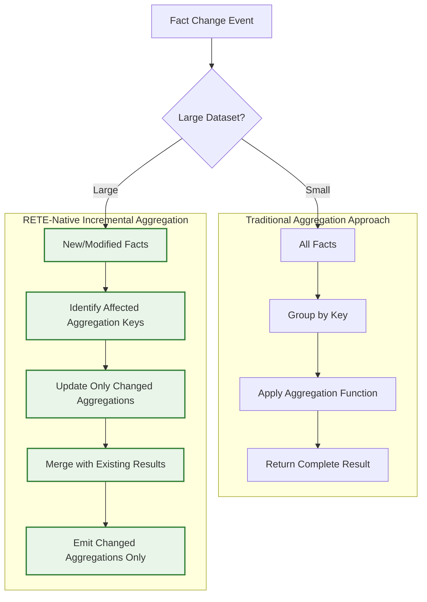
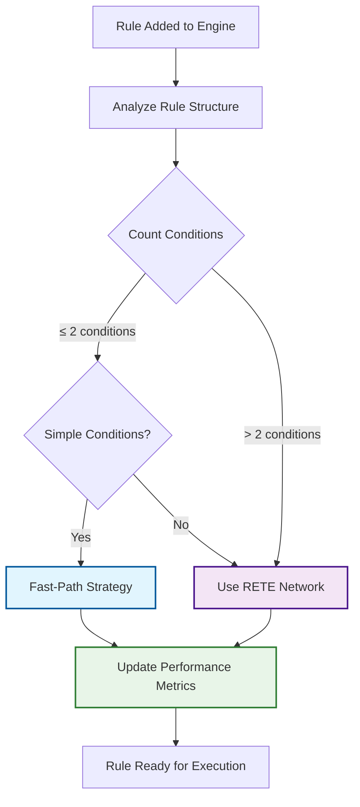
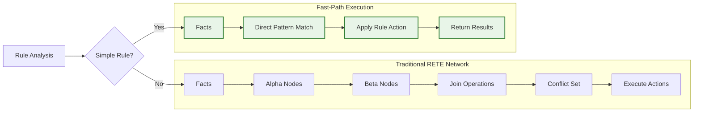
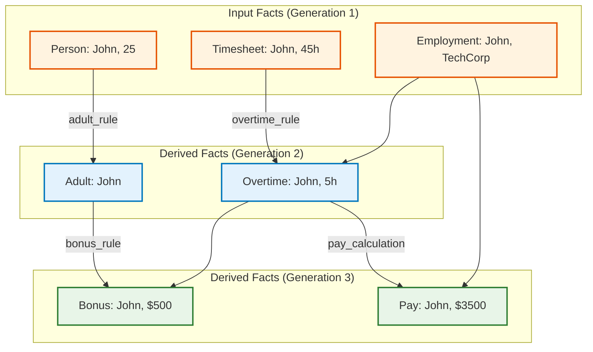
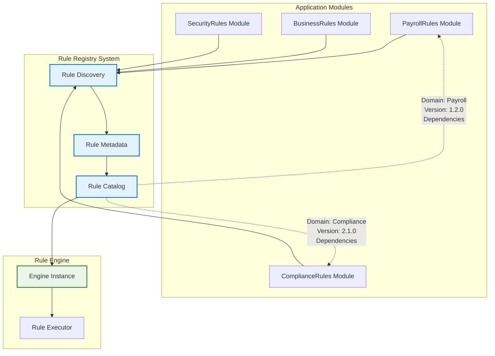
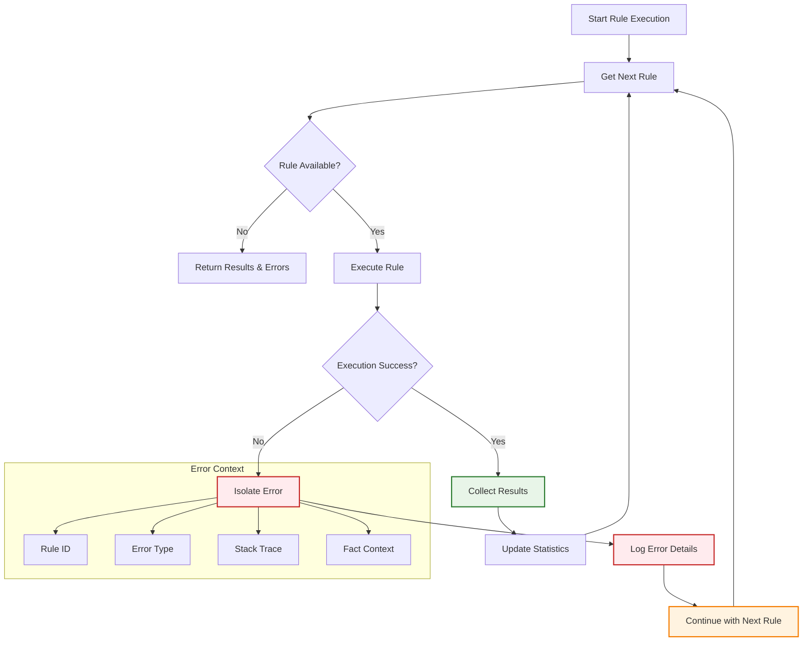
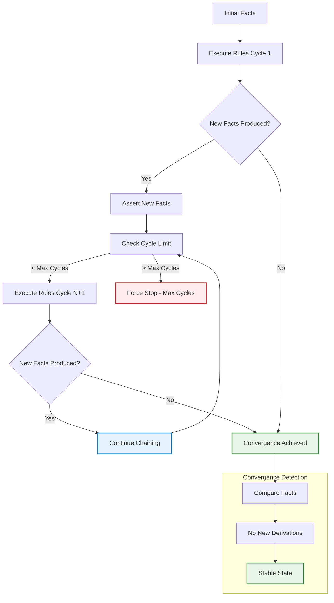
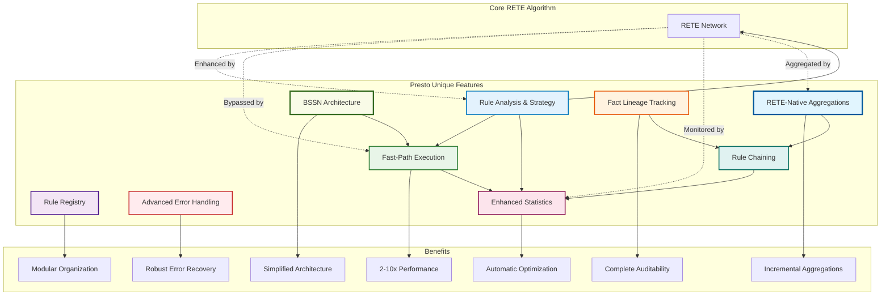

# Presto Unique Features Documentation

## Overview

This document describes unique features implemented in Presto that extend beyond the standard RETE algorithm specification. These features provide enhanced functionality, better performance, and improved developer experience while maintaining the core RETE algorithm principles.

Presto implements a **Best Simple System for Now (BSSN)** architectural approach, focusing on building the simplest system that meets current needs whilst maintaining appropriate quality standards. This philosophy permeates all design decisions, resulting in an explicit Elixir API without complex DSLs or over-engineering.

## 1. RETE-Native Aggregations

### Incremental Aggregation Processing Architecture



### Native Aggregation Support

Presto provides first-class support for aggregations that integrate seamlessly with the RETE network, offering incremental processing capabilities that scale efficiently with large datasets.

```elixir
# Define aggregation rules with native support
aggregation_rule = %{
  id: :total_sales_by_region,
  conditions: [
    {:sale, :region, :region_name},
    {:sale, :amount, :sale_amount}
  ],
  aggregation: %{
    group_by: [:region_name],
    aggregate: :sum,
    field: :sale_amount,
    emit_as: :regional_total
  },
  action: fn %{regional_total: total, region_name: region} ->
    [{:regional_sales_total, region, total}]
  end
}

# Add aggregation rule to engine
:ok = Presto.add_aggregation_rule(engine, aggregation_rule)

# Incremental updates - only affected aggregations recalculated
:ok = Presto.assert_fact(engine, {:sale, "North", 1500})  # Only North region total updated
:ok = Presto.assert_fact(engine, {:sale, "South", 2000})  # Only South region total updated
```

### Supported Aggregation Operations

```elixir
# Sum aggregation
sum_rule = %{
  aggregation: %{
    group_by: [:department],
    aggregate: :sum,
    field: :salary
  }
}

# Count aggregation
count_rule = %{
  aggregation: %{
    group_by: [:status],
    aggregate: :count
  }
}

# Average aggregation with incremental updates
avg_rule = %{
  aggregation: %{
    group_by: [:category],
    aggregate: :avg,
    field: :rating
  }
}

# Custom aggregation functions
custom_rule = %{
  aggregation: %{
    group_by: [:team],
    aggregate: :custom,
    function: fn values -> 
      # Custom aggregation logic
      Enum.max(values) - Enum.min(values)
    end,
    field: :performance_score
  }
}
```

**Key Benefits:**
- **Incremental processing**: Only affected aggregations recalculated on fact changes
- **Memory efficient**: Maintains aggregation state without storing intermediate results
- **RETE integration**: Aggregations participate in rule chaining and conflict resolution
- **Scalable performance**: O(1) updates for most aggregation operations

## 2. BSSN Architectural Philosophy

### Best Simple System for Now (BSSN) Implementation

Presto's architecture embodies BSSN principles by focusing on current requirements rather than speculative future needs.

```elixir
# BSSN Example: Explicit API design over DSL complexity
# Instead of complex DSL:
# rule "adult classification" do
#   when person.age >= 18
#   then classify_as :adult
# end

# BSSN approach: Simple, explicit Elixir structures
adult_rule = %{
  id: :adult_classification,
  conditions: [
    {:person, :name, :person_name},
    {:person, :age, :person_age},
    {:person_age, :>=, 18}
  ],
  action: fn bindings ->
    [{:adult, bindings[:person_name]}]
  end
}
```

### BSSN Design Decisions

```elixir
# 1. No complex rule builder patterns
# BSSN: Direct map structures
rule = %{id: :my_rule, conditions: [...], action: fn -> ... end}

# 2. No generic configuration frameworks  
# BSSN: Specific configuration for actual needs
config = %{
  enable_fast_path: true,      # Current optimisation need
  fast_path_threshold: 2       # Actual measured threshold
}

# 3. No speculative interfaces
# BSSN: Concrete implementations for current use cases
def add_rule(engine, rule), do: add_rule_impl(engine, rule)
def fire_rules(engine), do: fire_rules_impl(engine)
```

**BSSN Benefits:**
- **Reduced complexity**: No unnecessary abstractions or indirection
- **Clear intentions**: Explicit code reveals actual system behaviour  
- **Maintenance efficiency**: Less code to understand and modify
- **Performance clarity**: Direct implementation paths are easier to optimise

## 3. Rule Analysis and Strategy Selection

### Rule Analysis and Strategy Selection Workflow



### Automatic Rule Complexity Analysis

Presto automatically analyses each rule to determine the optimal execution strategy and provides detailed complexity metrics.

```elixir
# Automatic rule analysis when adding rules
analysis = Presto.RuleAnalyzer.analyse_rule(rule)
%{
  strategy: :fast_path,           # Execution strategy selection
  complexity: :simple,            # Rule complexity assessment  
  fact_types: [:person, :order],  # Fact types involved
  variable_count: 2,              # Number of variables bound
  condition_count: 2              # Number of conditions
}

# Get analysis for existing rule
analysis = Presto.RuleEngine.analyse_rule(engine, :adult_rule)

# Analyze entire rule set
rule_set_analysis = Presto.RuleEngine.analyse_rule_set(engine)
%{
  total_rules: 15,
  fast_path_eligible: 8,
  complexity_distribution: %{simple: 8, moderate: 5, complex: 2},
  fact_type_coverage: %{person: 10, order: 8, product: 3}
}
```

### Rule Strategy Determination

The system automatically chooses between execution strategies:

```elixir
# Strategy determination logic
defp determine_execution_strategy(rule) do
  condition_count = length(rule.conditions)
  
  cond do
    condition_count <= 2 and simple_conditions?(rule.conditions) -> 
      :fast_path
    true -> 
      :rete_network
  end
end

# Simple conditions check
defp simple_conditions?(conditions) do
  Enum.all?(conditions, fn condition ->
    case condition do
      {_fact_type, _field1, _field2} -> true  # Basic pattern
      {_variable, _operator, _value} -> true  # Simple test
      _ -> false  # Complex condition
    end
  end)
end
```

**Benefits:**
- **Automatic optimisation**: No manual strategy selection required
- **Performance insights**: Understand rule complexity and execution characteristics
- **System analysis**: Overall rule set optimisation opportunities

## 4. Fast-Path Execution

### Fast-Path vs RETE Network Execution Flow



### Bypass RETE Network for Simple Rules

Simple rules (≤2 conditions) can bypass the full RETE network for significant performance improvements.

```elixir
# Fast-path execution implementation
defmodule Presto.FastPathExecutor do
  def execute_fast_path(rule, working_memory) do
    facts = get_facts_from_memory(working_memory)
    matching_bindings = find_matches_direct(rule.conditions, facts)
    
    results = Enum.flat_map(matching_bindings, fn bindings ->
      try do
        rule.action.(bindings)
      rescue
        _ -> []
      end
    end)
    
    {:ok, results}
  end
  
  # Batch execution for multiple fast-path rules
  def execute_batch_fast_path(rules, working_memory) do
    facts = get_facts_from_memory(working_memory)
    
    results = Enum.flat_map(rules, fn rule ->
      matching_bindings = find_matches_direct(rule.conditions, facts)
      
      Enum.flat_map(matching_bindings, fn bindings ->
        rule.action.(bindings)
      end)
    end)
    
    {:ok, results}
  end
end
```

### Fast-Path Configuration

```elixir
# Configure fast-path optimisation
:ok = Presto.RuleEngine.configure_optimisation(engine, [
  enable_fast_path: true,           # Enable fast-path execution
  fast_path_threshold: 2,           # Max conditions for fast-path
  enable_rule_batching: true        # Batch multiple fast-path rules
])

# Get current configuration
config = Presto.RuleEngine.get_optimisation_config(engine)
```

**Performance Benefits:**
- **2-10x speedup** for simple rules
- **Reduced memory usage** by bypassing network construction
- **Lower latency** through direct pattern matching

## 5. Fact Lineage Tracking

### Fact Lineage Relationship Graph



### Complete Fact Derivation History

Presto tracks the complete lineage of every fact, including how derived facts were created and their relationships.

```elixir
# Fact lineage structure
fact_lineage: %{
  fact_key => %{
    fact: {:adult, "John"},              # The actual fact
    generation: 42,                      # Creation order number
    source: :derived,                    # :input | :derived
    derived_from: [parent_fact_keys],    # Source facts for derivation
    derived_by_rule: :adult_rule,        # Rule that created this fact
    timestamp: 1640995200000000          # Creation timestamp
  }
}

# Input facts (directly asserted)
%{
  fact: {:person, "John", 25},
  generation: 1,
  source: :input,
  derived_from: [],
  derived_by_rule: nil,
  timestamp: 1640995100000000
}

# Derived facts (produced by rules)
%{
  fact: {:adult, "John"},
  generation: 2,
  source: :derived,
  derived_from: ["fact_key_person_john_25"],
  derived_by_rule: :adult_rule,
  timestamp: 1640995150000000
}
```

### Lineage-Based Operations

```elixir
# Incremental processing using lineage
defp filter_incremental_results(all_results, new_facts, state) do
  new_fact_keys = Enum.map(new_facts, &create_fact_key/1)
  
  # Find all facts transitively derived from new facts
  derived_facts = get_facts_derived_from_new_facts(new_fact_keys, state)
  
  # Filter results to only include those involving new or derived facts
  filter_results_by_lineage(all_results, new_fact_keys, derived_facts)
end

# Track fact creation during rule execution
updated_fact_lineage = Map.put(state.fact_lineage, fact_key, %{
  fact: result_fact,
  generation: state.fact_generation + 1,
  source: :derived,
  derived_from: [source_fact_key],
  derived_by_rule: rule.id,
  timestamp: System.system_time(:microsecond)
})
```

**Use Cases:**
- **Incremental processing**: Only process rules affected by new facts
- **Debugging**: Understand how facts were derived
- **Auditing**: Track fact creation and modification history
- **Optimisation**: Identify derivation patterns for optimisation

## 6. Rule Registry and Discovery

### Rule Registry Architecture



### Modular Rule Organization

Presto provides a registry system for organising and discovering rules across modules.

```elixir
# Rule behaviour definition
defmodule Presto.RuleBehaviour do
  @callback rules() :: [map()]
  @callback rule_metadata() :: map()
end

# Example rule module implementation
defmodule MyApp.PayrollRules do
  @behaviour Presto.RuleBehaviour
  
  def rules do
    [
      overtime_rule(),
      holiday_pay_rule(),
      bonus_calculation_rule()
    ]
  end
  
  def rule_metadata do
    %{
      domain: :payroll,
      version: "1.2.0",
      author: "PayrollTeam",
      description: "Core payroll calculation rules",
      dependencies: [:time_tracking, :employee_data]
    }
  end
  
  defp overtime_rule do
    %{
      id: :overtime_calculation,
      conditions: [
        {:timesheet_entry, :employee_id, :hours},
        {:hours, :>, 40}
      ],
      action: fn bindings ->
        hours = bindings[:hours]
        overtime_hours = hours - 40
        [{:overtime, bindings[:employee_id], overtime_hours}]
      end,
      priority: 10
    }
  end
end
```

### Rule Discovery System

```elixir
# Automatic rule discovery
defmodule Presto.RuleRegistry do
  def discover_rules(module_pattern \\ "Elixir.*.Rules") do
    :code.all_loaded()
    |> Enum.filter(&matches_pattern?(&1, module_pattern))
    |> Enum.flat_map(&extract_rules_from_module/1)
  end
  
  def register_rule_module(module) do
    if implements_rule_behaviour?(module) do
      rules = module.rules()
      metadata = module.rule_metadata()
      {:ok, rules, metadata}
    else
      {:error, :invalid_rule_module}
    end
  end
  
  def list_rule_modules do
    # Returns all discovered rule modules with metadata
    discover_rule_modules()
    |> Enum.map(fn module ->
      {module, module.rule_metadata()}
    end)
  end
end

# Usage examples
# Discover all rule modules
rule_modules = Presto.RuleRegistry.discover_rules("MyApp.*.Rules")

# Register specific module
{:ok, rules, metadata} = Presto.RuleRegistry.register_rule_module(MyApp.PayrollRules)

# Load rules from multiple modules
{:ok, engine} = Presto.start_engine()
Enum.each(rule_modules, fn {module, _metadata} ->
  {rules, _metadata} = Presto.RuleRegistry.register_rule_module(module)
  Enum.each(rules, fn rule ->
    Presto.add_rule(engine, rule)
  end)
end)
```

**Benefits:**
- **Modular organisation**: Separate rules by domain or functionality
- **Automatic discovery**: Find and load rules without manual registration
- **Metadata tracking**: Version, author, and dependency information
- **Team collaboration**: Different teams can maintain separate rule modules

## 7. Advanced Error Handling

### Error Handling and Isolation Workflow



### Detailed Rule Execution Error Reporting

Presto provides comprehensive error handling with rule-specific error isolation and reporting.

```elixir
# Execute rules with detailed error reporting
{:ok, results, errors} = Presto.RuleEngine.fire_rules_with_errors(engine)

# Error format
errors = [
  {:error, :overtime_rule, %ArgumentError{message: "Invalid hours value"}},
  {:error, :bonus_rule, %FunctionClauseError{function: :calculate_bonus, arity: 2}}
]

# Implementation with error isolation
defp execute_rules_with_error_handling(state) do
  sorted_rules = get_sorted_rules(state)
  
  {results, errors} = Enum.reduce(sorted_rules, {[], []}, fn {rule_id, rule}, {acc_results, acc_errors} ->
    try do
      rule_results = execute_single_rule(rule_id, rule, state, :with_error_handling)
      {acc_results ++ rule_results, acc_errors}
    rescue
      error ->
        error_info = {:error, rule_id, error}
        {acc_results, [error_info | acc_errors]}
    end
  end)
  
  {results, errors}
end
```

### Error Recovery and Isolation

```elixir
# Rule-level error isolation
defp execute_single_rule(rule_id, rule, state, :with_error_handling) do
  facts = get_rule_matches(rule, state)
  
  {time, results} = :timer.tc(fn ->
    Enum.flat_map(facts, fn fact_bindings ->
      # Let exceptions bubble up for error handling
      rule.action.(fact_bindings)
    end)
  end)
  
  # Update statistics only if successful
  update_rule_statistics(rule_id, time, length(facts), state)
  results
end

# Failed rules don't affect other rules
# Statistics tracking for failed vs successful executions
# Detailed error context with rule and fact information
```

## 8. Rule Chaining with Convergence Detection

### Rule Chaining and Convergence Detection Flow



### Automatic Rule Chaining

Presto supports automatic rule chaining where the results of one rule execution become inputs for the next cycle.

```elixir
# Execute rules with automatic chaining until convergence
results = Presto.fire_rules(engine, auto_chain: true)

# Implementation with convergence detection
defp execute_rules_with_chaining(state, concurrent, all_results, cycle, max_cycles) do
  # Execute one cycle of rules
  {cycle_results, updated_state} = execute_rules_traditional(state, concurrent)
  
  # Check for convergence (no new facts produced)
  if Enum.empty?(cycle_results) do
    {List.flatten(all_results), updated_state}
  else
    # Assert results back into working memory
    new_state = Enum.reduce(cycle_results, updated_state, fn fact, acc_state ->
      assert_derived_fact(acc_state, fact)
    end)
    
    # Continue with next cycle (up to max_cycles limit)
    execute_rules_with_chaining(new_state, concurrent, [cycle_results | all_results], cycle + 1, max_cycles)
  end
end
```

**Features:**
- **Automatic convergence detection**: Stops when no new facts are produced
- **Cycle limit protection**: Prevents infinite loops
- **Fact lineage tracking**: Maintains derivation history across cycles
- **Performance optimisation**: Efficient chaining implementation

## 9. Enhanced Statistics and Monitoring

### Comprehensive Performance Tracking

Presto provides detailed performance statistics beyond basic execution metrics.

```elixir
# Detailed rule statistics
rule_stats = Presto.get_rule_statistics(engine)
%{
  adult_rule: %{
    executions: 45,
    total_time: 1500,              # microseconds
    average_time: 33,              # microseconds  
    facts_processed: 120,
    strategy_used: :fast_path,     # Execution strategy
    complexity: :simple            # Rule complexity
  }
}

# Engine optimisation statistics
engine_stats = Presto.get_engine_statistics(engine)
%{
  total_facts: 1234,
  total_rules: 56,
  total_rule_firings: 789,
  last_execution_time: 1500,
  fast_path_executions: 45,        # Fast-path optimisation usage
  rete_network_executions: 11,     # Traditional RETE execution
  alpha_nodes_saved_by_sharing: 12 # Memory optimisation metric
}

# Execution order tracking
execution_order = Presto.RuleEngine.get_last_execution_order(engine)
# Returns: [:high_priority_rule, :medium_priority_rule, :low_priority_rule]
```

### Performance Analysis

```elixir
# Rule set analysis for optimisation insights
analysis = Presto.RuleEngine.analyse_rule_set(engine)
%{
  total_rules: 15,
  fast_path_eligible: 8,           # Rules eligible for fast-path
  complexity_distribution: %{      # Rule complexity breakdown
    simple: 8,
    moderate: 5, 
    complex: 2
  },
  fact_type_coverage: %{           # Fact types used by rules
    person: 10,
    order: 8,
    product: 3
  }
}
```

## Presto Unique Features Integration

### Feature Interaction Overview



## Usage Examples

### Complete Workflow Example

```elixir
# 1. Start engine with optimisation
{:ok, engine} = Presto.start_engine()

# 2. Configure optimisations
:ok = Presto.RuleEngine.configure_optimisation(engine, [
  enable_fast_path: true,
  enable_alpha_sharing: true,
  fast_path_threshold: 2
])

# 3. Load rules from modules (including aggregation rules)
rule_modules = Presto.RuleRegistry.discover_rules("MyApp.*.Rules")
Enum.each(rule_modules, fn {module, _metadata} ->
  {rules, _metadata} = Presto.RuleRegistry.register_rule_module(module)
  Enum.each(rules, fn rule ->
    if Map.has_key?(rule, :aggregation) do
      Presto.add_aggregation_rule(engine, rule)
    else
      Presto.add_rule(engine, rule)
    end
  end)
end)

# 4. Analyze rule set
analysis = Presto.RuleEngine.analyse_rule_set(engine)
IO.inspect(analysis, label: "Rule Set Analysis")

# 5. Assert facts and execute rules (including facts for aggregations)
:ok = Presto.assert_fact(engine, {:person, "John", 25})
:ok = Presto.assert_fact(engine, {:employment, "John", "TechCorp"})
:ok = Presto.assert_fact(engine, {:sale, "North", 1500})
:ok = Presto.assert_fact(engine, {:sale, "South", 2000})

# 6. Execute with chaining and error handling
{:ok, results, errors} = Presto.RuleEngine.fire_rules_with_errors(engine)

# 7. Monitor performance
rule_stats = Presto.get_rule_statistics(engine)
engine_stats = Presto.get_engine_statistics(engine)

# 8. Incremental processing for new facts (including aggregation updates)
:ok = Presto.assert_fact(engine, {:person, "Jane", 30})
:ok = Presto.assert_fact(engine, {:sale, "North", 500})  # Incremental aggregation update
incremental_results = Presto.RuleEngine.fire_rules_incremental(engine)

# 9. BSSN philosophy in practice - explicit, simple operations
aggregation_results = Presto.get_aggregation_results(engine, :total_sales_by_region)
IO.inspect(aggregation_results, label: "Regional Sales Totals")
```

These unique features significantly enhance Presto's capabilities beyond a standard RETE implementation. The combination of **RETE-native aggregations** with **incremental processing**, the **BSSN architectural philosophy** promoting explicit simplicity over complex abstractions, and the suite of performance optimisations provides a powerful yet maintainable rules engine. The system delivers better performance, easier development workflows, and comprehensive monitoring capabilities while maintaining the core algorithmic benefits of RETE.

**Key Differentiators:**
- **First-class aggregation support** with O(1) incremental updates
- **BSSN architecture** avoiding over-engineering and speculative complexity
- **Explicit Elixir API** without DSL overhead
- **2-10x performance improvements** through intelligent strategy selection
- **Complete fact lineage tracking** for debugging and auditing
- **Modular rule organisation** supporting team collaboration